# 第四章：训练模型

迄今为止，我们对待机器学习模型和算法就像黑盒一样。如果你做过前几章的练习，你也许会感到惊奇，居然能在不知道背后原理的情况下实现那么多任务：优化回归系统，改进数字图像分类器，甚至从头开始建立了垃圾邮件过滤器——这一切你都不知道它究竟是怎么实现的。事实上，在许多解决方法中，你并不需要知道应用细节。

不过，对工作原理有一定了解的话，能帮助你快速选出合适的模型、正确的训练算法、以及一组好的超参数。了解背后的原理也能帮你调试问题、更高效地进行误差分析。最后，本章中讨论的绝大多数话题在理解、构建、训练神经网络上是很有必要的（在本书的第二部分讨论）。

本章中，我们首先来看线性模型，最简单的模型之一。我们会讨论两种极其不同的训练方法。

- 使用封闭方程直接计算在训练集上最适合模型的参数（即在训练集上使损失函数最小化的模型参数）
- 使用迭代优化方法，称为梯度下降（GD），它在训练集上逐渐调整模型参数，使损失函数最小化，最终会收敛到和第一种方法相同的值。我们也会介绍一些梯度下降的变体，当我们在第二部分学习神经网络的时候会反复用到：批量梯度下降（Batch GD），小批量梯度下降（Mini-batch GD）和随机梯度下降（Stochastic GD）。

接下来我们会介绍多项式回归，一个能适应非线性数据集的更复杂的模型。因为这个模型比线性回归有更多的参数，更容易发生过拟合训练集的情况，所以我们将会介绍如何使用学习曲线来检测模型是否过拟合，也会介绍一些能减少过拟合风险的正则技术。

最后，我们再看两个常用于分类任务的模型：逻辑回归和 Softmax 回归。

> **警告**
> 本章中会涉及到许多数学公式，以及线性代数和微积分的基本概念。为了理解这些公式，你需要知道向量和矩阵是什么、如何转换它们、点积是什么、矩阵的逆是什么、偏导数是什么。如果你对这些概念不熟悉，你可以在 Jupyter notebook 的在线补充材料上浏览线性代数和微积分入门指导。对于真的很讨厌数学的人，也应该浏览本章，仅跳过公式。希望能帮助你理解大部分概念。

## 线性回归

在第一章中，我们介绍了一个简单的生活满意度回归模型：。

这个模型只是输入特征`GDP_per_capita`的线性函数。  和  是模型的参数。

更普遍的，线性模型通过计算输入特征的权重总和，并加上一个常数**偏置项**（*bias term*）（也称为**截距项**（*intercept term*））来做出预测，如公式4-1：


-  是预测值。
-  是特征总数。
-  是第  个特征值。
-  是第  个模型参数（包括偏置项  和特征权重  。

可以写成更简短的向量形式，如公式4-2：


-  是模型的参数向量，包括偏置项  和特征权重  到 
-  是  的转置（行向量变为列向量）
-  是特征向量的实例，包括  到  ，且  恒为零
-  是  和  的点积
-  是函数的假设值，使用了模型参数 

这就是线性回归模型，所以我们该如何训练它呢？回想一下，训练模型意味着设置参数，使模型最适合训练集。为此我们需要一种能衡量模型好坏的指标。在第二章中我们已经知道，回归模型最普遍的性能测量是均方根误差（RMSE）（公式2-1）。因此，要训练线性回归模型，你需要找到能最小化RMSE的  值。在实践中，最小化均方误差（MSE）比RMSE更普遍，最小化的结果也是一样的（因为使函数最小化的值也使它的平方根最小化）。

在训练集  上，线性模型的假设值  的 MSE 用公式4-3来计算：


大多数公式都在第二章中（见“公式”）。主要的不同是我们把  写成  ，以便能清楚表明模型是由向量  参数化的。为了简化公式，我们用  代替 。

### 正规方程

为了找到能最小化损失函数的  值，可以使用**闭式解**（*closed-form solution*）——换言之，通过数学公式直接得到解。这被称为**正规方程**（*Normal Equation*）（公式4-4）：


-  是最小化损失函数的  值
-  是目标值的向量，包含 }) 到 })

让我们来生成一些近似线性的数据，在图4-1上测试这个公式：

```python
import numpy as np

X = 2 * np.random.rand(100, 1)
y = 4 + 3 * X + np.random.randn(100, 1)
```


现在通过正规方程来计算  。我们会从 NumPy 的线性代数模块（`np.linalg`）中使用`inv()`函数计算矩阵的逆，`dot()`方法计算矩阵乘法。

```python
X_b = np.c_[np.ones((100, 1)), X] # add x0 = 1 to each instance
theta_best = np.linalg.inv(X_b.T.dot(X_b)).dot(X_b.T).dot(y)
```

我们用来生成数据的实际函数是  高斯噪音。来看看正规方程发现了什么：

```python
>>> theta_best
array([[ 4.21509616],
       [ 2.77011339]])
```

我们希望得到  和  ，而不是   和  。很接近了，但噪音使它无法恢复原函数的确切参数值。

现在你可以用  来进行预测了：

```python
>>> X_new = np.array([[0], [2]])
>>> X_new_b = np.c_[np.ones((2, 1)), X_new] # add x0 = 1 to each instance
>>> y_predict = X_new_b.dot(theta_best)
>>> y_predict
array([[4.21509616],
       [9.75532293]])
```

来绘制模型的预测（图4-2）：

```python
plt.plot(X_new, y_predict, "r-")
plt.plot(X, y, "b.")
plt.axis([0, 2, 0, 15])
plt.show()
```

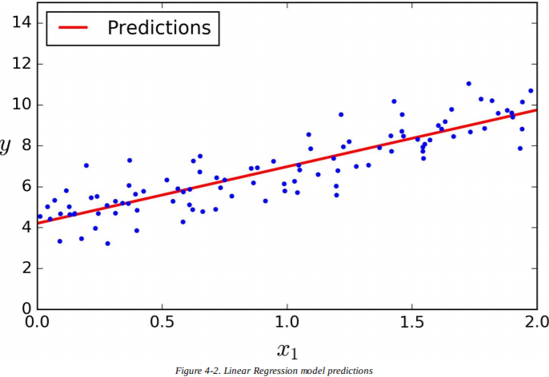

使用下面的 Scikit-Learn 代码可以达到相同的效果：

```python
>>> from sklearn.linear_model import LinearRegression
>>> lin_reg = LinearRegression()
>>> lin_reg.fit(X, y)
>>> lin_reg.intercept_, lin_reg.coef_
(array([ 4.21509616]), array([[ 2.77011339]]))
>>> lin_reg.predict(X_new)
array([[4.21509616],
       [9.75532293]])
```

### 运算复杂度

正规方程计算  的逆，它是个  的矩阵（  是特征的数量）。对这个矩阵求逆的运算复杂度在  和  之间（取决于具体应用）。换言之，如果特征数量翻倍，运算时间会变为原来的  到  倍。

> **警告**
> 当特征的数量很大时（比如 100000 ），正规方程会变得很慢。

好的一方面是，这个公式在训练集上对于实例而言是线性的（复杂度为 ) ，只要内存足够，就能高效处理大批数据。

同时，只要你训练过线性模型（使用正规方程或其他算法），预测就会很快：因为运算复杂度对于实例和特征而言都是线性的。换言之，当实例变为两倍时（或特征变为两倍），预测时间也不过是原来的两倍。

现在我们来看另一种用于训练线性回归模型的方法，当特征数量很多或训练实例太多、内存放不下时，这种方法更适用。

## 梯度下降

**梯度下降**（*Gradient Descent*）是一种非常通用的优化算法，能在许多问题中找到最优解。梯度下降的整体思路是通过迭代调整参数，使损失函数最小化。

假设你在迷雾弥漫的山中迷路了，你只能感觉到脚下土地的坡度。为了快速到达山底，最好的策略是沿着最陡的坡度下山。这就是梯度下降所做的事：它测量误差函数关于参数向量  的局部梯度，沿着梯度下降的方向前进。一旦梯度为零，你就得到了最小值。

具体来说，首先把  置为随机值（成为**随机初始化**（*random initialization*）），然后慢慢改善它，一次一小步，每一步都尝试减小损失函数（比如，MSE），直到算法收敛到一个最小值（见图4-3）。


梯度下降中一个重要的参数是步长，由超参数**学习率**决定。如果学习率太小，算法就不得不迭代许多次才能收敛，这会花费很长的时间（见图4-4）。


另一方面，如果学习率太大，你会越过最低点，跳到另一边，可能比之前的值还要大。这样可能会使算法发散，它的值会越来越大，无法找到一个好的解决方法（见图4-5）。


最后，不是所有的损失函数都看起像规则的碗一样。它们可能是洞、山脊、高原和各种不规则的地形，收敛到最小值很困难。图4-6展现了两个梯度下降主要的挑战：如果随机初始值选在左边，那么它会收敛到一个**局部最小值**（*local minimum*），它不如**全局最小值**（*global minimum*）那么好。如果它从右边开始，那么跨越高原会花费很长的时间，如果你过早停止训练，你将永远无法得到全局最小值。


幸运的是，线性回归模型的均方差损失函数恰好是一个**凸函数**（*convex function*），意味着如果你在曲线上随机选两点，它们的连线不会与曲线交叉。这意味着函数没有局部最小值，只有一个全局最小值。并且，它也是一个斜率永远不会突变的连续函数。这两点要素有一个重要的推论：梯度下降保证能无限接近全局最小值（只要训练时间够长，并且学习率并不是很大）。

事实上，损失函数的形状像一个碗，不过如果特征的取值范围相差过大时，碗会被拉长。图4-7展示了梯度下降在不同训练集上的表现。左图中，特征1和特征2有相同的比例；右图中，特征1的值比特征2要小得多。


如你所见，左图中梯度下降算法直接快速到达了最小值，而右图中它第一次前进的方向几乎和全局最小值垂直，并且在平坦的山谷中走了很久。它最终会到达最小值，不过会花费很长时间。

> **警告**
> 使用梯度下降的时候，你应该确保所有的特征取值范围都相似（例如，使用Scikit-Learn的`StandardScaler`类，否则它会花很长的时间才能收敛）。

这幅图也表明了一个事实，训练一个模型意味着在训练集上找到能最小化损失函数的一组模型参数。这是在模型参数空间（*parameter space*）中的搜索：一个模型的参数越多，空间的维度就越多，搜索就越困难——在一个300维的干草堆中找一根针要比在3维的干草堆中找一根针棘手多了。

幸运的是，因为线性回归的损失函数是凸函数，所以“针”就在碗底。

### 批量梯度下降

为了实现梯度下降，你需要计算每一个  下损失函数的梯度。换言之，你需要计算当  变化了一点点时，梯度会改变多少。这被称为**偏导数**（*partial derivative*）。这就像是你面向东方时询问“我脚下的斜率是多少？”，然后面向北方时问相同的问题一样（如果你能想象出一个超过三维的宇宙，所有方向以此类推）。公式4-5计算了损失函数对于参数  的偏导数，记为  。


你可以使用公式4-6一次性计算所有偏导数，不用单独一个个计算。梯度向量记为  ，包括了损失函数所有的偏导数（每个模型参数一个）。


> **警告**
> 注意，这个方程在每一步梯度下降计算时都使用了整个训练集X！这也就是算法被称为**批量梯度下降**（*Batch Gradient Descent*）的原因：每一步都使用全部训练集。所以它在大数据集上运行得很慢（不过我们马上就会介绍更快的梯度下降算法）。然而，梯度下降的运算规模和特征数量成正比。当有成百上千的特征时，使用梯度下降训练线性回归模型要比正规方程快很多。

一旦你得到梯度向量，如果它是上坡的，那就沿相反方向下坡。这就意味着从  减去  。这就是学习率  发挥作用的地方：梯度向量和  的乘积决定了下坡时的步长（公式4-7）。


来看看算法的一种快速实现方法：

```python
eta = 0.1 # learning rate
n_iterations = 1000
m = 100

theta = np.random.randn(2,1) # random initialization

for iteration in range(n_iterations):
	gradients = 2/m * X_b.T.dot(X_b.dot(theta) - y)
	theta = theta - eta * gradients
```

不是很难！来看看最终结果  ：

```python
>>> theta
array([[ 4.21509616],
       [ 2.77011339]])
```

这就是正规方程找到的值！梯度下降工作得很完美。不过，换一个学习率`eta`会如何？图4-8展示了三种不同学习率下梯度下降的前10步（虚线代表起始点）。

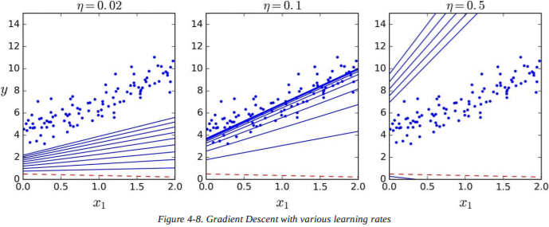

左边的图学习率太低了，算法虽然最终能算出结果，但是会花费大量时间。中间的图学习率看起来不错，它已经收敛到了最终结果。右边的图学习率太高了：算法发散了，跳过了所有数据，每一步都离正确结果越来越远。

为了找到一种好的学习率，你可以使用网格搜索（见第二章）。不过，你也许想限制迭代次数，让网格搜索筛掉收敛时间过久的模型。

你也许想知道如何设置迭代次数。如果次数太少，当算法结束时，你仍然离最优解很远，不过如果次数太多，当模型参数不再改变时，你会浪费许多时间。一种简单的方法是设定一个非常大的迭代次数，但当梯度向量变得很小时停止迭代——“很小”就是小于一个极小值  （称为容差（*tolerance*））——这时候梯度下降就（几乎）达到了最小值。

> **收敛率**
> 当损失函数是凸函数，并且斜率不会突变时（就像均方差损失函数），那么学习率固定的批量梯度下降有一个  的收敛率。换言之，如果你把  缩小10倍（为了得到更精确的解），那么算法的迭代次数会增加10倍。

### 随机梯度下降

批量梯度下降的主要问题是每一步计算梯度都要使用整个训练集，如果训练集过大，速度就会很慢。与之完全相反，**随机梯度下降**（*Stochastic Gradient Descent*），每一步都从训练集中随机挑选一个实例，只在这个单一实例上计算梯度。显然，这样算法会快很多，因为每次迭代时处理的数据都很少。这个算法可以训练大数据集，因为每次迭代只需要把一个实例放进内存（SGD可作为核外算法应用）。

另一方面，由于它的随机性，算法不像批量梯度下降那么有规律：损失函数会上下跳动，只在整体上具有下降趋势，而不是缓缓下降直到最小值。随时间流逝，它会很接近最小值，不过它不会停下，而是永远在周围跳动（见图4-9）。所以算法一旦停止，最终参数还不错，但不是最优。

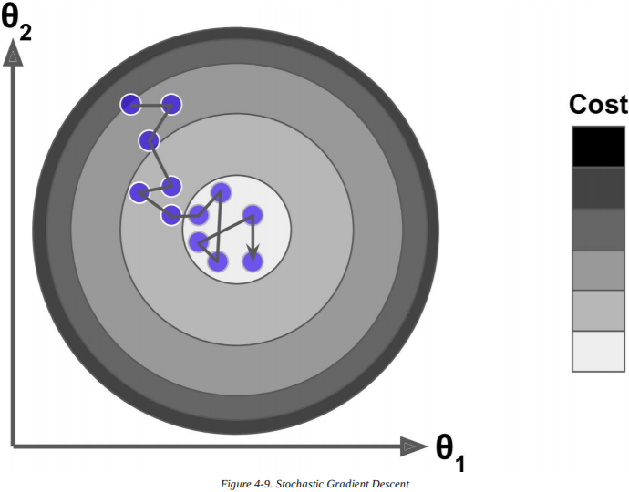

当损失函数非常不规律时（比如图4-6），这样其实能跳出局部最小值，所以在寻找全局最小值的问题上，随机梯度下降要优于批量梯度下降。

尽管随机能跳过局部最优，不过这也意味着永远无法到达最小值。解决两难问题的一个方法是逐渐减小学习率。开始时步长很大（有助于快速前进，并跳过局部最小），然后慢慢变小，让算法在全局最小处停止。这个过程被称为**模拟退火**（*simulated annealing*），因为它很像冶金时熔化金属慢慢冷却的退火过程。决定每次迭代的学习率的函数称为**学习进度**（*learning schedule*）。如果学习率下降过快，你可能会困在局部最小值中，甚至在半路就停止了。如果学习率下降过慢，你可能会在最小值附近长时间浮动，如果你过早停止训练，最终只能得到一个次优解。

下面的代码使用了一个简单的学习进度，实现了随机梯度下降：

```python
n_epochs = 50 
t0, t1 = 5, 50  #learning_schedule的超参数

def learning_schedule(t):
    return t0 / (t + t1)

theta = np.random.randn(2,1)	# random initialization

for epoch in range(n_epochs):
    for i in range(m):
        random_index = np.random.randint(m)
        xi = X_b[random_index:random_index+1]
        yi = y[random_index:random_index+1]
        gradients = 2 * xi.T.dot(xi,dot(theta)-yi)
        eta = learning_schedule(epoch * m + i)
        theta = theta - eta * gradiens
```

按照惯例，我们一般迭代m轮，每一轮都称为一代（*epoch*）。当批量梯度下降需要在训练集上迭代 100 次时，这段代码只需要迭代 50 次就能得到不错的解。
 
```python
>>> theta
array([[4.21076011],
       [2.74856079]])
```

图4-10展现了训练的前 10 步（注意它们的不规则性）。

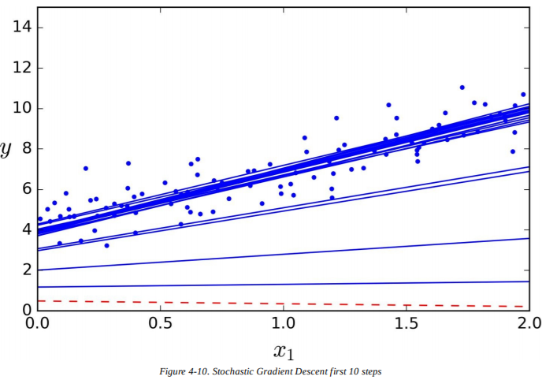

注意，尽管实例是随机挑选的，在每一代中，相同的实例可能会被挑选数次，而其他的一些可能从未被选中。如果你想确保在每一代中算法能遍历所有的实例，另一种方法是打乱训练集，再逐个遍历所有实例，然后再次打乱，以此类推。不过，这样会收敛得更慢。

要使用 Scikit-Learn 的 SGD 来实现线性回归，你可以使用`SGDRegressor`类，它默认最优化均方差损失函数。下面的代码会迭代 50 次，以 0.1 的学习率开始（`eta0=0.1`），使用默认的学习进度（和之前的不同），不使用任何正则化（`penalty=None`，还有更多细节）

```python
from sklearn.linear_model import SGDRegressor
sgd_reg + SGDRregressor(n_iter=50, penalty=None, eta0=0.1)
sgd_reg.fit(X,y.ravel())
```

你再一次发现返回的结果和正规方程的解很接近：

```python
>>> sgd_reg.intercept_, sgd_reg.coef_
(array([4.18380366]),array([2.74205299]))
```

### 小批量梯度下降

我们最后要介绍的算法是**小批量梯度下降**(*Mini-batch Gradient Descent*)。当你知道批量梯度下降和随机梯度下降后，它就好理解多了：在每一步中，它不像批量梯度下降，在整个训练集上计算梯度，也不像随机梯度下降，只在一个实例上计算梯度，小批量梯度下降在少量随机实例集（被称为小批量）上计算梯度。小批量梯度下降胜过随机梯度下降的主要优点是，你可以得到进行矩阵运算的硬件优化的性能提升，尤其是使用 GPU 的时候。

算法在参数空间上的表现比随机梯度下降要稳定，尤其是当小批量的数量很多时。所以，小批量梯度下降最终会比 SGD 更接近最小值。不过，另一方面，它也不容易跳出局部最小值（对于存在局部最小值的问题，不像先前见到的线性回归）。图4-11展现了三种梯度下降算法在参数空间中训练的路程。它们最终都很接近最小值，但是批量梯度下降最终停在了最小值，而随机梯度下降和小批量梯度下降都在周围浮动。不过，别忘了批量梯度下降每步都会花很长的时间，如果使用合适的学习进度，随机梯度下降和小批量梯度下降也能到达最小值。

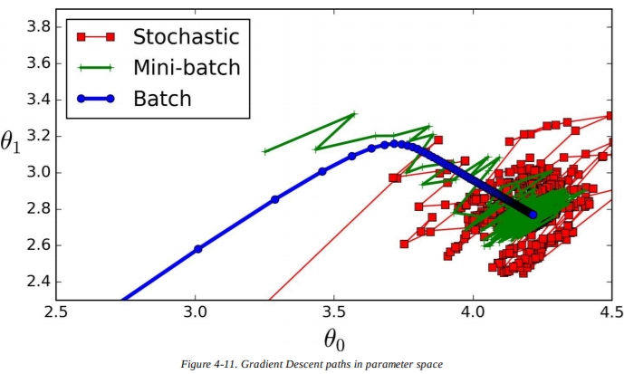

让我们来比较一下迄今为止的线性回归算法（m是训练实例的数量，n是特征的数量），见表4-1：

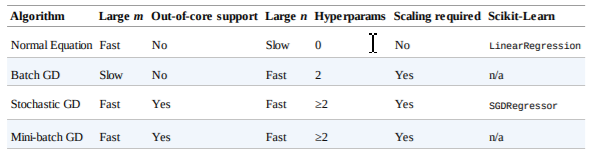

> **笔记**
> 它们在训练之后几乎没有区别：所有的算法最终都会得到相似的模型，以同样的方式做出预测。

## 多项式回归

如果你的数据实际上比简单的直线要更复杂呢？令人惊讶的是，你能用线性模型拟合非线性数据。一种简单的方法是给每个特征加权后作为新特征，在扩展的特征集上训练一个线性模型。这种技术称为**多项式回归**（*Polynomial Regression*）。

来看一个例子。首先，基于简单的二次方程生成一些非线性数据（增加一些噪音，见图4-12）。

```python
m = 100
X = 6 * np.random.rand(m, 1) - 3
y = 0.5 * X**2 + X + 2 + np.random.randn(m, 1)
```

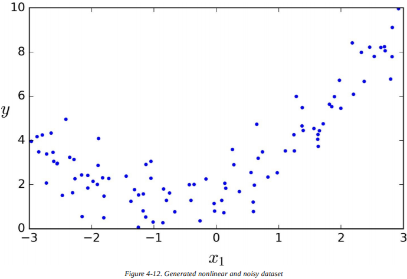

很明显，直线永远也不能合适地拟合这些数据。所以使用 Scikit-Learn 的`PolynomialFeatures`类来转换训练数据，在训练集中增加每个特征的平方（二次多项式）作为新特征（在本例中只有一个特征）：

```python
>>> from sklearn.preprocessing import PolynomialFeatures
>>> poly_features = PolynomialFeatures(degree=2,include_bias=False)
>>> X_poly = poly_features.fit_transform(X)
>>> X[0]
array([-0.75275929])
>>> X_poly[0]
array([-0.75275929, 0.56664654])
```

`X_poly`包含`x`的原始特征和它的平方。现在你能用`LinearRegression`模型来拟合扩展的训练集了（图4-13）：

```python
>>> lin_reg = LinearRegression()
>>> lin_reg.fit(X_poly, y)
>>> lin_reg.intercept_, lin_reg.coef_
(array([ 1.78134581]), array([[ 0.93366893, 0.56456263]]))
```

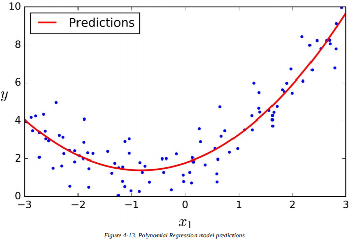

还不错：模型估计  ，实际上原始函数是  高斯噪音。

注意，当有多个特征时，多项式回归能找到特征之间的关系（这是普通的线性回归模型做不到的）。这是因为`PolynomialFeatures`增加了给定阶数的所有特征的组合。例如，如果有两个特征  和  ，三阶的`PolynomialFeatures`不仅会增加特征  ，  ，  和  ，也有组合  ，  和  。

> **警告**
> d阶的`PolynomialFeatures`将包含  个特征的数组转换为包含  个特征的数组，  是  的阶乘（*factorial*），等于  。当心特征数量的组合爆炸！

## 学习曲线

如果你使用高阶的多项式回归，它拟合数据的效果可能会比普通的线性回归模型更好。例如，图4-14在之前的训练集上使用了300阶的多项式模型，把它和纯线性模型、二项式模型进行比较。注意 300 阶的多项式模型是如何扭动而尽可能接近训练实例的。

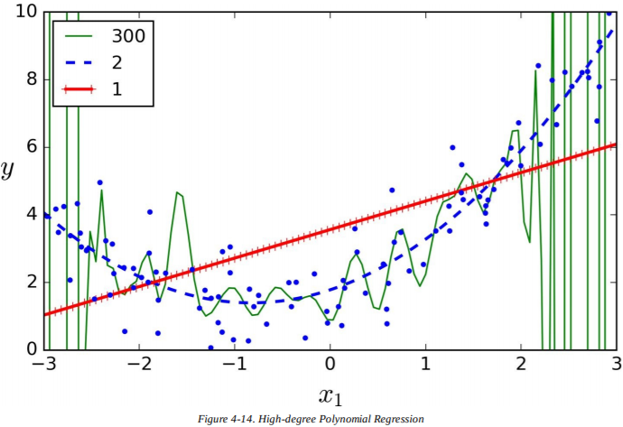

当然，高阶的多项式模型严重过拟合训练数据，而线性模型则欠拟合了。在本例中泛化最好的模型是二次项模型。因为数据是由二项式生成的，不过通常你不会知道是什么函数生成的数据，所以你该如何决定你的模型有多复杂？你该怎么知道自己的模型是过拟合还是欠拟合？

在第二章中，你使用交叉验证来得到模型泛化性能的评估。如果一个模型在训练数据上表现很好，但是通过交叉验证指标，得到的泛化很糟糕，那么你的模型过拟合了。如果两者皆糟糕，那么就是欠拟合了。这是一种分辨模型是过于简单还是过于复杂的方法。

另一种方法是看**学习曲线**（*learning curves*）：绘制模型在训练集和验证集上的表现，作为训练集规模的函数。为了泛化数据，在训练集不同规模的子集上简单训练模型多次。下面的代码定义了一个函数，用于绘制给定训练集模型的学习曲线：

```python
from sklearn.metrics import mean_squared_error
from sklearn.model_selection import train_test_split

def plot_learning_curves(model, X, y):
    X_train, X_val, y_train, y_val = train_test_split(X, y, test_size=0.2)
    train_errors, val_errors = [], []
    for m in range(1, len(X_train)):
        model.fit(X_train[:m], y_train[:m])
        y_train_predict = model.predict(X_train[:m])
        y_val_predict = model.predict(X_val)
        train_errors.append(mean_squared_error(y_train_predict, y_train[:m]))
        val_errors.append(mean_squared_error(y_val_predict, y_val))
plt.plot(np.sqrt(train_errors), "r-+", linewidth=2, label="train")
plt.plot(np.sqrt(val_errors), "b-", linewidth=3, label="val")
```

来看看普通线性回归模型的学习曲线（一条直线，图4-15）：


```python
lin_reg = LinearRegression()
plot_learning_curves(lin_reg, X, y)
```

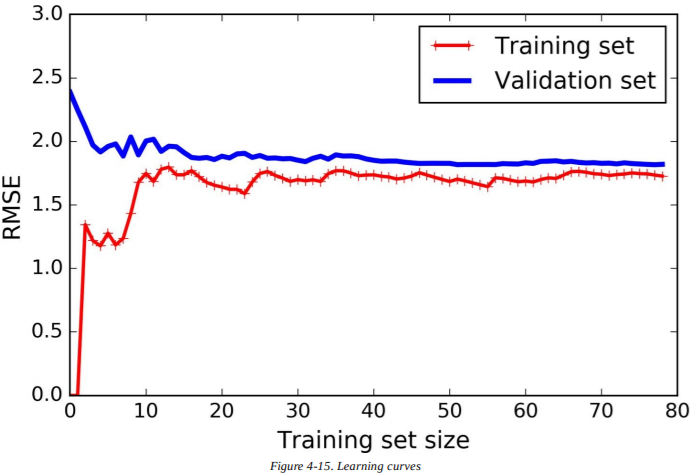

这需要一些解释。首先，来看看训练数据上的表现：当训练集中只有一两个实例时，模型能完美拟合它们，这就是曲线从零开始的原因。但是当新实例加入到训练集中，模型就不能再完美拟合数据了，不仅是因为数据有噪音，而且它也不再是线性了。所以训练数据的误差开始增大，直到它到达一个峰值，此时再增加新实例已经无法影响平均误差了。现在来看模型在验证集上的表现。当模型训练的实例过少时，它不能泛化得很好，这是因为验证误差初始就很大。然后当模型接受更多训练实例时，它开始学习，因此验证误差慢慢下降。不过，直线是无法很好地处理这些数据的，所以误差也停在一个峰值，很接近其他曲线。

这些学习曲线是典型的欠拟合模型。两条曲线都到达了一个峰值，它们很接近，并且相当高。

> **提示**
> 如果你的模型欠拟合了训练数据，增加一些训练实例也许会有所帮助。你需要使用一个更复杂的模型，或者找到更好的特征。

现在来看看 10 阶多项式模型在相同数据上的学习曲线（图4-16）：

```python
from sklearn.pipeline import Pipeline

polynomial_regression = Pipeline((
    ("poly_features", PolynomialFeatures(degree=10, include_bias=False)),
    ("sgd_reg", LinearRegression()),
))

plot_learning_curves(polynomial_regression, X, y)
```

这些曲线和之前的有点相似，不过有两处重要的不同点：

- 训练数据上的误差比在线性回归模型上的要低很多；
- 两条曲线之间有条沟。这意味着模型在训练集上的表现比在验证集上的要好得多，这是过拟合模型的标志。不过，如果你使用一个更大的训练集，两条曲线会继续靠近。

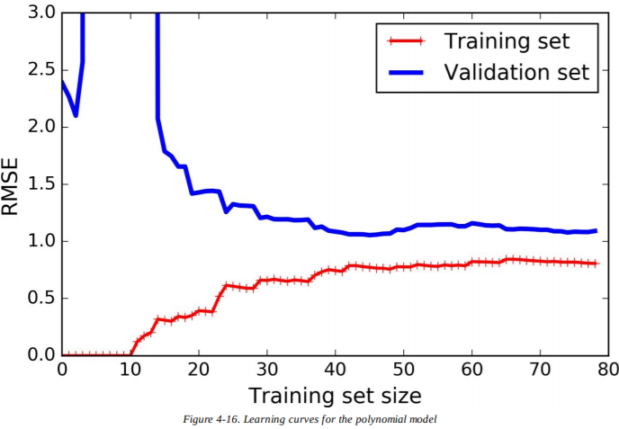

> **提示**
> 一种改善过拟合模型的方法是提供更多的训练数据，直到验证误差与训练误差相等。

> **偏差和方差的权衡**
>
> 在机器学习中和统计学中有一种重要的理论，模型的泛化误差是三种不同误差的总和：
>
> **偏差**（*Bias*）
>
> 这部分泛化误差是因为错误的假设，比如假设数据是线性的，而实际上是二次的。一个高偏差模型最可能欠拟合训练数据。
>
> **方差**（*Variance*）
>
> 这部分是因为对训练数据中细微方差的过度敏感。自由度很高的模型（比如高阶多项式模型）很可能有高方差，因此过拟合训练数据。
>
> **不可约误差**（*Irreducible error*）
>
> 这部分是因为数据本身的噪音。唯一能减少这种误差的方法是清洗数据（比如修复数据源，像是损坏的传感器，或者探测并移除异常值）。
> 增加模型的复杂度会典型地提高方差，降低偏差。相反地，减少模型的复杂度会提高偏差，降低方差。这就是权衡。

## 正则化线性模型

如我们在第一章和第二章中所见，减少过拟合的一种好办法是正则化模型（即，增加限制）：它的自由度越低，就越难过拟合数据。比如，正则化多项式模型的一种简单方法是减少多项式的阶数。

对于一个线性模型而言，正则化主要通过限制模型权重来实现。我们现在岭回归、Lasso回归，以及弹性网络，分别使用了三种不同的方法来限制权重。

### 岭回归

**岭回归**（*Ridge Regression*）（也被称为**吉洪诺夫正则法**（*Tikhonov regularization*））是线性回归的一种正则版本：在损失函数中加入等于  的正则项（*regularization term*）。这样迫使学习算法不仅要拟合数据，也要保持模型权重尽可能小。注意，正则项只能在训练时加入损失函数。一旦模型已经训练好，评估模型性能时要使用未正则化的性能度量。

> **笔记**
> 一般来说，训练时使用的损失函数和测试时使用的性能度量是不一样的。除了正则化，另一个原因是一个优秀的损失函数应该在优化时易于求导，而用于测试的性能度量应该尽可能接近最终的目标。有一个好的例子：分类器在训练时使用类似对数损失（会在稍后讨论）的损失函数，但评估时使用精确率/召回率。

超参数  控制模型的正则化程度。如果  ，岭回归就成了线性回归。如果  很大，所有的权重最终都会接近 0 ，结果就是经过数据平均值的一条水平直线。公式4-8就是岭回归的损失函数：


注意，偏置项  并没有被正则化（累加是从  开始的，而不是  ）。如果我们定义  作为特征权重（  到  ）的向量，那么正规项就等于  ，其中  表示权重向量的  范数。对于梯度下降，只要在均方差梯度向量中增加  。

> **警告**
> 使用岭回归前，对数据进行缩放（比如，使用`StandardScaler`）是很重要的，因为它对输入特征的尺度很敏感。大多数正则化模型都是如此。

图4-17展示了一些在相同的线性数据上使用不同  值的岭回归模型。左图是普通的岭回归模型，得到线性预测结果。右图中，数据首先使用`PolynomialFeatures(degree=10)`进行扩展，然后使用`StandardScaler`进行数据缩放，最后再应用岭回归模型：这就是带有岭正则的多项式回归。注意  增大时，预测曲线会变得平坦（即，更不极端，更合理），这样减少了偏差，但增加了方差。

对于线性回归，我们可以通过计算闭式解方程或者使用梯度下降来应用岭回归。优缺点是相同的。公式4-9展示了闭式解（矩阵  是除了左上角有个 0 的  单位矩阵（*identity matrix*），那个 0 对应偏置项）。

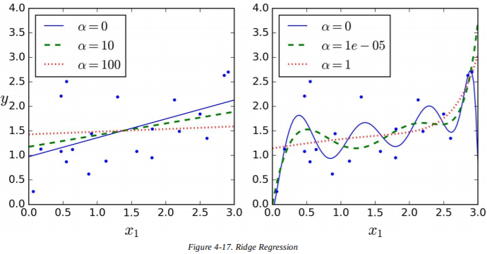


下面的代码是使用Scikit-Learn的闭式解（公式4-9的变形，使用了 André-Louis Cholesky 的矩阵分解技术）实现的岭回归：

```python
>>> from sklearn.linear_model import Ridge
>>> ridge_reg = Ridge(alpha=1, solver="cholesky")
>>> ridge_reg.fit(X, y)
>>> ridge_reg.predict([[1.5]])
array([[ 1.55071465]]
```

以及使用随机梯度下降的代码：

```python
>>> sgd_reg = SGDRegressor(penalty="l2")
>>> sgd_reg.fit(X, y.ravel())
>>> sgd_reg.predict([[1.5]])
array([[ 1.13500145]])
```

超参数`penalty`设定使用的正则项类型。指定"l2"表明你希望随机梯度下降在损失函数中加上一个正则项，数值为权重向量的  范数平方的一半，：这就是普通的岭回归。

### Lasso回归

最小绝对值收敛和选择算子回归（*Least Absolute Shrinkage and Selection Operator Regression*，简称为**Lasso回归**（*Lasso Regression*））是另一种线性回归的正则版本：像岭回归一样，它在损失函数加上一个正则项，不过它使用权重向量的  范数，而不是权重向量的  范数的平方的一半（见公式4-10）。


图4-18和图4-17一样，但是把岭模型换成了 Lasso 模型，使用了一个更小的  值。

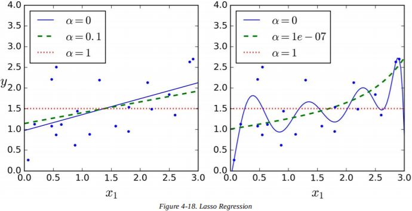

Lasso回归一个重要的特性是它趋向于完全消除最不重要特征的权重（即把它们都设为零）。例如，图4-18（  ）里右图中的虚线看起来像是二次方程，几乎是线性的：所有高阶多项式特征的权重都为零。换言之，Lasso 回归自动实现特征选择并输出稀疏模型（即，非零的权重很少）。

看图4-19，你能知道为什么会是这样的：在左上角的图中，背景等高线（椭圆）代表未正则化的均方差损失函数（ ），白圈显示了批量梯度下降中损失函数的路径。前景等高线（菱形）代表  惩罚，三角显示了仅在惩罚下（  ）批量梯度下降的路径。注意第一次路线是如何到达  的，然后往下滚动直到  。在右上角的图中，等高线代表加上了  惩罚（  ）后同样的损失函数。全局最小值在  轴上。批量梯度下降先到达  ，然后往下滚动直到到达全局最小值。两个底部图和上面的一样，不过使用了  惩罚。正则化后的最小值比未正则化的更接近零，不过权重并未完全消除。

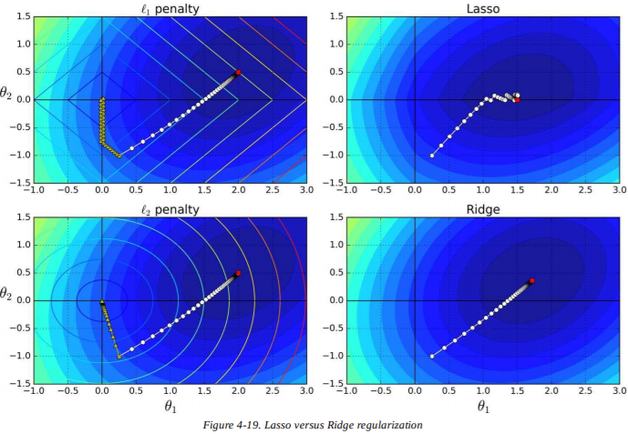

> **提示**
> 在Lasso回归损失函数中，批量梯度下降的路径先下降到低谷后提高，直到终点。这是因为在  时，斜率发生了突变。为了真正收敛到全局最小值，你需要慢慢降低学习率。

Lasso损失函数在  处不可微分，但是如果你使用子梯度向量（*subgradient vector*）  ，梯度下降就能正常运作。公式4-11展示了用于梯度下降中 Lasso 损失函数的子梯度向量等式。


下面是一个使用了Scikit-Learn中`Lasso`类的小例子。你也可以用`SGDRegressor(penalty="l1")`代替。

```python
>>> from sklearn.linear_model import Lasso
>>> lasso_reg = Lasso(alpha=0.1)
>>> lasso_reg.fit(X, y)
>>> lasso_reg.predict([[1.5]])
array([ 1.53788174]
```

### 弹性网络

弹性网络介于岭回归和Lasso回归之间。它的正则项是岭回归和Lasso回归正则项的简单混合，你可以控制混合率  。当  时，弹性网络和岭回归相同，当   时，弹性网络和Lasso回归相同（见公式4-12）。


所以，什么时候用普通的线性回归（即，没有任何正则化），什么时候用岭回归、Lasso或者弹性网络呢？一般来说，有一点正则会更好，所以通常应该避免使用普通的线性回归。岭回归是个不错的默认选项，不过如果你怀疑只有少数特征有用，你可以选择Lasso回归或弹性网络，因为它们会将无用特征的权重降低为零。通常来讲，弹性网络要优于Lasso，因为当特征数量大于训练实例数量时，或是特征之间关联很强时，Lasso会表现得不规律。

下面是一个使用了 Scikit-Learn 的`ElasticNet`（`l1_ratio`和混合率  有关）的简短例子：

```python
>>> from sklearn.linear_model import ElasticNet
>>> elastic_net = ElasticNet(alpha=0.1, l1_ratio=0.5)
>>> elastic_net.fit(X, y)
>>> elastic_net.predict([[1.5]])
array([ 1.54333232])
```

### 早期停止法

一种与众不同的调整迭代学习算法（比如梯度下降）的方法是当验证误差到达最小值时尽快停止训练。这被称为**早期停止法**（*early stopping*）。图4-20展示了一个正在使用批量梯度下降训练的复杂模型（本例中是一个高阶多项式回归模型）。当纪元增加，算法开始学习，训练集上的预测误差（RMSE）自然地下降，验证集上的预测误差也一样。不过，一段时间后验证误差不再下降，反而开始回升。这表明模型开始过拟合数据了。有了早期停止法，你能在验证误差到达最小值时尽快停止训练。它是如此简单而高效的正则技术，以至于 Geoffrey Hinton 将它称为“美丽的免费午餐”。

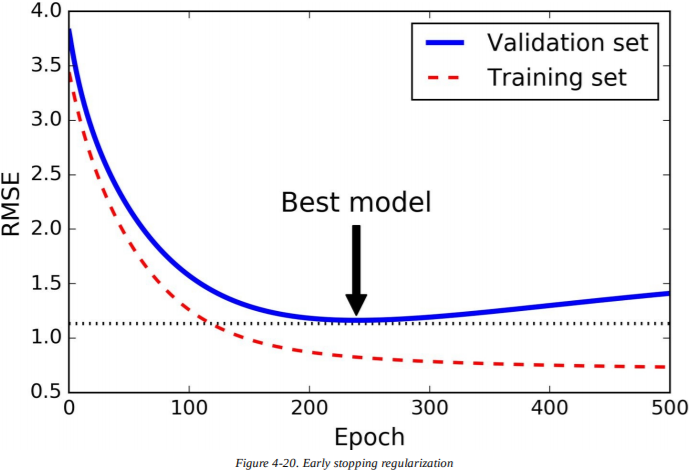

> **笔记**
> 在随机梯度下降和小批量梯度下降中，曲线没有那么光滑，你可能很难确定它是否到达最小值。一种办法是只在验证误差高于最小值一段时间后（当你确信模型不会再变得更好了）才停止，之后将模型参数回滚到验证误差还在最小值的时候。

下面是早期停止法的基础应用：

```python
from sklearn.base import clone
sgd_reg = SGDRegressor(n_iter=1, warm_start=True, penalty=None,learning_rate="constant", eta0=0.0005)

minimum_val_error = float("inf")
best_epoch = None
best_model = None
for epoch in range(1000):
    sgd_reg.fit(X_train_poly_scaled, y_train)
    y_val_predict = sgd_reg.predict(X_val_poly_scaled)
    val_error = mean_squared_error(y_val_predict, y_val)
    if val_error < minimum_val_error:
        minimum_val_error = val_error
        best_epoch = epoch
        best_model = clone(sgd_reg)
```

注意，如果设定`warm_start=True`，当`fit()`方法被回调时，它会从停下来的地方继续训练，而不是从头开始。

## 逻辑回归

我们在第一章中讨论过，有些回归算法也能用于分类（反之亦然）。**逻辑回归**（*Logistic Regression*，也称为*Logit	Regression*）用于清除实例属于某一特定类的概率（比如，邮件属于垃圾邮件的概率）。如果估计的概率大于 50% ，模型预测实例属于这个类（称为正类，标记为“1”），否则预测它不属于这个类（即，它属于负类，标记为“0”）。这样它就是一个二分类器了。

### 概率估计

所以它是怎么运作的？就像线性回归模型一样，逻辑回归模型计算输入特征的权重总和（加上偏置项），不过不像线性回归模型那样直接输出结果，它输出结果的逻辑函数值（*logistic*）（见公式4-13）。


逻辑函数——也称为*logit*，记为  ——是**sigmoid函数**（*sigmoid function*，即 S 形函数），输出介于 0 和 1 之间的数。它的定义见公式4-14和图4-21。


一旦逻辑回归模型估计出实例  属于正类的概率  ，它就能轻松得到预测  （见公式4-15）。


注意，当$t<0$时$\sigma(t)<0.5$，当$t\geq0$时$\sigma(t)\geq0.5$，所以如果$\theta^T\cdot \mathbf{x}$为正类，逻辑回归模型预测为1，如果是负类则预测为0。

### 训练与损失函数

很好，现在你知道逻辑回归是如何进行概率估计和预测的了。不过，它是如何进行训练的？训练的目标是设置参数向量$\theta$，使模型估计正例（$y=1$）的概率高，估计负例（$y=0$）的概率低。等式4-16的单个样例$\mathbf{x}$的损失函数体现了这种思路。


这个损失函数是合理的，因为当$t$接近零时，$-\log(t)$变得很大，所以如果模型估计正例的概率接近0，损失会很大，如果估计反例的概率接近1，损失也很大。另一方面，当$t$接近1时，$-log(t)$接近0，所以如果模型估计一个负例的概率接近0，或估计一个正例的概率接近1，那么损失函数也接近0，那么损失接近0，这正是我们想要的。

整个训练集上的损失函数就是在所有训练实例上的平均损失。它可以写成一个表达式（你能很容易证明），称为**对数损失**（*log loss*），如公式4-17所示。


坏消息是没有已知的闭式方程可以计算最小化损失函数的$\theta$值，不过好消息是损失函数是凸函数，所以梯度下降（或者其他优化算法）可以找到全局最小值（如果学习率不是很大，并且有充足的等待时间）。公式4-18给出了损失函数关于第$j$个模型参数$\theta_j$的偏导数。


这个公式看起来很像公式4-5：它计算每个实例的预测误差，再乘上第$j$个特征值，然后计算所有训练实例的平均值。一旦你得到了包含所有偏导数的梯度向量，就可以在批量梯度下降算法中使用了。你现在知道如何训练一个逻辑回归模型了。对于随机梯度下降，你一次只用一个实例，对于小批量梯度下降，你一次用一个小批量。

### 决策边界

让我们使用鸢尾花数据集来描绘逻辑回归。这是个著名的数据集，包含 150 种鸢尾花的花瓣和花萼长度，来自三个不同的品种——山鸢尾（Iris-Setosa），变色鸢尾（Iris-Versicolor），维吉尼亚鸢尾（Iris-Virginica）（看图4-22）。

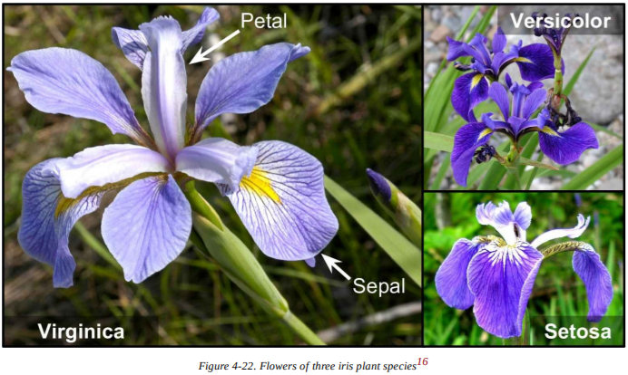

来试着建立创建一个分类器，只基于花瓣长度来检测维吉尼亚鸢尾。首先加载数据：

```python
>>> from sklearn import datasets
>>> iris = datasets.load_iris()
>>> list(iris.keys())
['data', 'target_names', 'feature_names', 'target', 'DESCR']
>>> X = iris["data"][:, 3:] # petal width
>>> y = (iris["target"] == 2).astype(np.int)
```

现在来训练一个逻辑回归模型：

```python
from sklearn.linear_model import LogisticRegression

log_reg = LogisticRegression()
log_reg.fit(X, y)
```

来看看模型对于花瓣长度在 0 到 3 厘米间的鸢尾花的概率估计（图4-23）：

```python
X_new = np.linspace(0, 3, 1000).reshape(-1, 1)
y_proba = log_reg.predict_proba(X_new)
plt.plot(X_new, y_proba[:, 1], "g-", label="Iris-Virginica")
plt.plot(X_new, y_proba[:, 0], "b--", label="Not Iris-Virginica"
```

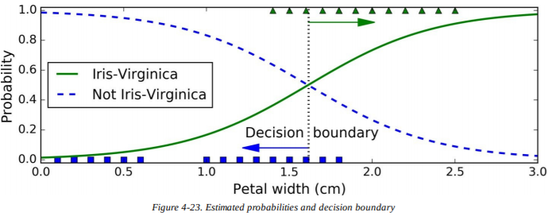

维吉尼亚鸢尾花（用三角形表示）的花瓣长度在 1.4 到 2.5 厘米间，而其他鸢尾花（用正方形表示）的花瓣长度通常更小，在 0.1 到 1.8 厘米间。注意，有一部分重叠了。大约在 2 厘米以上时，分类器高度确信这些花是维吉尼亚鸢尾花（输出了很高的概率），而在 1 厘米以下时，它高度确信这些花不是维吉尼亚鸢尾花（“不是维吉尼亚鸢尾花”的概率很高）。在两个极端之间，分类器是不确定的。不过，如果你让它去预测（使用`predict()`方法，而不是`predict_proba()`方法），它会返回最有可能的那个类别。因此，在 1.6 厘米周围，两边的概率都等于 50% 的地方有一条**决策边界**（*decision boundary*）：如果花瓣长度大于 1.6 厘米，分类器会预测这朵花是维吉尼亚鸢尾花，否则就不是（即便它并不确定）：

```python
>>> log_reg.predict([[1.7], [1.5]])
array([1, 0])
```

图4-24展现了相同的数据集，不过这次展示了两种特征：花瓣宽度和长度。一旦训练好，逻辑回归分类器就能基于两种特征，估计一朵新花是维吉尼亚鸢尾花的概率。虚线表示两者概率都是 50% ：这就是模型的决策边界。注意这是一条线性边界。每条平行线代表模型输出的特定概率，从 15%（左下）到 90% （右上）。所有在右上边界上方的花都有超过 90% 的概率是维吉尼亚鸢尾花。

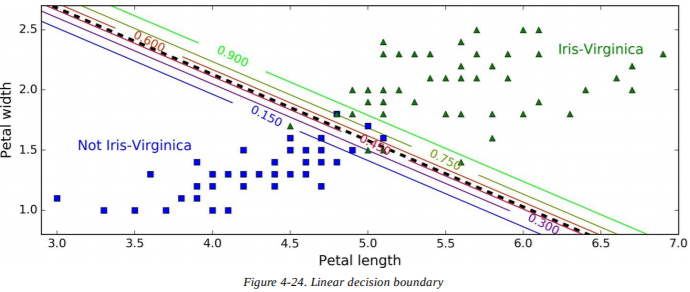

就像其他线性模型一样，逻辑回归模型也能使用$\ell_1$或$\ell_2$惩罚来正则化。事实上，Scikit-Learn默认添加了$\ell_2$惩罚。

> **笔记**
> 在Scikit-Learn的`LogisticRegression`中，控制正则化强度的超参数不是$\alpha$（像其他线性模型一样），而是它的逆：$C$。$C$的值越高，模型的正则化强度越低。

### Softmax 回归

逻辑回归模型可以直接支持多类别分类，无需训练并结合多个二分类器（像第三章中讨论的那样）。这被称为 **Softmax 回归**（*Softmax Regression*），或**多项逻辑回归**（*Multinomial Logistic Regression*）。

思路很简单：对于给定的实例$\mathbf{x}$，Softmax 回归模型首先计算$k$类的分数$s_k(\mathbf{x})$，然后通过应用 softmax 函数（通常也称为归一化指数（*normalized exponential*））来估计每个类的概率。计算$s_k(\mathbf{x})$的等式看起来应该很眼熟，因为它看起来就像线性回归的预测（见公式4-19）。


每个类都有自己的专用参数向量$\theta^{(k)}$。所有的向量都都以行的形式储存在参数矩阵$\Theta$中。

一旦你算出了每个类中每个实例$\mathbf{x}$的的分数，你就可以通过 softmax 函数（公式4-20）估计实例属于类别$k$的概率\hat p_k$$：它计算每个分数的指数，然后把它们归一化（除以所有指数的总和）。


- $K$ 是类别的总数。
- $\mathbf{s}(\mathbf{x})$ 是包含了每个类中的每个实例 $\mathbf{x}$ 的分数的向量。
- $\sigma(\mathbf{s}(\mathbf{x}))_k$ 是给定每一类的分数后，实例 $\mathbf{x}$ 属于类别 $k$ 的估计概率。

就像逻辑回归分类器一样，Softmax 回归分类器也使用最高估计概率预测类别（就是分数最高的类别），像公式4-21中展示的那样。


- *argmax*运算符返回能最大化函数的变量值。在上面的公式中，它返回能最大化估计概率  的 $k$ 值。

> **提示**
> Softmax 回归分类器一次只预测一类（即，它是多分类的，但不是多输出的），所以它只用于判断互斥的类别，像不同种类的植物。你不能用它来识别同一张照片中的多个人。

既然你已经知道模型是如何进行概率估计和预测的了，就让我们来看看训练过程吧。目标是能建立一个在目标类上拥有高概率（因此其他类别的概率很低）的模型。最小化公式4-22中的损失函数，称为**交叉熵**（*cross entropy*），因为当它对目标类的估计概率很低时，它会惩罚模型。交叉熵频繁用于测量待测类与目标类的匹配程度（在后面几章中，我们会多次使用到）。


- 如果第$i$个实例的目标类是$k$，$y_k^{(i)}=1$，否则$y_k^{(i)}=0$ 。

注意，当只有两种类别时（K=2），损失函数和逻辑回归的损失函数一样（对数损失，见公式4-17）。

> **交叉熵**
>
> 交叉熵起源于信息学理论。假设你想高效传输每天的天气信息。如果有 8 个选项（晴天，雨天，等等），你可以用 3 位编码每个选项，因为$2^3=8$。不过，如果你认为每天都是晴天，那么更高效的方法是：只用 1 位（0）编码“晴天”，其他 7 个选项用 4 位（从 1 开始）编码。交叉熵测量每个选项实际发送的平均比特数。如果对于天气的假设是完美的，交叉熵和天气自身的熵（即内部的不可预测性）是相同的。但如果假设是错误的（比如经常下雨），交叉熵会比**相对熵**（KL散度，*Kullback–Leibler divergence*）更大。
>
> 在概率分布 p 和 q 之间的交叉熵被定义为$H(p,q)=-\sum_xp(x)\log q(x)$（分布至少是离散的）。

损失函数关于$\theta^{(k)}$的梯度向量在公式4-23中给出：


现在可以计算每个类的梯度向量了，之后使用梯度下降（或其他优化算法）来找到能最小化损失函数的参数矩阵$\Theta$。

让我们来使用 Softmax 回归，讲鸢尾花分为三类。当你使用`LogisticRegression`在两种以上的类别进行训练时，Scikit-Learn会默认使用一对所有策略，不过你可以把超参数`multi_class`设定为`multinomial`，将它转换为 Softmax 回归。你必须指定一个支持 Softmax 回归的求解器，比如`lbfgs`（更多细节请参阅Scikit-Learn的文档）。它也会默认使用$\ell_2$正则化，你可以通过超参数$C$控制它。

```python
X = iris["data"][:, (2, 3)] # petal length, petal width
y = iris["target"]

softmax_reg = LogisticRegression(multi_class="multinomial",solver="lbfgs", C=10)
softmax_reg.fit(X, y)
```
所以，下一次当你发现一朵花瓣 5 厘米长、2 厘米宽的鸢尾花时，你可以询问模型它是哪种鸢尾，模型会回答它有 94.2% 的概率是维吉尼亚鸢尾花（类别 2 ），或者它有 5.8% 的概率是变色鸢尾花。

```python
>>> softmax_reg.predict([[5, 2]])
array([2])
>>> softmax_reg.predict_proba([[5, 2]])
array([[ 6.33134078e-07, 5.75276067e-02, 9.42471760e-01]])是
```
图4-25用不同背景颜色展示了决策边界的结果。注意，任意两种类间的决策边界都是线性的。这张图也用曲线展示了变色鸢尾花的概率（比如，标记了 0.450 的线代表 45% 概率的边界）。注意，模型能预测概率估计低于 50% 的类别。比如，在所有决策边界相交的一点，所有的类别都有 33% 的估计概率。

## 练习

1. 如果你有成千上万的训练集，你该使用哪种线性回归训练算法？
2. 假设你训练集中的特征数值尺度都不同，哪种算法受到的影响最大？它是如何影响算法的？你该怎么做？
3. 当训练逻辑回归模型时，梯度下降会陷在局部最小值中吗？
4. 如果运行时间足够久，所有的梯度下降算法最终会得到相同的模型吗？
5. 假设你使用批量梯度下降，在每一代都绘制了验证误差。如果你注意到验证误差一直上升，可能发生了什么？你该如何修复它？
6. 当验证误差上升时，立即停止小批量梯度下降是个好主意吗？
7. 哪个梯度下降算法（在讨论过的范围中）能最快到达最优解的附近？哪一种最终会收敛？你该如何让剩余的算法也收敛？
8. 假设你在使用多项式回归。你绘制了学习曲线，注意到在训练误差和验证误差之间有条很大的沟。发生了什么？解决的三种办法是什么？
9. 假设你在使用岭回归，并注意到训练误差和验证误差都一样高。你认为模型是高偏差还是高方差？你应该增加正则参数$\alpha$还是降低它？
10. 你何时会想要使用：
- 岭回归，而不用普通的线性回归（即没有任何正则）？
- Lasso回归，而不用岭回归？
- 弹性网络，而不用Lasso回归？
11. 假设你想将照片分类为室内/室外和白天/夜晚。你应该使用两个逻辑回归分类器还是一个 Softmax 回归分类器？
12. 在 Softmax 回归上应用批量梯度下降的早期停止法（不使用Scikit-Learn）。
