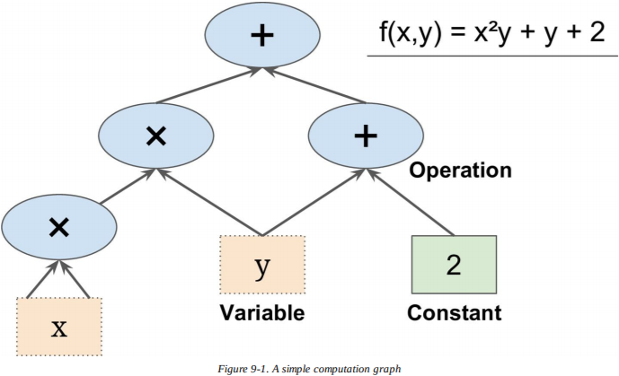
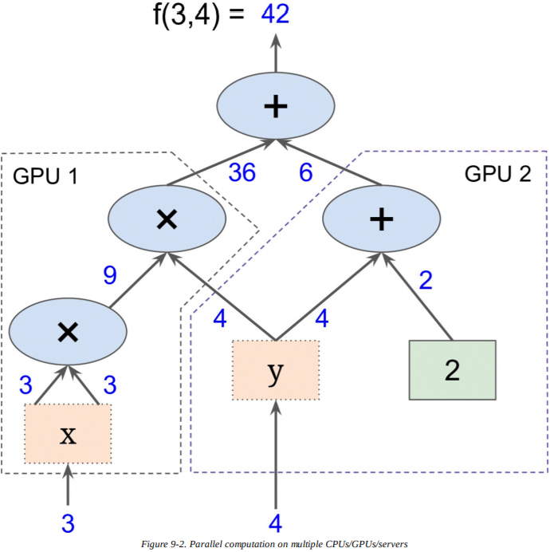
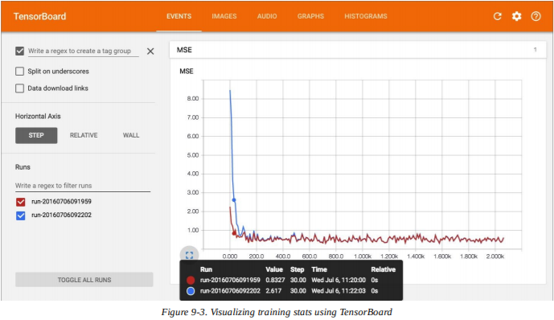
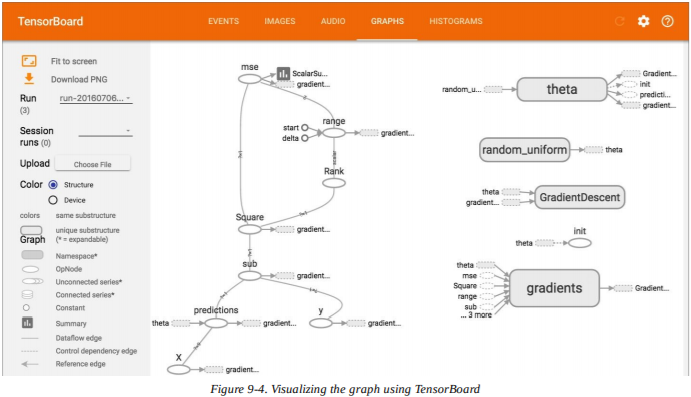
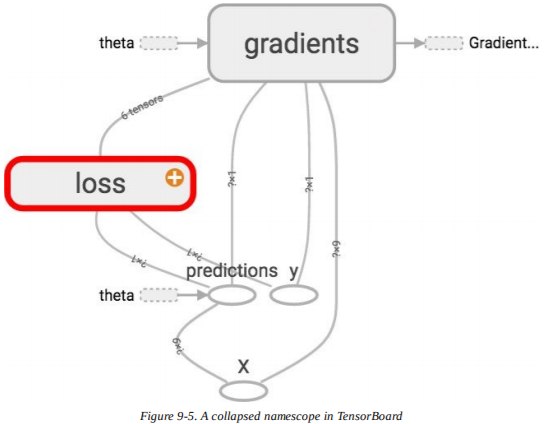
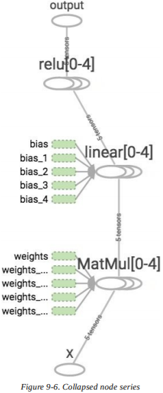
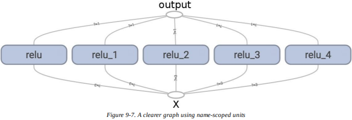
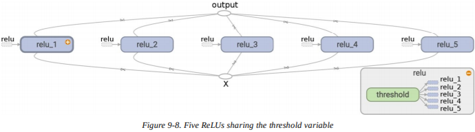
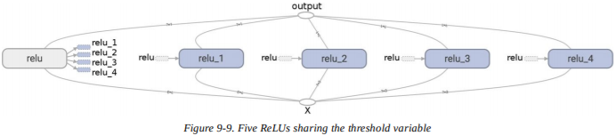

# 第九章：启动与运行 Tensorflow

*TensorFlow* 是一个用于数值计算的强大的开源软件库，尤其适用于大规模机器学习的微调。它的基本原理很简单：先用 Python 定义要执行的计算图（例如图 9-1），之后 TensorFlow 会使用优化的 C++ 代码高效运行该图。



最重要的是，可以将图分为多块，在多个 CPU 或 GPU 上并行运行（见图 9-2 ）。 TensorFlow 也支持分布式计算，所以你可以通过在数百台服务器上分割计算，在合理的时间内用庞大的数据集训练大型神经网络（见第十二章）。 Tensorflow 能在由数十亿实例组成、每个实例有数百万特征的训练集上训练一个带有数百万参数的网络。这没什么好惊讶的，因为 Tensorflow 是由 Google Brain 团队开发的，它支持许多谷歌的大规模服务器，比如 Google Cloud Speech， Google Photos 和 Google	Search 。



当 Tensorflow 在 2015 年 11 月开源时，在深度学习上已经有许多流行的开源库了（表 9-1 列举了一些），公平地说，大部分 Tensorflow 的功能已经存在于其他一些库中。尽管如此， Tensorflow 清晰的设计、可扩展性、灵活性和优秀的文档（更不用说 Google 的名声了）飞速让它荣登榜首。简而言之， Tensorflow 被设计成灵活的、可扩展的、生产就绪的，现有的三种框架中只讨论到了两种。下面是一些 Tensorflow 的亮点：

- 它不仅能在 Windows 、 Linux 和 MacOS 上运行，还能在移动设备上运行，包括 Android 系统和 iOS 系统。
- 它提供了非常简单的 Python API ，称为 *TF.Learn* （`tensorflow.contrib.learn`），兼容 Scikit-Learn 。接下来你会看到，只需几行代码，你就能用它训练各种神经网络。它之前是一个称为 *Scikit Flow* （或 *skflow* ）的独立项目。
- 它也提供另一个简单的 API ，称为 *TF-slim* （`tensorflow.contrib.slim`），来简化构建、训练和评估神经网络。
- 其他一些高级的 API 已经在 Tensorflow 之上独立构建，比如 [Keras](http://keras.io) （现在可以通过`tensorflow.contrib.keras`来使用） 和 [Pretty Tensor](https://github.com/google/prettytensor/) 。
- 它的核心 Python API 提供了更多的灵活性（以更高的复杂性为代价）来创建各种计算，包括任何你能想到的神经网络架构。
- 它包括了许多机器学习操作的高效 C++ 实现，特别是那些需要构建神经网络的。还有 C++ API ，能定义自己的高性能操作。
- 它提供了一些高级优化节点，用于搜寻最小化损失函数的参数。它们都很易于使用，因为 Tensorflow 会自动处理你定义函数的梯度。这被称为**自动微分**（ *automatic differentiating*，或 *autodiff* ）。
- 它也有一个优秀的可视化工具，称为 *TensorBoard* ，你可以浏览计算图，观察学习曲线等等。
- Google 还推出了 [用于运行 Tensorflow 图的的云服务](https://cloud.google.com/ml) 。
- 最后，它还有一支热忱的团队，和一群热情而乐于助人的开发者，以及一个致力于不断改善的成长中的社区。它是 GitHub 上最流行的开源项目之一，有越来越多的优秀项目正在基于它进行构建（例如，在 [https://www.tensorflow.org/](https://www.tensorflow.org/) 或 [https://github.com/jtoy/awesome-tensorflow](https://github.com/jtoy/awesome-tensorflow) 上查看资源页面）。如果要提问技术性问题，你应该使用 [http://stackoverflow.com/](http://stackoverflow.com/) ，将你的问题标记为 “`tensorflow`” 。你也可以通过 GitHub 提交 bug 和功能需求。对于一般讨论，可以加入 [Google 小组](http://goo.gl/N7kRF9) 。

在本章中，我们会介绍 Tensorflow 的基础，从安装到创建、运行、保存和可视化简单的计算图。在你创建自己的第一个神经网络前（下一章我们会进行），熟练掌握这些基础很重要。


## 安装

来开始吧！假设你已经在第二章跟着安装说明安装了 Jupyter 和 Scikit-Learn ，你可以简单地使用 pip 来安装 Tensorflow 。如果你使用 virtualenv 构建了独立环境，你首先需要激活它：

```
$ cd $ML_PATH   # 你的机器学习工作路径(e.g., $HOME/ml)
$ source env/bin/activate
```

接下来，安装 Tensorflow ：

```
pip3 install --upgrade tensorflow
```

> **笔记**
> 为了 GPU 支持，你需要安装`tensorflow-gpu`而不是`tensorflow`。详见第十二章。

输入以下命令，来测试你的安装。它应该输出你安装的 Tensorflow 版本。

```
$ python3 -c 'import tensorflow; print(tensorflow.__version__)'
1.0.0
```

## 创建你的第一个图，在会话中运行

下面的代码会创建图 9-1 中的图：

```python
import tensorflow as tf
x = tf.Variable(3, name="x")
y = tf.Variable(4, name="y")
f = x*x*y + y + 2
```

这样就完成了！要理解的最重要的事是代码并不执行任何计算，即使它看起来做了（尤其是最后一行）。它只创建了一个计算图。事实上，甚至连变量都没有初始化。为了对图求值，你需要打开一个 Tensorflow 的会话（*session*），并用它初始化变量和求`f`值。 Tensorflow 的会话负责处理在 CPU 或 GPU 设备上的操作并运行它们，它会保留所有的变量值。下面的代码会创建一个会话，初始化变量，求出`f`的值，之后关闭会话（释放资源）。

```python
>>> sess = tf.Session()
>>> sess.run(x.initializer)
>>> sess.run(y.initializer)
>>> result = sess.run(f)
>>> print(result)
42
>>> sess.close()
```

每次都不得不重复`sess.run()`有点麻烦，不过幸运的是有更好的方法：

```python
with tf.Session() as sess:
    x.initializer.run()
    y.initializer.run()
    result = f.eval()
```

在`with`块代码中，会话被设置为默认会话。调用`x.initializer.run()`和调用`tf.get_default_session().run(x.initializer)`是等效的，类似地，调用`f.eval()`和调用`tf.get_default_session().run(f)`也是等效的。这样就增加了代码的可读性。此外，会话会在块代码的最后自动关闭。

你可以使用`global_variables_initializer()`函数，无需手动初始化每个单独变量。注意，它并不会立即执行初始化，而是在图中创建一个节点，它在运行时会初始化所有变量：

```python
init = tf.global_variables_initializer()  # 准备初始化节点
with tf.Session() as sess:
    init.run()	# 事实上初始化了所有变量
    result = f.eval()
```

在 Jupyter 或者 Python Shell 中，你可能会偏于创建一个`InteractiveSession`。它与常规`Session`的唯一区别是当`InteractiveSession`被创建时，它会自动被设为默认会话，所以你不需要再写一个`with`块了（但是当你完事后，你需要手动关闭会话）。

```python
>>> sess = tf.InteractiveSession()
>>> init.run()
>>> result = f.eval()
>>> print(result)
42
>>> sess.close()
```

一个 Tensorflow 程序通常被分为两部分：第一部分会构建一个计算图（被称为构造阶段（*construction phase*）），第二部分会运行它（这是执行阶段（*execution phase*））。构造阶段通常建立计算图，代表机器学习模型以及所需用于训练的计算。执行阶段通常进行循环，重复对训练步骤求值（例如，每步一个小批量），逐渐改善模型的参数。我们稍后会有一个样例。

## 管理图

任何你所创建的节点都会被自动加入默认图中：

```python
>>> x1 = tf.Variable(1)
>>> x1.graph is tf.get_default_graph()
True
```

大多数情况下它运行没问题，但是有时你也许想要管理多个独立图。你可以创建新的`Graph`，暂时在`with`块中将它设为默认图，像这样：

```python
>>> graph = tf.Graph()
>>> with graph.as_default():
...     x2 = tf.Variable(2)
...
>>> x2.graph is graph
True
>>> x2.graph is tf.get_default_graph()
False
```

> **提示**
> 在 Jupyter （或 Python Shell ）中，在实验时通常会多次运行同一个命令。因此，你可能会得到有许多重复节点的默认图。一种解决方法是重启 Jupyter 内核（或 Python Shell ），不过更便捷的方法是运行`tf.reset_default_graph()`，重置默认图。

## 节点值的生命周期

当你求一个节点的值时， Tensorflow 会自动确定依赖的节点集，并优先求出这些节点的值。例如，考虑下面的代码：

```python
w = tf.constant(3)
x = w + 2
y = x + 5
z = x * 3
with tf.Session() as sess:
    print(y.eval())	  # 10
    print(z.eval())	  # 15
```

首先，代码定义了一个非常简单的图。之后它启动了会话，运行图来对`y`求值： Tensorflow 自动检测到`y`依赖于`x`，而`x`依赖于`w`，所以它会优先计算`w`，然后是`x`，再是`y`，之后返回`y`的值。最后，代码运行图来求`z`的值。再次强调， Tensorflow 检测到它必须先对`w`和`x`求值。有一点很重要，之前求得的`w`和`x`不会被重用。简而言之，之前的代码会计算`w`和`x`两次。

所有的节点值都会在图运行间被删除，除了被会话跨图保持的变量值（队列和读写器也会保持一些状态，详见第十二章）。变量在初始化时开始生命周期，在会话关闭时结束生命周期。

如果你想要高效地计算`y`和`z`，而不用在之前的代码中求两次`w`和`x`，你必须让 Tensorflow 在一张图运行时同时计算`y`和`z`，就像下面的代码一样：

```python
with tf.Session() as sess:
    y_val, z_val = sess.run([y, z])
    print(y_val)    # 10
    print(z_val)    # 15
```

> **警告**
> 在单进程 Tensorflow 中，多会话并不共享状态，即便它们重用了同一张图（每个会话都有属于自己的每个变量的备份）。在分布式 Tensorflow 中（见第十二章），变量状态储存在服务器上，不在会话上，所以多会话也能共享同变量。

## Tensorflow 实现线性回归

Tensorflow 操作（也简称为 *ops* ）可以接收任意数量的输入，生成任意数量的输出。例如，加法和乘法操作接收两个输入，生成一个输出。常量和变量无需输入（被称为源操作（*source ops*））。输入与输出是多维数组，被称为**张量**（*tensors*，也是名字 “tensor flow” 的由来）。就像 NumPy 的数组，张量也有类型和形状。事实上，在 Python API 中，张量可以简单地用 NumPy 数组来表示。它们通常包含浮点数，不过你也可以让它们来承载字符串（任意字节的数组）。

迄今为止的样例中，张量只包含了单个标量值，不过你当然可以对任何形状的数组进行计算。例如，下面的代码操作二维数组，在加利福尼亚房价数据集上实现了线性回归（在第二章介绍过）。它从获取数据开始，之后在所有训练实例上添加一个额外的偏置输入特征（  ）（这一步使用了 NumPy ，所以能立即运行）；再之后它会创建两个 Tensorflow 常量节点`X`和`y`来保存数据和目标，并用一部分 Tensorflow 提供的矩阵操作定义`theta`。这些矩阵函数——`transpose()`，`matmul()`和`matrix_inverse()`——都是不言自明的，不过和往常一样，它们并不会立即执行计算。相反地，它们在图中创建节点，在图运行的时候节点就会执行。你也许意识到了`theta`的定义对应于正规方程（见第四章）。最后，这些节点创建一个会话，用它来计算`theta`。

```python
import numpy as np
from sklearn.datasets import fetch_california_housing

housing = fetch_california_housing()
m, n = housing.data.shape
housing_data_plus_bias = np.c_[np.ones((m, 1)), housing.data]

X = tf.constant(housing_data_plus_bias, dtype=tf.float32, name="X")
y = tf.constant(housing.target.reshape(-1, 1), dtype=tf.float32, name="y")
XT = tf.transpose(X)
theta = tf.matmul(tf.matmul(tf.matrix_inverse(tf.matmul(XT, X)), XT), y)

with tf.Session() as sess:
    theta_value = theta.eval()
```

如果你有 GPU 的话，和直接用 NumPy 计算正规方程相比，这段代码的主要优点是 Tensorflow 会自动在你的 GPU 上运行（如果你安装了有 GPU 支持的 Tensorflow ，当然，详见第十二章）。

## 实现梯度下降

让我们来试试使用批量梯度下降（在第四章介绍过），而不用正规方程。首先，我们会手动计算梯度，之后我们会使用 Tensorflow 的 autodiff 功能来使 Tensorflow 自动计算梯度，最后我们会使用一些 Tensorflow 现成的优化器。

> **警告**
> 当你使用梯度下降时，记住首先标准化输入特征向量是很重要的，否则训练可能会很慢。你可以通过 Tensorflow 、 NumPy 、 Scikit-Learn 的`StandardScaler`，或者其他你更偏好的解决方法来完成这一步。下面的代码假设标准化已经完成。

### 手动计算梯度

下面的代码应该相当容易看懂，除了一些新的元素：

- `random_uniform()`函数在图中创建一个新的节点，会生成一个包含了随机值的张量，给定形状和值域，类似 NumPy 的`rand()`函数。
- `assign()`函数创建一个节点，它会赋给变量新值。在本例中，它实现了批量梯度下降的步骤  。
- 主要的循环会一遍遍执行训练步骤（共`n_epochs`次），每 100 次循环都会打印当前的均方误差（`mse`）。你应该看到每次迭代均方误差都在下降。

```python
n_epochs = 1000
learning_rate = 0.01

X = tf.constant(scaled_housing_data_plus_bias, dtype=tf.float32, name="X")
y = tf.constant(housing.target.reshape(-1, 1), dtype=tf.float32, name="y")
theta = tf.Variable(tf.random_uniform([n + 1, 1], -1.0, 1.0), name="theta")
y_pred = tf.matmul(X, theta, name="predictions")
error = y_pred - y
mse = tf.reduce_mean(tf.square(error), name="mse")
gradients = 2/m * tf.matmul(tf.transpose(X), error)
training_op = tf.assign(theta, theta - learning_rate * gradients)

init = tf.global_variables_initializer()

with tf.Session() as sess:
    sess.run(init)
    
    for epoch in range(n_epochs):
        if epoch % 100 == 0:
            print("Epoch", epoch, "MSE =", mse.eval())
        sess.run(training_op)
        
    best_theta = theta.eval()
```

### 使用自动微分

之前的代码运行没问题，但是它需要从损失函数（ MSE ）中利用数学推导梯度。在线性回归的例子中，这相当简单，但是如果你在深度神经网络也这么做，你会有点儿头疼：这将会是乏味而易错的。你可以使用符号微分（*symbolic differentiation*）来自动找到偏导数的方程，不过生成的代码并不一定非常有效。

为了理解原因，考虑函数 f(x)=exp(exp(exp(x))) 。如果你知道微积分，你能求出它的导数 f′(x)=exp(x) × exp(exp(x)) × exp(exp(exp(x))) 。如果你将 f(x) 和 f'(x) 分别按照它们的样子编写代码，那么你的代码不会太有效。更有效的解决方法是写一个函数，先计算 exp(x) ，之后是 exp(exp(x)) ，再是 exp(exp(exp(x))) ，并返回这三个值。这样可以直接得到 f(x) （第三项），如果你需要导数，将三项全部相乘即可。用传统方法你不得不调用`exp`函数九次来计算 f(x) 和 f'(x) ，而用这种方法你只需要调用三次。

当你的函数被任意代码定义时，它会变得更糟。你能找到计算下面函数偏导数的方程（或代码）吗？提示：别试。

```python
def my_func(a, b):
    z = 0
    for i in range(100):
        z = a * np.cos(z + i) + z * np.sin(b - i)
    return z
```

幸运的是， Tensorflow 的自动微分功能可以帮上忙：它会自动而高效地为你计算梯度。只需简单地将上一节梯度下降代码中`gradients = ...`这一行替换为下面的一行代码，它会继续正常运行。

```python
gradients = tf.gradients(mse, [theta])[0]
```

`gradients()`函数获取了 op （本例中是`mse`）和一个变量列表（本例中只有`theta`），它为每个变量创建了 op 列表，来计算 op 关于每个变量的梯度。所以`gradients`节点会计算均方误差对于`theta`的梯度向量。

有四种自动计算梯度的主要方法。表 9-2 进行了总结。 Tensorflow 使用**反向模式自动微分**（*reverse-mode autodiff*），当输入很多、输出很少时它的表现很完美（高效而准确），比如在神经网络中。它只需遍历图  次就能计算所有输出关于输入的偏导数。


如果你对它的工作原理感兴趣，请参阅附录 D 。

### 使用优化器

Tensorflow 会为你计算梯度。不过可以更简单：它也提供了许多现成的优化器，包括梯度下降优化器。你可以简单地把之前的`gradients = ...`和`training_op = ...`替换为下面的代码，一切都会正常工作：

```python
optimizer = tf.train.GradientDescentOptimizer(learning_rate=learning_rate)
training_op = optimizer.minimize(mse)
```

如果你想使用不同类型的优化器，你只需要改动一行代码。例如，你可以像这样定义优化器，来使用动量优化器（它通常比梯度下降收敛更快，见第十一章）：

```python
optimizer = tf.train.MomentumOptimizer(learning_rate=learning_rate, momentum=0.9)
```

## 为训练算法提供数据

让我们修改之前的代码，实现小批量梯度下降。因此，我们需要一种在每个迭代中用下一个小批量替换`X`和`y`的方法。最简单的方法是使用占位符节点。这些节点是特别的，因为它们并不进行任何计算，它们只输出你在运行时让它们输出的数据。它们通常用于在训练时将训练数据传递给 Tensorflow 。如果你在运行时没有给占位符指定值，会发生异常。

要创建占位符节点，你必须调用`placeholder()`函数，并指定输出张量的数据类型。你也可以选择指定它的形状。如果指定一个维度为`None`，意味着“任意大小”。例如，下面的代码创建了占位符节点`A`，以及节点`B = A + 5`。当我们计算`B`的值时，我们将`feed_dict`传给指定`A`值的`eval()`方法。注意，`A`必须是 2 级的（即，它必须是二维的），并且必须有三列（否则会产生异常），不过可以有任意数量的行。

```python
>>> A = tf.placeholder(tf.float32, shape=(None, 3))
>>> B = A + 5
>>> with tf.Session() as sess:
...     B_val_1 = B.eval(feed_dict={A: [[1, 2, 3]]})
...     B_val_2 = B.eval(feed_dict={A: [[4, 5, 6], [7, 8, 9]]})
...
>>> print(B_val_1)
[[ 6.  7.  8.]]
>>> print(B_val_2)
[[  9.  10.  11.]
 [ 12.  13.  14.]]
```

> **笔记**
> 其实你可以提供任意操作的输出，不仅仅是占位符的。在本例中， Tensorflow 并不对这些操作求值，它只使用你提供的数据。

为了实现小批量梯度下降，我们只需稍微调整已有的代码。首先改变`X`和`y`在构造阶段的定义，把它们变为占位符节点：

```python
X = tf.placeholder(tf.float32, shape=(None, n + 1), name="X")
y = tf.placeholder(tf.float32, shape=(None, 1), name="y")
```

之后定义批量大小，并计算批量的总数：

```python
batch_size = 100
n_batches = int(np.ceil(m / batch_size))
```

最后，在执行阶段逐一获取小批量，当对依赖于`X`或`y`的节点求值时，通过`feed_dict`参数提供`X`和`y`的值。

```python
def fetch_batch(epoch, batch_index, batch_size):
    [...]  # 从硬盘加载数据
    return X_batch, y_batch
with tf.Session() as sess:
    sess.run(init)

    for epoch in range(n_epochs):
        for batch_index in range(n_batches):
            X_batch, y_batch = fetch_batch(epoch, batch_index, batch_size)
            sess.run(training_op, feed_dict={X: X_batch, y: y_batch})
            
    best_theta = theta.eval()
```

> **笔记**
> 在计算`theta`时，我们不需要传递`X`和`y`的值，因为`theta`不依赖于它们。

## 保存与恢复模型

一旦你训练好了模型，应该将参数保存在硬盘，所以你可以随时回来、在另一个程序中使用它、将它与其他模型进行比较等等。此外，你也许想在训练时定期保存检查点，这样即便在训练时计算机发生崩溃，你也可以从最后一个检查点继续运行，而不必从头开始。

Tensorflow 的保存与恢复模型十分简单。只需在构造阶段的最后（所有变量节点都创建好之后）创建`Saver`节点；之后在执行阶段，在你想保存模型的时候只需调用`save()`方法，将会话和检查点文件的路径出传给它。

```python
[...]
theta = tf.Variable(tf.random_uniform([n + 1, 1], -1.0, 1.0), name="theta")
[...]
init = tf.global_variables_initializer()
saver = tf.train.Saver()

with tf.Session() as sess:
    sess.run(init)
    
    for epoch in range(n_epochs):
        if epoch % 100 == 0:  # 每 100 次迭代就设置检查点
            save_path = saver.save(sess, "/tmp/my_model.ckpt")
        
        sess.run(training_op)
    
    best_theta = theta.eval()
    save_path = saver.save(sess, "/tmp/my_model_final.ckpt")
```

恢复模型也一样简单：像之前一样在构造阶段的最后创建`Saver`，不过在执行阶段的开始，不用`init`节点初始化变量，而是调用`Saver`对象的`restore()`方法：

```python
with tf.Session() as sess:
    saver.restore(sess, "/tmp/my_model_final.ckpt")
    [...]
```

`Saver`默认保存和恢复所有名下的变量，不过如果你需要更多的控制，你可以指定要保存或恢复的具体变量，以及要使用的名字。例如，下面的`Saver`只会保存在名字`weights`名下的`theta`变量。

```python
saver = tf.train.Saver({"weights": theta})
```

### 可视化图与使用 TensorBoard 的训练曲线

所以现在我们有了用小批量梯度下降训练了线性回归模型的计算图，并且定期保存检查点。听起来很复杂是吧？不过，我们仍然依赖`print()`函数来可视化训练的过程。有一种更好的方法：选择 TensorBoard 。如果你提供给它一些统计数据，它就会在你的网页浏览器上显示统计数据的交互式可视化（比如，学习曲线）。你也能提供给它图的定义，它会给你到浏览器的优秀接口。这对于在图中识别错误、寻找瓶颈层等等很有用。

第一步是调整你的程序，以便将图的定义和一些训练统计数据——比如说，训练误差（ MSE ）——写入 TensorBoard 能读取的日志目录。每次运行程序你都需要使用不同的日志目录，否则 TensorBoard 会将不同 runs 的统计数据混合，会把视图弄乱。最简单的解决方法是在日志目录名字中加入时间戳。在程序的开始加入下面的代码：

```python
from datetime import datetime

now = datetime.utcnow().strftime("%Y%m%d%H%M%S")
root_logdir = "tf_logs"
logdir = "{}/run-{}/".format(root_logdir, now)
```

接下来，在构造阶段的最后加入下面的代码：

```python
mse_summary = tf.summary.scalar('MSE', mse)
file_writer = tf.summary.FileWriter(logdir, tf.get_default_graph())
```

第一行在图中创建了一个节点，它计算均方误差的值，并将其写入称为 *summary* 的兼容 TensorBoard 的二进制日志字符串中。第二行创建了一个`FileWriter`，你会用于将 summary 写入日志目录的日志文件中。第一个参数表明日志文件的路径（本例中是形如 *tf_logs/run-20160906091959/* 的字符串，相对于当前目录）。第二个（可选的）参数是你想要可视化的图。一经创建，如果日志目录不存在，`FileWriter`便会自行创建（如有需要，还会创建它的父目录），并将图的定义写入被称为事件文件（*events file*）的二进制日志文件。

接下来你需要更新执行阶段，在训练期间有规律地计算`mse_summary`节点（比如每 10 个小批量）。它会输出一个 summary ，你稍后可以用`file_writer`将它写入事件文件中。以下是更新后的代码：

```python
[...]
for batch_index in range(n_batches):
    X_batch, y_batch = fetch_batch(epoch, batch_index, batch_size)
    if batch_index % 10 == 0:
        summary_str = mse_summary.eval(feed_dict={X: X_batch, y: y_batch})
        step = epoch * n_batches + batch_index
        file_writer.add_summary(summary_str, step)
    sess.run(training_op, feed_dict={X: X_batch, y: y_batch})
[...]
```

> **警告**
> 要避免在每一步训练时记录训练数据，因为它会大幅降低训练速度。

最终，你要在程序的最后关闭`FileWriter`：

```python
file_writer.close()
```

现在运行这个程序：它会创建日志目录并写入一个事件文件，包括图的定义和均方误差的值。打开一个 shell 终端，前往工作目录，输入`ls -l tf_logs/run*`列出日志目录的所有内容：

```
$ cd $ML_PATH # Your ML working directory (e.g., $HOME/ml)
$ ls -l tf_logs/run*
total 40
-rw-r--r-- 1 ageron staff 18620 Sep 6 11:10 events.out.tfevents.1472553182.mymac
```

如果你再次运行程序，你会在 *tf_logs/* 目录中看到第二个目录：

```
$ ls -l tf_logs/
total 0
drwxr-xr-x 3 ageron staff 102 Sep 6 10:07 run-20160906091959
drwxr-xr-x 3 ageron staff 102 Sep 6 10:22 run-20160906092202
```

很好！是时候启动 TensorBoard 服务器了。你需要激活你的`virtualenv`环境，之后通过运行`tensorboard`命令来打开服务器，指向根日志目录。这样会打开 TensorBoard 的网页服务器，监听端口 6006 （就是倒着写的 “goog” ）。

```
$ source env/bin/activate
$ tensorboard --logdir tf_logs/
Starting TensorBoard on port 6006
(You can navigate to http://0.0.0.0:6006)
```

接下来打开浏览器，前往 [http://0.0.0.0:6006/](http://0.0.0.0:6006/) （或 [http://localhost:6006/](http://localhost:6006/) ）。欢迎来到 TensorBoard ！在 Events 选项卡中你应该看右边的均方误差。如果你进行点击，你会看到不同 runs 的均方误差在训练中的曲线（图 9-3 ）。你可以检查或不检查你想见的 runs ，放大或缩小，悬停在曲线上获取更多细节等等。



现在点击 Graph 选项卡。你应该看图 9-4 中的图表。

为了减少混乱，有许多边（即连接其他节点）的节点被分离到右边的辅助区域（你可以通过右键在主图和辅助区域之间来回移动一个节点）。在默认情况下，图的某些部分也会崩溃。例如，尝试在`gradients`节点上悬停，点击  图标来扩展它的子图。接下来，在子图中试着扩展`mse_grad`子图。



> **提示**
> 如果你想直接看一眼 Jupyter 内的图，在本章你可以使用 notebook 中可用的`show_graph()`函数。它最初是由 A. Mordvintsev 写于伟大的 [deepdream tutorial notebook](http://goo.gl/EtCWUc) 。另一种选择是下载 E. Jang 的 [TensorFlow debugger tool](https://github.com/ericjang/tdb) ，它包含了 Jupyter 的图形可视化扩展（及更多）。

## 命名域

在处理像神经网络这样更复杂的模型时，图很有可能被数千节点弄乱。为了避免这种情况，你可以创建**命名域**（*name scopes*）对相关节点进行分组。例如，让我们修改之前的代码，用一个叫做`"loss"`的命名域来定义`error`和`mse`操作：

```python
with tf.name_scope("loss") as scope:
    error = y_pred - y
    mse = tf.reduce_mean(tf.square(error), name="mse")
```

每个操作在命名域中定义的名字现在加上了`"loss/"`前缀：

```python
>>> print(error.op.name)
loss/sub
>>> print(mse.op.name)
loss/mse
```
在 TensorBoard 中，`mse`和`error`节点现在出现在`loss`命名空间中了，默认情况下会发生崩溃（图 9-5 ）。



## 模块化

假设你想创建一个图，将两个**整流线性单元**（*rectified linear units*，ReLU）相加。 ReLU 计算输入的线性函数，如果为正输出结果，否则输出 0 ，如公式 9-1 所示。


下面的代码实现了这一功能，但重复性很高：

```python
n_features = 3
X = tf.placeholder(tf.float32, shape=(None, n_features), name="X")
w1 = tf.Variable(tf.random_normal((n_features, 1)), name="weights1")
w2 = tf.Variable(tf.random_normal((n_features, 1)), name="weights2")
b1 = tf.Variable(0.0, name="bias1")
b2 = tf.Variable(0.0, name="bias2")
z1 = tf.add(tf.matmul(X, w1), b1, name="z1")
z2 = tf.add(tf.matmul(X, w2), b2, name="z2")
relu1 = tf.maximum(z1, 0., name="relu1")
relu2 = tf.maximum(z1, 0., name="relu2")
output = tf.add(relu1, relu2, name="output")
```

如此重复的代码很难维护，且容易出错（事实上，这段代码含有复制粘贴错误，你发现了吗？）。如果你想加入更多的 ReLU ，它可能会变得更糟。幸运的是， Tensorflow 会让你保持 DRY （ Don’t Repeat Yourself ，不要重复自己）：只创建一个函数来构建 ReLU 。下面的代码会创建 5 个 ReLU ，并输出它们的总和（注意，`add_n()`会计算张量列表的总和）。

```python
def relu(X):
    w_shape = (int(X.get_shape()[1]), 1)
    w = tf.Variable(tf.random_normal(w_shape), name="weights")
    b = tf.Variable(0.0, name="bias")
    z = tf.add(tf.matmul(X,	w), b, name="z")
    return tf.maximum(z, 0., name="relu")

n_features = 3
X = tf.placeholder(tf.float32, shape=(None, n_features), name="X")
relus = [relu(X) for i in range(5)]
output = tf.add_n(relus, name="output")
```

注意，当你创建一个节点时， Tensorflow 会检查它的名称是否已存在，如果已存在，它会附加下划线，后面跟上索引，使该名称唯一。所以第一个 ReLU 包含名为`"weights"`，`"bias"`，`"z"`和`"relu"`（加上默认名称的更多节点，比如`"MatMul"`）；第二个 ReLU 包含名为`"weights_1"`，`"bias_1"`，以此类推的节点；第三个 ReLU 同理，包含`"weights_2"`，`"bias_2"`等等的节点。 TensorBoard 会识别这样的系列，将它们折叠以减少混乱（见图 9-6 ）。



使用命名域可以使图更清晰。简单地将所有`relu()`的内容移到同一个命名域中。图 9-7 展示了生成的图。注意 Tensorflow 也通过附加`_1`，`_2`等等使命名域唯一。

```python
def relu(X):
    with tf.name_scope("relu"):
        [...]
```



## 共享变量

如果你想要在图的多个组件间共享变量，一种简单的选择是先创建好，再将它作为参数传递给需要它的函数。例如，假设你想要使用所有 ReLU 共享的变量`threshold`控制 ReLU 的阈值（现在被硬编码为 0 ）。你可以先创建变量，再将它传递给`relu()`函数：

```python
def relu(X, threshold):
    with tf.name_scope("relu"):
        [...]
        return tf.maximum(z, threshold, name="max")
        
threshold = tf.Variable(0.0, name="threshold")
X = tf.placeholder(tf.float32, shape=(None, n_features), name="X")
relus = [relu(X, threshold) for i in range(5)]
output = tf.add_n(relus, name="output")
```

这段代码运行良好：现在你可以通过`threshold`变量控制所有 ReLU 的阈值了。然而，如果就像这里一样，有许多共享变量，总是得将它们作为参数传递是很痛苦的。有些人会创建一个 Python 目录，包含模型中所有的参数，将它传递给每个函数。还有的人会为每个模块创建一个类（比如使用类变量来处理共享参数的`ReLU`类）。还有一种选择是在第一次调用时将共享变量设为`relu()`函数的属性，如下所示：

```python
def relu(X):
    with tf.name_scope("relu"):
        if not hasattr(relu, "threshold"):
            relu.threshold = tf.Variable(0.0, name="threshold")
        [...]
        return tf.maximum(z, relu.threshold, name="max")
```

Tensorflow 提供了另一种选择，代码可能比之前的解法更清晰和模块化。这种方法起初有一点难理解，不过因为它在 Tensorflow 中多次使用，值得一探个中奥秘。思路是使用`get_variable()`函数，如果共享变量不存在，则新建一个，如果已存在就重用。所需的行为（创建或重用）由当前`variable_scope()`的属性控制。例如，下面的代码会创建一个名为`"relu/threshold"`的变量（作为标量，因为`shape=()`，且使用 0.0 作为初始值）：

```python
with tf.variable_scope("relu"):
    threshold = tf.get_variable("threshold", shape=(),
                                initializer=tf.constant_initializer(0.0))
```

注意，如果变量已通过之前调用`get_variable()`创建，代码会引发异常。这种行为能避免错误地重用变量。如果你想重用变量，则需要明确将变量域的`reuse`属性设为`True`（你不必指定形状或初始值）：

```python
with tf.variable_scope("relu", reuse=True):
    threshold = tf.get_variable("threshold")
```

这段代码会获取已存在的`"relu/threshold"`变量，如果不存在的话就报错，如果未创建的话就使用`get_variable()`。或者，你可以通过调用域的`reuse_variables()`方法，在块中将`reuse`属性设置为`True`：

```python
with tf.variable_scope("relu") as scope:
    scope.reuse_variables()
    threshold = tf.get_variable("threshold")
```

> **警告**
> 一旦`reuse`被设为`True`，它就不能在块内再被设置回`False`。此外，如果你在其中定义了其他的变量域，它们会自动继承`reuse=True`。最后一点，只有`get_variable()`创建的变量才可以这样重用。

现在你已经具备了让`relu()`函数访问`threshold`变量的所有要素，不再需要再将它作为参数传递：

```python
def relu(X):
    with tf.variable_scope("relu", reuse=True):
        threshold = tf.get_variable("threshold")    # 重用已存在的变量
        [...]
        return tf.maximum(z, threshold, name="max")
        
X = tf.placeholder(tf.float32, shape=(None, n_features), name="X")
with tf.variable_scope("relu"):     # 创建变量
    threshold = tf.get_variable("threshold", shape=(),
                                initializer=tf.constant_initializer(0.0))
    
relus = [relu(X) for relu_index in range(5)]
output = tf.add_n(relus, name="output")
```

这段代码首先定义了`relu()`函数，再创建了`relu/threshold`变量（作为会被初始化为 0.0 的标量），调用`relu()`函数建立了五个 ReLU 。`relu()`函数重用`relu/threshold`变量，并创建其他 ReLU 的节点。

> **笔记**
> 用`get_variable()`创建的变量始终以`variable_scope`的名称作为前缀（比如`"relu/threshold"`），但是对于其他节点（包括用`tf.Variable()`创建的变量），变量域表现得如同一个新的变量域。特别地，如果已经创建具有相同名称的变量域，那么就添加后缀使名称唯一。例如，之前代码创建的所有节点（除了`threshold`变量）都有前缀`"relu_1/"`到`"relu_5/"`，如图 9-8 所示。



不幸的是，`threshold`变量必须定义在`relu()`函数之外，而 ReLU 的其余部分都在里面。为了解决这个问题，下面的代码在第一次调用时就在`relu()`内创建了`threshold`函数，然后在后续调用中重用。现在`relu()`函数不必再担心命名域或变量分享了：只需调用`get_variable()`，就会创建或重用`threshold`变量（它无需知道是哪种情况）。剩余的代码调用`relu()`五次，确保在第一次调用时设为`reuse=False`，其余的调用则设为`reuse=True`。

```python
def relu(X):
    threshold = tf.get_variable("threshold", shape=(),
                                initializer=tf.constant_initializer(0.0))
    [...]
    return tf.maximum(z, threshold, name="max")

X = tf.placeholder(tf.float32, shape=(None, n_features), name="X")
relus = []
for relu_index in range(5):
    with tf.variable_scope("relu", reuse=(relu_index >= 1)) as scope:
        relus.append(relu(X))
output = tf.add_n(relus, name="output")
```

生成的图和之前略有不同，因为共享变量在第一个 ReLU 中（见图 9-9 ）。



至此就结束了 Tensorflow 的介绍。在接下来的章节中，我们会讨论更多高级话题，尤其是许多和深度神经网络、卷积神经网络、循环神经网络有关的操作，以及如何使用多线程、队列、多 GPU 和多服务器来扩展 Tensorflow 。

## 练习

1. 和直接执行计算相比，创建计算图的主要优点是什么？主要缺点是什么？
2. `a_val = a.eval(session=sess)`和`a_val = sess.run(a)`相同吗？
3. `a_val, b_val = a.eval(session=sess)`，`b.eval(session=sess)`和`a_val, b_val = sess.run([a, b])`相同吗？
4. 能在同一个会话中运行两张图吗？
5. 如果你创建了一个包含变量`w`的图`g`，之后开启两个线程，在每个线程中打开一个会话，使用同样的图`g`，每个会话都有变量`w`的备份，还是会共享它？
6. 变量何时被初始化？何时被销毁？
7. 占位符和变量有什么区别？
8. 当你运行图，去计算一个依赖于你未提供值的占位符的操作时会发生什么？如果操作不依赖占位符又会发生什么？
9. 当你运行图时，你是能提供任何操作的输出值，还是只有占位符的值？
10. 如何将变量设定为你想要的任意值（在执行阶段）？
11. 为了计算损失函数关于 10 个变量的梯度，反向模式自动微分需要遍历图多少次？前向模式自动微分呢？符号微分呢？
12. 使用 Tensorflow 实现小批量梯度下降的逻辑回归。在卫星训练集上对它训练并评估（在第五章介绍过）。试着加入附加功能：
- 在能被简单重用的`logistic_regression()`函数内定义图。
- 训练期间使用`Saver`定期保存检查点，在训练的最后保存最终模型。
- 如果训练被中断，则在启动时恢复最后一个检查点。
- 使用好的域定义图，让图在 TensorBoard 中视觉效果良好。
- 添加摘要，在 TensBoard 中可视化学习曲线。
- 试着微调一些超参数，比如学习率或小批量大小，观察学习曲线的形状。
