# 第一章：机器学习总览

当大多数人听到“机器学习”时，他们会在脑海中描绘一个机器人——可靠的男管家，或者是致命的终结者，由你的命令决定。但是机器学习不只是未来的幻想，它已经存在于现实了。事实上，在一些专业领域上它已经应用几十年了，比如**光学字符识别**（OCR）。不过，第一个真正变成主流的机器学习应用，改善了成千上万人民的生活，在20世纪90年代接管了世界——它就是**垃圾邮件过滤器**。虽然并不是一个有自我认知的天网系统，但是在技术上有资格作为机器学习（它已经学习得足够好了，以致于你几乎再也不需要标记一封邮件为垃圾邮件）。它被成百的机器学习应用所追随，这些应用现在低调地为数百种你经常使用的产品和功能提供支持，来自更好的推荐使用语音搜索。

机器学习是从何而起，向何而终？对于机器而言，**学习**事物究竟意味着什么？如果我下载一个维基百科的备份，我的计算机真的会学到什么吗？它会突然更聪明吗？在这一章，我们将会由此开始——阐明机器学习到底是什么，以及为什么你可能会想要用它。

然后，在我们启程去探索机器学习大陆之前，我们会先看一眼地图，了解主要地区和最显眼的地标——监督与无监督学习，在线与批量学习，基于实例与基于模型的学习。之后我们将着眼于一个典型的机器学习计划的工作流程，讨论你可能会遇到的主要挑战，包括如何评估与微调机器学习系统。

这一章节介绍了许多基本概念（和行话），每个数据科学家都应该牢记于心。它会是个高级概述（唯一一章没有很多代码的），一切都很简单，不过你应该确保在继续接下来的内容之前，一切都清晰明了。那么，拿一杯咖啡，让我们开始吧。

> **提示**
>
> 如果你已经了解了所有机器学习的基础，你可能会想直接跳到第二章。如果你不确定，在行动之前先试着回答章节后罗列的所有问题。

## 什么是机器学习？

机器学习是编程计算机的科学（和艺术），所以它们能够**从数据中学习**。

下面是一个更广义的定义：

> 机器学习是一门学习领域——给计算机学习的能力，而没有明确的编程。（Arthur Samuel, 1959）

另一个和工程相关的定义：

> 假设用P来评估计算机程序在某任务类T上的性能，若一个程序通过利用经验E在T中任务上获得了性能改善，则我们就说关于T和P，该程序对E进行了学习。（Tom Mitchell, 1997，此句翻译来自周志华《机器学习》）

举个例子，你的垃圾邮件过滤器是个机器学习程序，它能根据被标记的（比如由用户标记）的垃圾邮件和常规邮件（非垃圾邮件，通常被称为“ham”）的样例，来标记垃圾邮件。系统用来学习的样例被称为**训练集**（*training set*）。每一个训练样例被称为**训练实例**（*training instance*）（或者**样本**（*sample*））。在这种情况下，任务T是在新邮件中标记出垃圾邮件，经验E是**训练数据**（*training data*），性能指标P需要定义——比如说，你可以使用被正确分类的邮件的比率。这个特别的性能指标被称为**精度**（*accuracy*），它在分类任务中经常被使用。

如果你只是下载了维基百科的备份，你的计算机只是多了些数据，并没有在任何任务上突然变聪明。因此，这不是机器学习。


## 为什么使用机器学习？

考虑一下你会如何用传统的编程技术来写一个垃圾邮件过滤系统（图1-1）：

1. 首先，你会看看垃圾邮件长什么样。你可能会注意到一些相同的词语或短语（比如“4U”，“信用卡”，“免费”，“amazing”），它们在同一封邮件中出现很多次。也许你也会注意到一些其他的模式，比如发件人姓名、邮件的正文，等等。
2. 你可能会为每一个你注意到的模式写一个检测算法，如果许多这样的模式被检测到，你的程序就会将其标记为垃圾邮件。
3. 你将测试你的程序，重复步骤1和2直到它足够优秀。

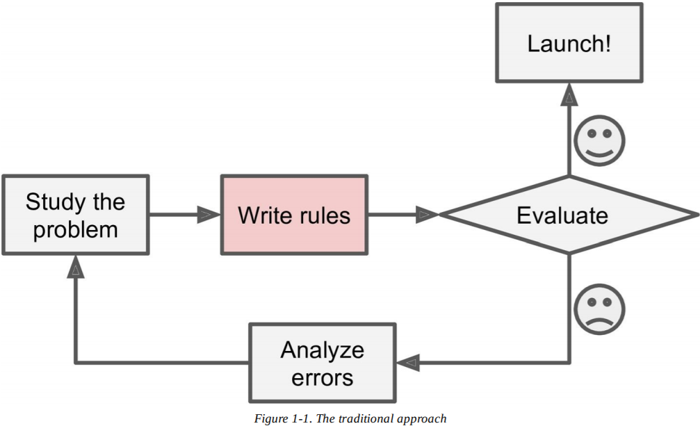

这个问题并不简单，你的程序可能会变成一长串复杂的规则——很难维护。

相反，基于机器学习技术的垃圾邮件过滤器通过与常规邮件作比较，检测垃圾邮件样例中异常频繁的单词模式，自动学习哪些单词和短语是检测垃圾邮件的预测值（图1-2）。这样的程序要短多了，更容易维护，而且很可能更准确。

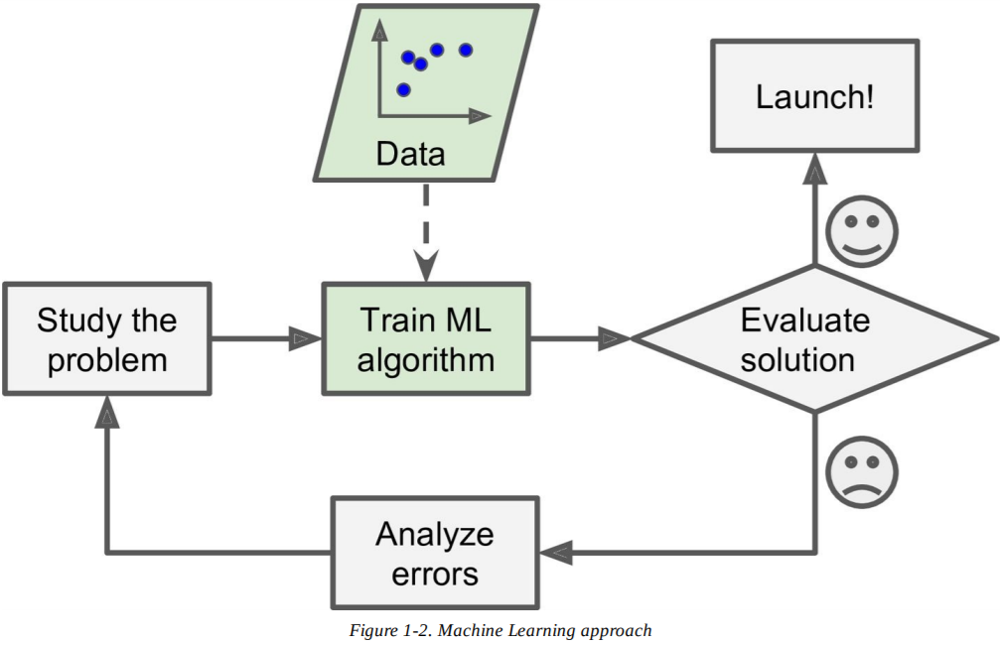

此外，如果垃圾邮件发送者注意到所有包含“4U”的邮件都被拦截了，他们可能会开始写“For U”。使用传统编程技术的垃圾邮件过滤器需要更新，标记“For U”的邮件。如果垃圾邮件发送者一直这么干，你可能要写一辈子新规则。

相反，基于机器学习技术的垃圾邮件过滤器会自动注意到，在用户标记的垃圾邮件中，“For U”变得异常频繁，它会在你没有介入的情况下开始标记它们（图1-3）。

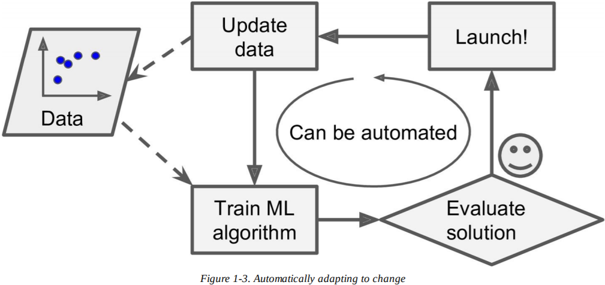

另一个机器学习大放光彩的地方是解决对于传统方法而言过于复杂，或者没有已知算法可以解决的问题。例如，考虑一下语音识别：你想写一个简单可行的程序来区分单词“one”和“two”。你也许会注意到，单词“two”以一个高音“T”为首，所以你可以硬编码一个算法来测量高音的强度，用它来区分“one”和“two”。显然，这种技术无法测量在嘈杂的环境中数百万各异的人所说的上千不同语言的词语。最优解（至少在现在）是写一个自己会学习的算法，给出许多单词的录音样例。

最后，机器学习能帮助人类学习（图1-4）：我们能调查机器学习算法学到了什么（尽管对某些算法而言这有些棘手）。譬如，一旦垃圾邮件过滤器接受了充分的训练，很容易通过调查，发现它所认为的是垃圾邮件的最佳预测指标的单词列表和组合。有时候会发现一些意想不到的相关性或新的趋势，从而导致更好地理解问题。

应用机器学习挖掘大数据能帮助发现不明显的模式。这叫做**数据挖掘**（*data mining*）。

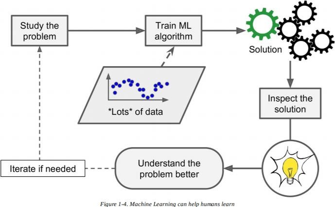

总结一下，机器学习适用于：

- 解决方法需要手动调整或规则列表很长的问题：机器学习算法经总能简化代码，表现更好。
- 如果使用传统方法，根本没有良好解决方法的复杂问题：最好的机器学习技术能找到一种解决方法。
- 波动环境：机器学习系统能适应新数据。
- 深入了解复杂问题或者大数据。


## 机器学习系统的类型

机器学习系统的类型繁多，根据以下内容对它们进行广泛分类是很有用的：

* 是否由人类监督训练（有监督，无监督，半监督和强化学习）
* 是否可以动态学习（在线和批量学习）
* 是简单地将新数据点与已知数据点进行比较，还是检测训练数据中的模式并建立预测模型，像科学家一样（基于实例和基于模型的学习）

这些标准并不是唯一的，你可以用自己喜欢的方式组合它们。比如说，最先进的垃圾邮件过滤器可以使用神经网络模型即时学习，它由使用的垃圾邮件和常规邮件训练过。这样它就是一个在线、基于模型的有监督学习系统。

让我们更进一步来看这些标准。


### 监督/无监督学习

机器学习系统可以根据他们在训练期间获得的监督的数量和类型进行分类。有四种主要类别：有监督学习，无监督学习，半监督学习，强化学习。


#### 监督学习

在**监督学习**（*supervised learning*）中，你提供给算法的训练数据包括所需的解决方法，被称为**标签**（*label*）（图1-5）。

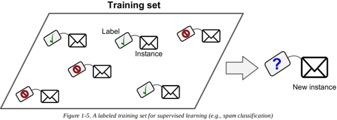

一个典型的有监督学习任务是**分类**（*classification*）。垃圾邮件过滤就是一个很好的例子：它使用了许多带有**类别**（*class*）（垃圾邮件或者常规邮件）的样例邮件作为训练，并且它必须学习如何分类新邮件。

另一个典型的任务就是预测**目标**（*target*）数值，比如汽车的价格（里程，年龄，品牌等），通过给定的一组**特征**（*features*），称为**预测量**（*predictors*）。这种排序任务被称为**回归**（*regression*）（图1-6）。为了训练系统，你需要提供足够多的汽车样例，包括预测量和标签（即它们的价格）。

> **笔记**
>
> 在机器学习中，**属性**（*attribute*）是一种数据类型（比如“里程”），而特征根据上下文有若干含义，但通常表示一种属性加上它的数值（比如，“里程=15,000”）。虽说如此，许多人在使用这两个词时时常互换。

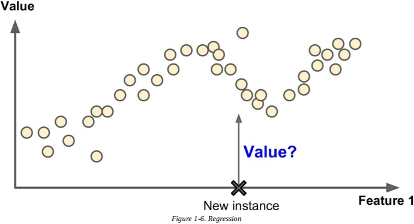

注意，有些回归算法也能用于分类，反之亦然。举个例子，**逻辑回归**（*Logistic Regression*）常用于分类，但它能输出与属于某一特定类别的概率对应的值（比如，20%的可能性是垃圾邮件）。

以下是一些最重要的监督学习算法（本书中有介绍）：

- k-近邻算法
- 线性回归
- 逻辑回归
- 支持向量机（SVMs）
- 决策树和随机森林
- 神经网络


#### 无监督学习

在**无监督学习**（*unsupervised learning*）中，你能猜到，训练数据是未被标记的（图1-7）。系统尝试在没有老师的情况下进行学习。

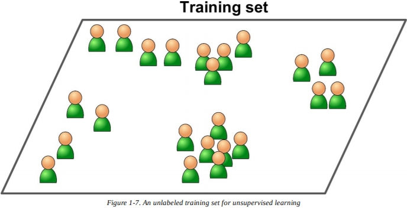

以下是一些最重要的无监督学习算法（我们将在第八章介绍降维）：

- 聚类
  - k-means
  - 层次聚类分析（HCA）
  - 期望最大化
- 可视化与降维
  - 主成分分析（PCA）
  - 核主成分分析
  - 局部线性嵌入（LLE）
  - t分布随机近邻嵌入（t-SNE）
- 关联规则学习
  - Apriori
  - Eclat

举个例子，假设你有很多关于你博客访问者的数据。你可能想用聚类算法来检测相似访问者的分组（图1-8）。你从未告诉过算法某一访问者属于哪个组：它无需你的帮助，就能找到这些联系。比如说，它可能会注意到，40%的访问者是喜欢漫画的男性，时常在傍晚阅读你的博客，而20%的访问者是年轻的科幻爱好者，经常在周末访问博客，等等。如果你使用层次聚类算法，它也许会把每一组都细分成更小的组。这能帮助你为每组定位相关的文章。

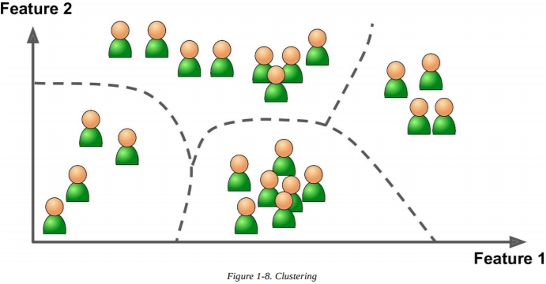

可视化算法也是无监督学习算法的良好例子：你提供许多复杂而无标记的数据，它们输出2D或3D的能被简单描绘的数据表示（图1-9）。这些算法试图保留尽可能多的结构（比如，尝试在输入空间中保持分离的聚类，不让它们在可视化中被覆盖），你能够理解数据是如何被组织的，也许能识别未预料到的模式。

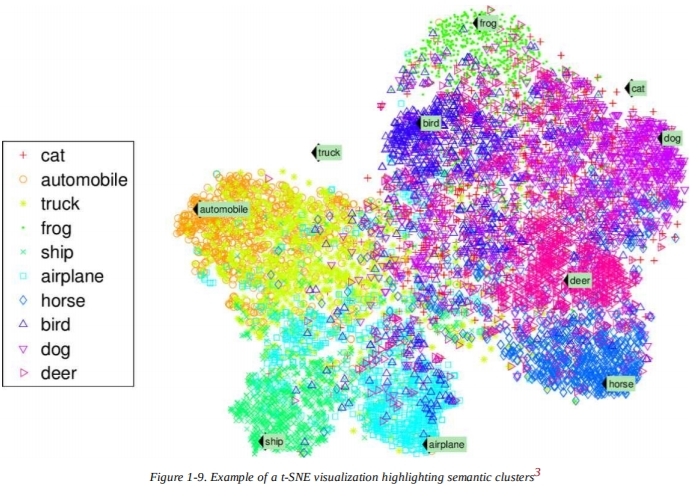

一种相关的任务是**降维**（*dimensionality reduction*），它的目标是在不丢失过多信息的前提下简化数据。一种办法是将一些相关的特征合为一个。举个例子，一辆汽车的里程可能和它的年龄有关，所以降维算法可能会将它们合并为一个表示汽车损耗的特征。这叫做**特征提取**（*feature extraction*）。 

> **提示**
>
> 在你将数据提供给另一个机器学习算法之前（比如监督学习算法），最好尝试用降维算法降低训练数据的维度。它会运行得更快，数据也会占用更少的硬盘和内存空间，在某种程度上，它也许会表现得更好。

另一个重要的无监督任务是**异常检测**（*anomaly detection*）——比如说，通过检测不寻常的信用卡交易来防止诈骗，捕捉制造业的缺陷，在将数据提供给学习算法之前自动移除离群点。系统是用常规实例训练的，当它看到一个新的实例时，能知道它看起来是个正常实例还是异常实例（图1-10）。

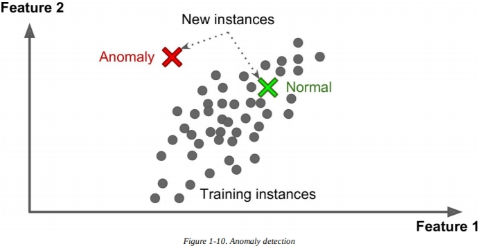

最后，另一种常见的无监督任务是关联规则学习，它的目标是挖掘大量数据，发现属性之间有趣的关系。比如说，假设你拥有一家超市。在你的销售日志上运行关联规则，可能会发现那些买了烧烤酱和薯片的人也倾向于买牛排。因此，你可能会把这些商品放得近一些。


#### 半监督学习

有些算法能处理部分被标记的训练数据，通常是很多未标记的数据和一小部分有标记的数据。这被称为**半监督学习**（*semi-supervised learning*）（图1-11）。

一些照片托管服务，像是Google Photos，就是很好的例子。一旦你上传所有的家庭照片，它会自动认出在照片1,5和11中出现的同一个人A，以及在照片2,5和7中出现的另一个人B。这是算法无监督的一部分（聚类）。现在系统所需要的就是你告诉他们这些人是谁。只要给每个人一个标签，它就能把每张照片中的人都标上名字，在搜索照片时很有帮助。

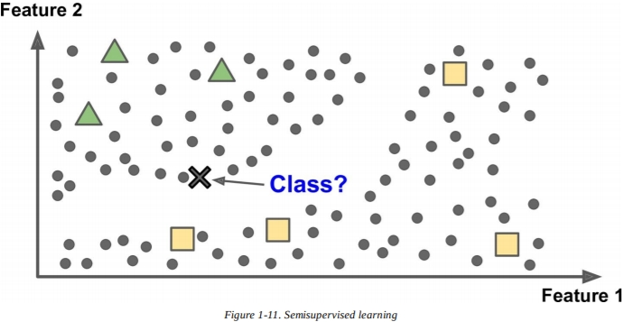

绝大多数半监督学习算法都是监督学习和无监督学习的组合。比如说，**深度置信网络**（*deep belief networks*，DBNs）就是基于堆叠在一起的被称为**受限波尔波兹曼机**（*restricted Boltzmann machines*，RBMs）的无监督组件。RBMs以无监督的方式顺序进行训练，然后整个系统使用监督学习的技术进行微调。


#### 强化学习

**强化学习**（*Reinforcement Learning*）是一头与众不同的野兽。学习系统被称为**代理**（*agent*），它能观察环境，选择行为，并得到**奖赏**（*rewards*）作为回报（或者以负面奖励的形式得到**惩罚**（*penalties*），像图1-12）。为了得到最好的奖赏，它必须自学得到最优策略，称为**策略**（*policy*）。策略定义了代理在给定情况下应该选择什么样的行为。

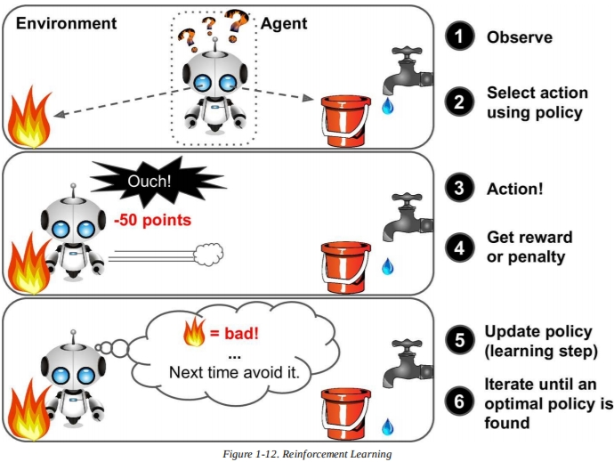

举个例子，许多机器人都应用了强化学习来学习如何走路。DeepMind的AlphaGo也是一个强化学习的优秀例子：当它在围棋中击败了世界冠军李世石的时候，它创造了2016年3月的头条。它通过分析数百万场的棋局来学习它的决胜策略，然后和自己对弈许多盘棋。注意，在和冠军下棋时，学习机制是关闭的；AlphaGo只是应用了它学到的策略。 


### 批量和在线学习

另一种对机器学习系统分类的标准是看系统是否能从输入数据流中逐步学习。


#### 批量学习

在批量学习中，系统无法逐步学习：它必须使用所有可行的数据来训练。这样会花费大量时间和计算资源，所以一般是离线工作的。首先，系统被训练，然后被投入生产，运行时不再进行任何学习；它只应用它学到的东西。这被称作**离线学习**（*offline learning*）。

如果你希望一个批量学习系统学习新数据（比如一种新的垃圾邮件），你需要在完整数据集上从头训练系统的新版本（不只是新的数据，还有旧的数据），然后停止旧系统的使用，将它更换为新系统。

幸运的是，训练、评估和推出机器学习系统的全过程相当容易自动化（如图1-3所示），所以即便是批量学习系统也能适应变化。只需更新数据并根据需要从头开始训练新版本的系统。

这个解决方案很简单，而且经常运行得很好，但是使用完整数据集来训练会花费数小时，所以你通常只能每24小时甚至每周训练一个新系统。如果你的系统要适应快速变化的数据（比如预测股票价格），那你需要一个反应更快的解决方案。

同时，用完整数据集训练需要许多计算资源（CPU，内存空间，硬盘空间，硬盘I/O，网络I/O，等等）。如果你有许多数据，每天自动化从头训练你的系统，它最终会花费许多钱。如果数据量很庞大，那几乎不可能使用批量学习算法。

最后，如果你的系统需要自主学习，资源又是有限的（比如一个手机应用，或者火星上的火星车），那么带着大量训练数据、占用许多资源的情况下每天训练数小时会是一个障碍。

幸运的是，在这种种情况下，更好的选择是使用能够逐步学习的算法。


#### 在线学习

在**在线学习**（*online learning*）中，你通过顺序地提供数据实例来逐步训练系统，既不是逐个地训练，也不是用被称为**小批量**（*mini-batches*）的小组数据。每一步训练都快速而便宜，所以系统能够即时学习新数据（参考图1-13）。

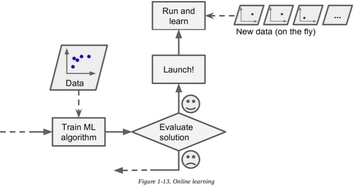

在线学习对于以连续流（比如股票价格）接收数据并且需要快速或自主地适应变化的系统来说是很好的。如果你限制了计算资源，它也是一个很好的选择：一旦在线学习系统学到了新的数据实例，它就不再需要它们了，你可以丢弃它们（除非你想要回滚到上一状态“重现”数据）。这样可以节省巨大的空间。

在线学习算法还可用于训练大型数据集上的系统，这些数据集无法放入一台机器的主存储器中（这被称为**核外**（*out-of-core*）学习）。算法加载部分数据，对该数据运行训练步骤，重复过程直到所有的数据都运行完毕（图1-14）。

> **警告**
>
> 整个过程通常是离线的（即不在实时系统上），所以在线学习可能是个令人困惑的名称。可以把它看作**增量学习**（*incremental learning*）。

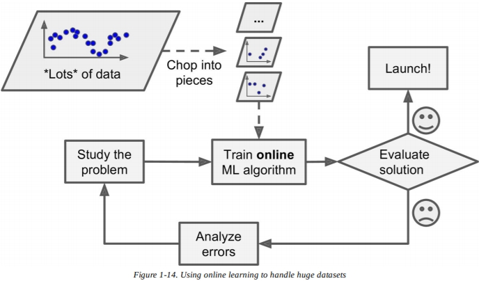

在线学习系统的一个重要参数是它们应该如何快速适应不断变化的数据：这被称为**学习率**（*learning rate*）。如果你设置了一个很高的学习率，你的系统会迅速地适应新数据，不过也会很快忘记旧数据（你不希望垃圾邮件过滤器只标记最新的垃圾邮件吧）。反过来，如果你设置一个很低的学习率，系统就会有更多的惯性：就是说，它会学得更慢，但是也会对新数据中的噪声或非代表性数据点的序列更不敏感。

在线学习的一个挑战是如果给系统提供了不良数据，系统的性能会逐渐下降。如果我们谈论的实时系统，那么你的客户会注意到。比如说，不良数据可能来自机器人的传感器故障，也可能来自发送垃圾邮件的搜索引擎，它试图在搜索结果中排名靠前。为了降低风险，你需要密切监控你的系统，如果你检测到性能下降，立即关闭学习（并可能恢复到以前的工作状态）。你也许会想监控输入数据并对异常数据做出反应（比如说，使用异常检测算法）。


### 基于实例和基于模型学习

还有一种分类机器学习系统的方法，就是看它们如何**泛化**（*generalize*）。大多数的机器学习任务都是预测。这意味着，给出一些训练数据，系统需要能泛化为以前未见过的样例。在训练数据上有良好的性能指标是很不错，但还不够；真正的目标是要在新的实例上也表现优秀。

有两种泛化的方法：基于实例的学习和基于模型的学习。


#### 基于实例学习

也许最微不足道的学习形式就是简单地学习。如果你要这样创造一个垃圾邮件过滤器，它只会标记所有其他用于已经标记过的垃圾邮件——不是最糟的情况，但确实不是最好的。

只是标记相同的已知垃圾邮件，你的过滤器也可以编程实现标记那些和已知的垃圾邮件很相似的邮件。这就需要两封邮件之间的**相似度**（*measure of similarity*）。两封邮件之间的（非常基础的）相似度可以是可以是计算共同的单词数量。如果一封邮件和已知的垃圾邮件有许多相同的单词，那么系统就会将它标记为垃圾邮件。

这被称为**基于实例学习**（*instance-based learning*）：系统学习样例，使用相似度来泛化新的例子（图1-15）。

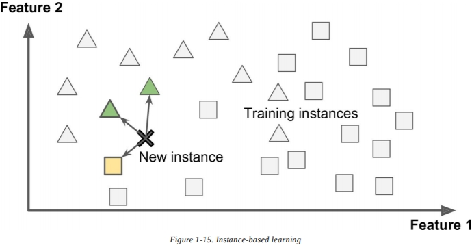


#### 基于模型学习

另一种从一堆样例中泛化的方法是为样例建立模型，使用模型来预测。这被称为**基于模型学习**（*model-based learning*）（图1-16）。

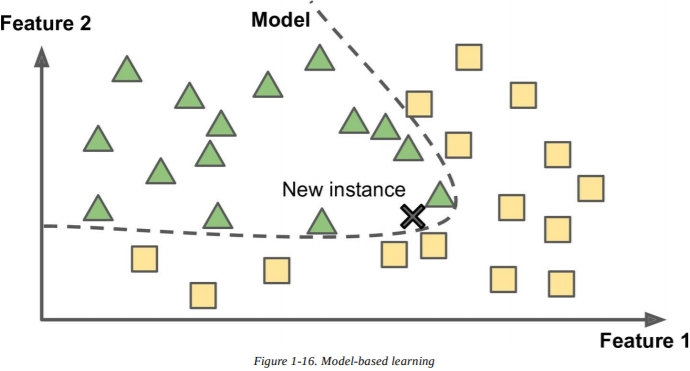

举个例子，假设你想知道金钱能否使人快乐，所以你从经合组织（OECD）的网站下载了*Better Life Index*数据，还从国际货币基金组织（IMF）的网站下载了关于人均GPD的统计数据。然后你把它们放进表格，按照人均GDP排序。表格1-1显示了你所得数据的摘录。 

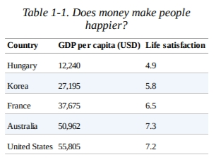

让我们来给几个随机挑选的国家绘制数据（图1-17）。

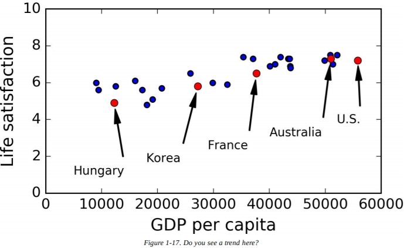

这里似乎有一些趋势！虽然数据很**杂乱**（*noisy*）（即部分随机），不过看起来随着国家人均GDP的增加，生活满意度或多或少地线性增长。所以你决定将生活满意度建模为关于人均GDP的线性函数。这一步被称为**模型选择**（*model selection*）：你为生活满意度选择了一个线性模型，它只有人均GDP这一个属性（等式1-1）。 

$$life\_satisfication=\theta_0+\theta_1\times GDP\_per\_capita$$

这个模型有两个模型参数，$\theta_0$和 $\theta_1$参数，你可以使模型表示任何线性函数，就像图1-18。

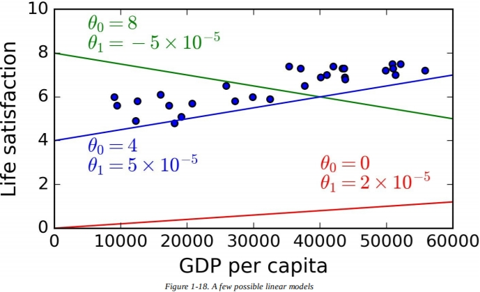

在你使用模型之前，你需要定义参数值$\theta_0$和$\theta_1$。你如何知道哪个值能使模型表现最好？为了回答这个问题，你需要指定一种性能指标。你可以定义一个**效用函数**（*utility function*）（或**适应度函数**（*fitness function*））来度量你的模型有多好，或者你可以定义一个**损失函数**（*cost function*）来测量它有多糟。对于线性回归问题，人们通常使用损失函数来测量线性模型的预测值训练样例之间的距离；目标是最小化这个距离。

这就是线性回归算法的用武之地：你提供训练数据，它根据你的数据找到能使线性模型拟合最佳的参数。这个过程被称作训练模型。在刚才的情况中，算法找到的最优参数值是$\theta_0=4.85$和$\theta_1=4.91\times10^{-5}$  。

现在模型尽可能近地拟合训练数据（以线性模型），如图-19所见。

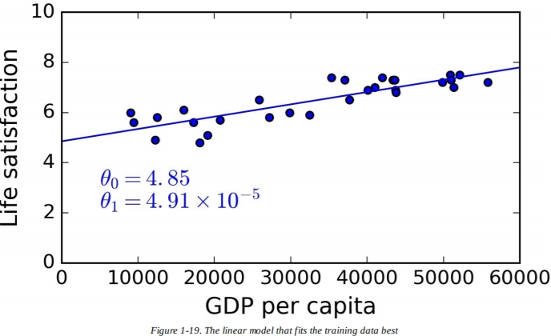

最终，你准备好运行模型来预测了。比如说，假设你想知道塞浦路斯人有多快乐，但经合组织的数据并没有给出回答。幸运的是，你可以用你的模型来做预测：你查看塞浦路斯共和国的人均GDP，是22587美元，然后应用你的模型，发现生活满意度大约在$4.85+22587\times4.91\times10^{-5}=5.96$附近。

为了吊你胃口，样例1-1展示了加载数据的Python代码，准备好它，创建一个可视化散点图，然后训练一个线性模型，做出预测。

```python
import matplotlib
import matplotlib.pyplot as plt
import numpy as np
import pandas as pd
import sklearn
# Load the data
oecd_bli = pd.read_csv("oecd_bli_2015.csv", thousands=',')
gdp_per_capita = pd.read_csv("gdp_per_capita.csv",thousands=',',delimiter='\t',
encoding='latin1', na_values="n/a")
# Prepare the data
country_stats = prepare_country_stats(oecd_bli, gdp_per_capita)
X = np.c_[country_stats["GDP per capita"]]
y = np.c_[country_stats["Life satisfaction"]]
# Visualize the data
country_stats.plot(kind='scatter', x="GDP per capita", y='Life satisfaction')
plt.show()
# Select a linear model
lin_reg_model = sklearn.linear_model.LinearRegression()
# Train the model
lin_reg_model.fit(X, y)
# Make a prediction for Cyprus
X_new = [[22587]] # Cyprus' GDP per capita
print(lin_reg_model.predict(X_new)) # outputs [[ 5.96242338]]
```

> **笔记**
>
> 如果你使用的是基于实例的学习算法，那么你会发现斯洛文尼亚的人均GDP与塞浦路斯相近（20,732美元），因为经合组织的数据告诉我们斯洛文尼亚人的生活满意度是5.7，你可能会预测塞浦路斯人的生活满意度也是5.7。如果你缩小一点查看下一个最接近的国家，你会发现葡萄牙和西班牙的生活满意度分别是5.1和6.5。计算这三个数的平均值，得到5.77，很贴近基于模型的预测。这个简单的算法叫做**k-近邻**（*k-Nearest Neighbors*）回归（在样例中，k=3）。
>
> 在上一段代码中用k-近邻算法代替线性回归很简单，只要换掉下面这一行：
>
> ```python
> clf = sklearn.linear_model.LinearRegression()
> ```
>
> 换上这一句：
>
> ```python
> clf = sklearn.neighbors.KNeighborsRegressor(n_neighbors=3)
> ```

如果一切正常，你的模型会得到良好的预测。否则，你需要使用更多属性（就业率，健康，空气污染，等等），获得更多或质量更高的训练数据，或者选择一个更强大的模型（比如多项式回归模型）。

总结一下：

- 学习数据。
- 选择模型。
- 用训练数据训练模型（即学习算法寻找能最小化损失函数的模型参数）。
- 最后，应用模型来对新的样例做出预测（这被称为**推断**（*inference*）），希望模型能泛化得很好。

这就是典型的机器学习项目看起来的样子。在第二章中，你将通过一个端到端（end-to-end）项目亲身体验到。

到目前为止，我们已经介绍了许多内容：你已经知道了什么是机器学习，为什么它很有用，机器学习系统最常见的主要分类有哪些，还有典型的机器学习项目工作流程是怎么样的。现在，让我们来看看学习中可能出现的问题，它们会妨碍你做出准确的预测。


## 机器学习的主要挑战

简而言之，既然你的主要任务是选择一个学习算法并用一些数据训练它，可能会出错的两件事就是“糟糕的算法”和“糟糕的数据”。让我们从糟糕的数据开始。


### 训练数据不足

为了让幼儿知道苹果是什么，你只需要指着苹果说“苹果”（也许这个过程要重复好几次）。现在这个孩子已经能从各种颜色和形状的水果中认出苹果了。真聪明。

机器学习不太一样，大多数机器学习算法需要大量数据才能正常工作。即便是很简单的问题，你也通常需要上千的样例，对于复杂的问题，比如图像识别或者语音识别，你可能需要数百万样例（除非你能重用部分已经存在的模型）。

> **数据的不合理有效性**
>
> 在2001年发表的一篇著名论文中，微软研究人员 Michele Banko 和 Eric Brill 表示，那些迥异的机器学习算法，包括了非常简单的算法，一旦获得足够多的数据，在自然语言消歧的复杂问题上表现几乎完全相同（如你所见，在图1-20）。
>
> 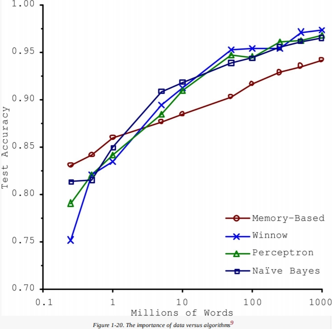
>
> 如作者所说，“这些结果表明，我们可能需要重新考虑权衡两者之间的得失——花费时间和金钱在算法开发上，和在语料库的开发上。”
>
> 这种在复杂问题上数据比算法更重要的观点，在2009年发表的名为《数据的不合理有效性》的论文中，被 Peter Norvig 等人进一步推广。然而，应该注意，小型和中等的数据很普遍，想要得到额外的训练数据并不总是容易而便宜的，所以不要因此放弃算法。


### 非代表性训练数据

为了得到良好的泛化，至关重要的是，你的训练数据必须代表你想泛化的新样例。无论你是用基于实例学习还是基于模型学习，这一点是确凿的。

举个例子，我们之前用来训练线性模型的一组国家并不完全具有代表性，它缺失了一些国家。图1-21显示了加上一些缺失国家后的数据。

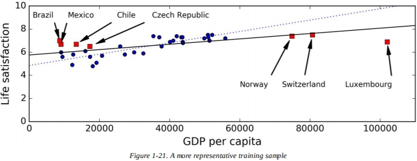

如果你用线性模型训练这些数据，你会得到这条实线，而旧的模型由虚线代表。如你所见，增加一些缺失国家不仅改变了模型，也清楚地表明了，这种简单的线性模型也可能会失效。看起来非常富裕的国家并不比中等富裕的国家快乐（事实上，他们似乎并不快乐），反而一些贫穷国家看起来比富有国家更快乐。

通过使用非代表性训练数据集，我们训练出了一个不太可能预测准确的模型，尤其是对于非常贫穷和非常富裕的国家而言。

使用能代表你想要泛化的样例的训练集，这是很重要的。通常比听起来要难：如果样本太小，你会得到**采样噪音**（*sampling noise*）（即非代表性的数据具有偶然的结果），但是如果抽样方法有缺陷，即便是很大的样本量也可能是非代表性的。这被称为**抽样误差**（*sampling bias*）。

> **抽样误差的重要样例**
>
> 也许最著名的抽样误差的样例发生在1936年的美国总统选举期间，那次是兰登对罗斯福：《文学文摘》（*Literary Digest*）进行了一次非常大的民意调查，向大约1000万人发送邮件。它获得了240万个答案，并且高度自信地预测兰登将获得57％的选票。然而，罗斯福以62%的选票获胜。缺陷是在《文学文摘》的抽样方法中：
>
> - 首先，为了获得发送民意调查的地址，《文学文摘》使用了电话簿，杂志订阅者列表，俱乐部会员列表等。所有这些名单往往偏向富人，他们更有可能投票给共和党人（因此是兰登）。
> - 其次，接受民意调查的人中，只有不到25%进行了回复。这样再次引入了抽样误差，排除了那些不关心政治的人、不喜欢《文学文摘》的人、还有一些重要团体。这是一种特殊的抽样误差，名为**无反应偏差**（*nonresponse bias*）。
>
> 还有一个例子：如果你想建立一个能识别疯克音乐（funk music）视频的系统，一种建立训练集的办法是在YouTube上搜索“funk music”，使用搜索到的视频。不过，这样是假设YouTube的搜索引擎返回了一组代表YouTube上所有疯克音乐的视频。事实上，搜索结果很可能偏向于受欢迎的艺术家（如果你在巴西，你会得到许多“funk carioca ”的视频，听起来就像 James Brown 一样）。另一方面，你该如何得到一个大数据集？


### 低质量数据

显然，如果你的训练数据满是误差，离群点和噪声（比如说，由于质量很差的测量），这会使得系统很难预测潜在模式，所以你的系统可能表现不太好。花时间清理数据通常是值得的。事实上，大多数数据科学家花费了大量时间来做这件事。举个例子：

- 如果某些实例显然是离群点，简单地舍弃它们或尝试手动修复错误可能会有所帮助。
- 如果某些实例缺失了一些特征（比如说，5%的客户没有说明年龄），你必须做出决定，是完全忽略这个属性，忽略这些实例，填充缺失值（比如使用平均年龄），还是分别训练一个有这些特征的模型和一个没有这些特征的模型，等等。


### 无关特征

俗话说：废料输入，废料输出 。只有当训练数据包含足够多的相关特征、不太多的无关特征时，你的系统才能学习。机器学习项目成功的关键部分就是提取一组好的特征来训练。这一过程被称为**特征工程**（*feature engineering*），包括：

- **特征选择**（*feature selection*）：在现有特征中选择最有用的特征来训练。
- **特征提取**（*feature extraction*）：将现有特征组合为另一个更有用的（就像我们先前看到的，降维算法能帮上忙）。
- 收集新数据，创造新特征。

既然我们已经看过了很多糟糕数据的例子了，让我们来看一些糟糕算法的例子。


### 过拟合训练数据

假如你正在外国旅游，而出租车司机坑了你，你可能会说这个国家*所有*的出租车司机都是贼。过度泛化是我们人类经常做的事，不幸的是，如果我们不够细心的话，机器也会掉进同一个陷阱。在机器学习中，这叫做**过拟合**（*overfitting*）：意思是模型在训练集上表现得很好，但泛化得并不好。

图1-22展示了一个高次多项式的生活满意度模型的例子，强烈地过拟合了训练数据。尽管与简单的线性模型相比，它在训练数据上表现得好多了，不过你真的能相信它的预测吗？

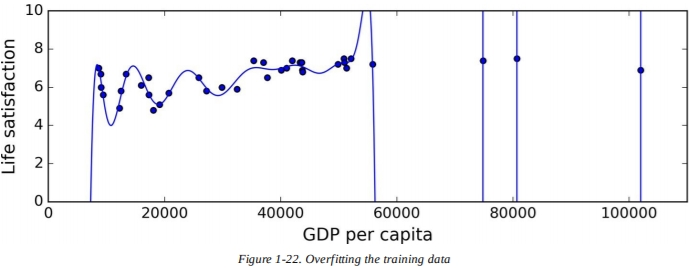

诸如深度神经网络那样的复杂模型能检测数据中的细微模型，不过如果训练集的噪音过多，或者数据量过小（这样引入了采样噪音），模型就很有可能在噪声本身中检测到模式。显然这些模式并不能泛化到新的实例上。例如，假设你为生活满意度模型提供了大量属性，包括一些无信息的内容——像是国家名之类的。那样的话，一个复杂的模型可能会检测到这样的模式——训练数据中所有名字中带“w”且生活满意度大于7的国家：新西兰（7.3），挪威（7.4），瑞典（7.2）和瑞士（7.5）。你有多少信心这个W-满意度规则能泛化到卢旺达和津巴布韦？显然，这种模式只是纯粹偶然发生在训练数据中，但是模型并不知道模式是否是真的，或者它只是数据中噪声的结果。

> **警告**
>
> 当模型相对于训练数据的数量和噪声过于复杂时，会发生过度拟合。可能的解决方法有：
>
> - 通过选择具有较少参数的模型（例如，线性模型而不是高次多项式模型）、减少训练数据中的属性数量或约束模型来简化模型
> - 获得更多训练数据
> - 减少训练数据中的噪声（比如，修复数据错误或者移除离群点）

约束模型使其更简单，并降低过拟合风险的这一措施称为**正则化**（*regularization*）。例如，我们先前定义的线性模型有两个参数，$\theta_0$和$\theta_1$。这为学习算法提供了两个**自由度**（*degrees of freedom*），以使模型适应训练数据：它能调整直线的高度（$\theta_0$）和斜率（$\theta_1$）。如果我们让$\theta_0=0$，算法就只有一种自由度，合适地拟合数据会变得更加困难：它能做的就只有让直线上下移动，尽可能地贴近训练实例，所以它最终会在平均值附近停下。实在是一个简单的模型！如果我们允许算法修改$\theta_1$，但让它保持一个很小的值，那么学习算法将有效地处于一到两个自由度之间。它会产生一个比两个自由度更简单，但比一个自由度要复杂得多的模型。你希望找到一种正确的平衡，在完美拟合数据，和保持模型简单、确保它能泛化得好之间。

图1-23展现了三种模型：点线代表使用缺失了一些国家的数据所训练的原始模型，虚线代表是使用全部国家的数据所训练的模型，实线是一个线性模型，与第一个模型所用数据相同，但是用了正规化约束。你能看到，使用了正则化的模型有更小的斜率，与数据拟合得少，但是实际上对新样例泛化得更好。

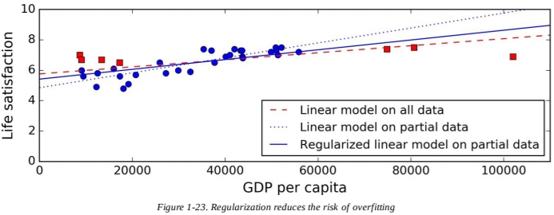

在学习期间应用的正则化数量可以由**超参数**（*hyperparameter*）控制。超参数是学习算法的参数（不是模型的）。因此，它不受学习算法本身影响。它必须在训练之前设定，并在训练期间保持不变。如果你把超参数设置得很大，你将得到一个几乎平坦的模型（斜率接近零）。学习算法一定不会过拟合训练数据，但是也不太可能找到一个好的解决方法。调参是建立机器学习系统中重要的一部分（你会在下一章中看到详细的例子）。


### 欠拟合训练数据

你也许猜到了，**欠拟合**（*underfitting*）与过拟合相反：当你的模型过于简单，以致于难以学习数据的底层结构时，欠拟合就会发生。例如，生活满意度的线性模型很容易欠拟合。现实总比模型复杂，因此即使在训练样例上，其预测也必然是不准确的。

解决这个问题的主要选择有：

- 选择更强的模型，使用更多参数
- 为学习算法提供更好的特征（特诊工程）
- 减少对模型的约束（比如，减少正则化超参数）


### 回顾

到目前为止，你对机器学习已经了解很多了。然而，我们介绍了太多概念，你可能会感到有点茫然无措，所以让我们退一步，回顾学过的内容：

- 机器学习是通过学习数据使机器在某些任务上变得更好，而不是必须明确地编写规则。
- 机器学习有许多不同类型：监督与无监督，批量与在线，基于实例和基于模型，等等。
- 在机器学习项目中，你从训练集中获得数据， 为学习算法提供训练集。如果算法是基于模型的，它会调整参数来使模型适应训练集（即在训练集上做出更好的预测），然后希望它对新样例也能做出好的预测。如果算法是基于模型的，它只是简单地学习样例，使用相似度来泛化新样例。
- 如果你的训练集太小，或者数据是非代表性的，杂乱的，或者被无关特征污染了的（废料输入，废料输出），那么系统的表现会不太好。

只有最后一个重要的主题要介绍了：当你训练好一个模型时，你不想只是“希望”它能泛化到新样例上，你想评估它，如果有必要的话再进行调参。让我们来看看该怎么办。


## 测试与评估

唯一能知道模型在新样例上泛化能力的方法就是真正地在新样例上试一遍。一种方法是将模型投入生产并监控其执行情况。这样很有效，不过如果你的模型非常糟糕，你的用户会抱怨——这不是最好的办法。

一个更好的建议是把数据分成两份：**训练集**（*training set*）和**测试集**（*test set*）。就像名字那样，你用训练集来训练模型，用测试集来测试它。在新样例上的误差率被称为**泛化误差**（*generalization error*）（或者**样本外错误**（*out-of-sample error*），通过在测试集上评估模型，你会得到误差的估计值。这个值会告诉你，在从未见过的新样例上，模型会有怎样的表现。

如果训练误差很低（即模型在训练集上几乎不出错），但是泛化误差很高，这意味着你的模型过拟合训练数据了。

> **提示**
>
> 通常将80%的数据用于训练，20%的用于测试。

所以评估模型很简单：只需要用一个测试集。现在，假设你在两个模型之间犹豫（比如线性模型和多项式模型）：你该如何决定？一个选择就是两个模型都训练一遍，比较使用训练集后哪一个泛化得更好。

现在假设线性模型泛化得更好，但是你想应用一些正则化来避免过拟合。问题是：你如何选择正则化超参数的值？一种办法是训练100种不同的模型，使用100个不同的超参数值。假设你发现了最好的超参数值，模型产生的泛化误差最低，比如说5%的误差。

所以你把这个模型投入生产，但是遗憾的是，它的表现没有像预期的那么好，产生了15%的误差。发生了什么？

问题在于你在测试集上多次测量了泛化误差，你调整模型和超参数所生成的最佳模型*只适应这个数据集*。这就意味着，模型在新数据上不可能表现得好。

这个问题的一个常见解决方法是创造第二个留出集，称为**验证集**（*validation set*）。你使用训练集训练具有各种超参数的多个模型，选择在验证集上表现最好的模型和超参数，当你对你的模型很满意的时候，在测试集上单独测试最后一次，获得泛化误差的评估。

为了避免在验证集中“浪费”过多训练数据，一种常见的技术是使用**交叉验证**（*cross-validation*）：训练集被分为互补子集，每个模型都针对这些子集的不同组合进行训练，并针对其余部分进行验证。一旦选择了模型类型和超参数 ，就在完整训练集上使用这些超参数训练最终模型，并在测试集上测量泛化误差。

> **没有免费午餐定理**
>
> 模型是观测的简化版本。简化就意味着要清除多余的细节，它们不太可能泛化到新样例上。然而，为了决定清除哪些保留哪些，你必须要作出假设（*assumptions*）。例如，线性模型假设数据基本上是线性的，实例和直线之间的距离只是噪声，可以安全地忽略。
>
> 在1996年的一份著名论文中，David Wolpert 证明，如果你不对任何数据做出假设，那就没有理由偏好任何一种模型。这被称为**没有免费的午餐理论**（*No Free Lunch*，NFL）。对有些数据而言最好的模型是线性模型，而对另一些数据而言，则是神经网络。没有先验的模型可以保证更好地工作（理论名字的由来）。想要知道哪个模型是最好的，唯一的方法就是全部评估一遍。因为这是不可能的，实际上你会对数据做出合理的假设，然后你只评估一部分合理的模型。例如，对于简单的任务，你可以使用不同级别的正则化来评估线性模型，而对于复杂的任务，你可以评估各种神经网络。


## 练习

在这一章中，我们已经介绍了一些机器学习最重要的概念。在下一章中，我们会深入写更多代码，不过在那之前，确保你已经知道如何回答下面的问题：

1. 如何定义机器学习？
2. 你能说出四种类型的问题吗？
3. 什么是被标记的训练集？
4. 两种最常见的监督任务是什么？
5. 你能说出四种无监督任务吗？
6. 你会使用哪种机器学习算法来让机器人在各种未知地形上行走？
7. 你会使用哪种算法将你的客户划分为多组？
8. 你会将垃圾邮件检测问题当做监督学习问题还是无监督学习问题？
9. 在线学习系统是什么？
10. 核外学习是什么？
11. 什么类型的学习算法依赖于相似性度来进行预测？
12. 模型参数和学习算法的超参数之间的区别是什么？
13. 基于模型的算法搜索什么？它们使用的最常见的策略是什么？它们如何预测？
14. 你能说出四种机器学习主要的挑战吗？
15. 如果你的模型在训练集上表现得很好，但在新样例上泛化得很糟，这是什么情况？你能说出三种可能的解决方法吗？
16. 测试集是什么？为什么你会想要使用它？
17. 验证集的目的是什么？
18. 如果你使用测试集来调整超参数，会发生什么问题？
19. 交叉验证是什么？为什么你更喜欢用验证集？

## 总结
本章中出现的术语：
- 训练集 training set
- 训练实例 training instance
- 样本 sample
- 训练数据 training data
- 精度 accuracy
- 数据挖掘 data mining
- 监督学习 supervised learning
- 标签 label
- 分类 classification
- 类别 class
- 目标 target
- 特征 features
- 预测量 predictors
- 回归 regression
- 属性 attribute
- 逻辑回归 Logistic Regression
- 无监督学习 unsupervised learning
- 降维 dimensionality reduction
- 异常检测 anomaly detection
- 半监督学习 semi-supervised learning
- 深度置信网络 deep belief networks，DBNs
- 受限波尔波兹曼机 restricted Boltzmann machines，RBMs
- 强化学习 Reinforcement Learning
- 代理 agent
- 奖赏 rewards
- 惩罚 penalties
- 策略 policy
- 离线学习 offline learning
- 在线学习 online learning
- 小批量 mini-batches
- 增量学习 incremental learning
- 学习率 learning rate
- 泛化 generalize
- 相似度 measure of similarity
- 基于实例学习 instance-based learning
- 基于模型学习 model-based learning
- 模型选择 model selection
- 效用函数 utility function
- 适应度函数 fitness function
- 损失函数 cost function
- k-近邻 k-Nearest Neighbors
- 推断 inference
- 采样噪音 sampling noise
- 抽样误差 sampling bias
- 无反应偏差 nonresponse bias
- 特征工程 feature engineering
- 特征选择 feature selection
- 特征提取 feature extraction
- 过拟合 overfitting
- 正则化 regularization
- 自由度 degrees of freedom
- 超参数 hyperparameter
- 欠拟合 underfitting
- 测试集 test set
- 泛化误差 generalization error
- 样本外错误 out-of-sample error
- 验证集 validation set
- 交叉验证 cross-validation
- 没有免费的午餐理论 No Free Lunch，NFL
