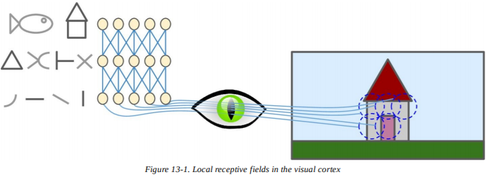
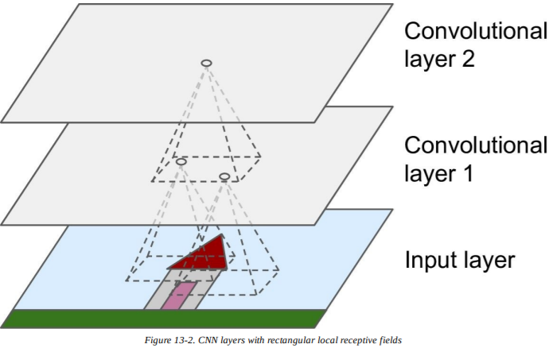
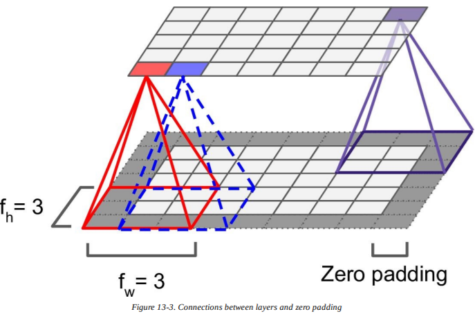
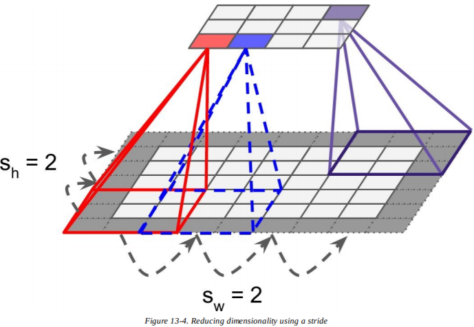
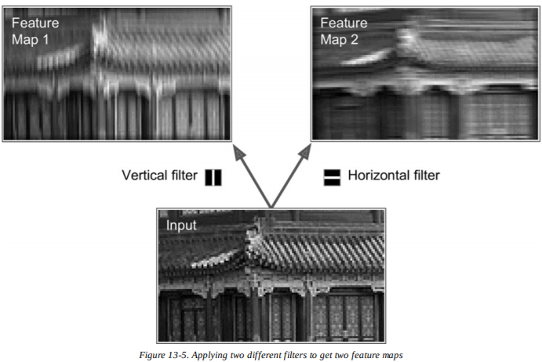
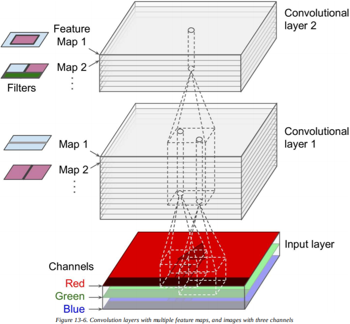
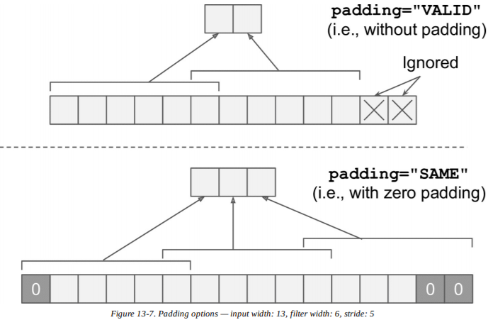
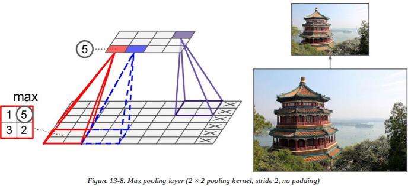

# 第十三章：卷积神经网络

尽管在 1996 年， IBM 的超级计算机深蓝击败了世界国际象棋冠军 Garry	Kasparov ，但是直到现在计算机都不能可靠地解决一些琐碎复杂的任务，比如检测照片中的小狗，或是语音识别。为什么这些任务对于人类而言不费吹灰之力？答案是感知发生在我们意识到的领域之外，在专门化的视觉、听觉以及大脑中的其他感知模块中。当感知信息达到意识层时，它已经被高级特征所装饰。例如，当你看一张可爱的小狗照片时，你不能选择*不*去看这只小狗，或者*不*去注意它的可爱。你也不能解释你是*如何*认出这是一只可爱的小狗，这对你而言是显而易见的。因此，我们不能相信自己的主观经验：感知并不是无关紧要的，为了理解它，我们必须研究感知模块是如何工作的。

卷积神经网络（CNN）是从大脑视觉皮层的研究中出现的，自从 20 世纪 80 年代以来，它们一直被用于图像识别。在近几年，多亏计算能力的进步、可用训练数据的数量的增加以及训练深度网络的技巧的提升， CNN 致力于在一些复杂视觉任务上获得超人的表现。它们强化了图像搜索服务、无人驾驶汽车、自动视频分类等领域。此外， CNN 并不局限于视觉感知：它们在其他任务中也很成功，比如语音识别或自然语言处理（*natural	language	processing*，NLP）。不过，我们现在专注于视觉应用。

在本章中，我们会介绍 CNN 的由来，构建模块的外观，以及如何用 Tensorflow 实现它们。之后我们会展示一些最佳的 CNN 架构。

## 视觉皮层的架构

在 1958 年 和 1959 年， David H. Hubel 和 Torsten Wiesel 进行了一系列对猫的实验（几年后是对猴子的实验），在视觉皮层的结构上给出了重要的见解（作者因此获得了 1981 年的诺贝尔生理和医学奖）。特别地，他们展示了视觉皮层中许多神经元都有一个微小的**局部感受野**（*local receptive field*），意味着它们只对视野中有限区域内的视觉刺激有反应（见图 13-1 ， 5 个神经元的局部感受野用虚线圆圈表示）。不同神经元的感受野可能会重叠，它们一起铺满了整个视觉域。此外，作者也展示了一些神经元只对水平方向的图像有反应，而另一些只对不同方向上的图像有反应（两个神经元也许会有相同的感受野，但是对不同方向的图像做出反应）。他们也注意到，有些神经元有更大的感受野，它们会对更复杂的图案——低级图案的组合——做出反应。这些观测结果引发了猜想，高级神经元基于邻近低级神经元的输出（在图 13-1 中，注意每个神经元只从前一层上连接了部分神经元）。这个强大的架构可以在视野中任何地方检测各种复杂模图案。



这些视觉皮层的研究启发了 1980 年的 [新认知机](http://www.cs.princeton.edu/courses/archive/spr08/cos598B/Readings/Fukushima1980.pdf)  ，逐渐演变为我们现在称呼的**卷积神经网络**（*convolutional neural networks*）。一个重要的里程碑是 1998 年 由 Yann	LeCun,	Léon	Bottou,	Yoshua	Bengio,	and	Patrick	Haffner 发表的 [论文](http://yann.lecun.com/exdb/publis/pdf/lecun-01a.pdf) ，提出了著名的 *LeNet-5* 架构，被广泛运用于手写支票号码识别。这个架构有一些你已知的构建模块，比如全连接层和 sigmoid 激励函数，不过也介绍了两个全新的构建模块：**卷积层**（*convolutional layers*）和**池化层**（*pooling layers*）。现在让我们来看一看。

> **笔记**
> 对于图像识别任务，为什么不简单使用一个拥有全连接层的常规深度神经网络？不幸的是，尽管这样在小型图片（比如 MNIST ）上运行良好，但是，它在大型图片上就会由于需求参数过多而崩溃。例如，一张 100×100 的图片有 10000 个像素，如果第一层有 1000 个神经元（这已经严重限制了传输到下一层的信息量），这就意味着一共有 1000 万条连接。这还只是第一层。 CNN 使用局部连接层解决这个问题。

## 卷积层

CNN 中最重要的构建模块就是卷积层（*convolutional layer*）：第一卷积层的神经元不是连接到输入图像的每个像素上（就像上一章），而是只连接到感受野上的像素（见图 13-2 ）。依次，第二卷积层中的每个神经元也只连接位于第一卷积层小矩形内的神经元。这种架构允许网络专注于第一隐藏层中的低级特征，然后将它们组合为下一隐藏层中的高级特征，以此类推。这种层次结构在现实世界的图像中很常见，这也是 CNN 在图像识别上表现优异的原因。



> **笔记**
> 到目前为止，所有我们看到的多层神经网络都含有由一长串神经元组成的层，所以将输入图像传递给神经网络之前，我们不得不将它们压缩到一维。现在，每一层都是二维的形式，神经元与相关输入的匹配变得更加容易。

在给定的某层中，一个位于第  行第  列的神经元连接前一层中位于第  行到  行、第  列到  列的神经元的输出，其中  和  分别是感受野的高度和宽度（见图 13-3 ）。为了使该层的高度和宽度与前一层保持一致，通常会在输入周围添加零，如图所示。这被称为**零填充**（*zero padding*）。



通过将感受野隔开，还可以将较大的输入层与较小的层相连接，如图 13-4 所示。两个连续感受野之间的距离被称为**步幅**（*stride*）。在图中，一个 5×7 的输入层（添加了零填充）与一个 3×4 的层相连接，使用了 3×3 的感受野，步幅为 2 （本例中各个方向的步幅都相同，但并不总是这样的）。上层中位于第  行第  列的神经元与前一层中位于第  行到  行、第  列的神经元的输出层相连接，其中  和  分别是垂直和水平方向上的步幅。



### 过滤器

神经元的权重可以表示为感受野大小的小图像。例如，图 13-5 展示了两种可能的权重集合，称为**过滤器**（*filters*）或**卷积核**（*convolution kernels*）。第一种表示为中央有一条垂直白线的黑色矩形（它是一个 7×7 的矩阵，除了中间一列都是 1 ，其余都是 0 ）；使用了这些权重的神经元会忽视感受野中除了中央垂直线以外的一切事物（因为所有的输入都会乘上零，除了中央垂直线的那一列）。第二种过滤器是中央有一条水平白线的黑色矩形。同样地，使用了这些权重的神经元会忽视感受野中除了中央水平线以外的一切事物。

现在如果某一层中的神经元使用相同的垂直线过滤器（且具有相同的偏差项），你将图 13-5 中底部所示的输入图像传递给网络，会得到左上角的输出图像。注意，垂直白线被增强，而其余的则变模糊。类似地，右上角的图像是使用水平线过滤器的神经元得到的图像；注意，水平白线被增强，而其余的则变模糊。因此，使用同一过滤器的神经元层会给你**特征映射**（*feature map*），它会突出图像中和过滤器最相似的区域。在训练过程中， CNN 会找到对任务最有利的过滤器，它会学习将它们组合为更复杂的特征（例如，十字是图像中垂直过滤器和水平过滤器都激活的区域）。



### 堆叠的多特征映射

到目前为止，简单起见，我们将每个卷积层都表现为一个薄的二维层，但是实际上它是由几组规模相同的特征映射组成的，所以用三维图来表示更准确（见图 13-6 ）。在特征映射中，所有的神经元共享相同的参数（权重和偏差项），但是不同的特征映射可能有不同的参数。神经元的感受野与之前描述相同，不过它会扩展到之前所有层的特征映射上。简而言之，卷积层同时在输入中应用多个过滤器，可以在输入中的任何位置检测多种特征。

> **笔记**
> 事实上，特征映射中所有神经元共享相同参数会大幅降低模型中的参数数量，不过最重要的是，这意味着一旦 CNN 学会了识别某个位置的特征，它就能在任何其他位置识别它。相反地，一旦常规的 DNN 学会了识别某个位置的特征，它就只能在该特定的位置识别它。

此外，输入图像也由多个子层组成：每个**颜色通道**（*color channel*）都有一个。典型的三种是：红，绿，蓝（ RGB ）。灰度图只有一个通道，但是有些图像可能有更多——比如，捕捉额外光频（比如红外线）的卫星图像。



具体地，位于卷积层  中特征映射  的第  行第  列的神经元与前一层 中位于第  行到  行、第  列到  列的神经元的输出相连接，遍布所有特征映射（在  层中）。所有位于同一行同一列、但在不同的特征映射中的神经元与上一层中完全相同的神经元的输出相连接。

公式 13-1 用一个数学公式概括了之前的解释：它展示了如何计算卷积层中给定神经元的输出。因为索引不同，所以它有点儿丑，不过它所做的是计算所有输入的权重总和，加上偏差项。


-  是卷积层（  层）特征映射  的位于第  行第  列的神经元的输出。
-  和  分别是垂直和水平方向上的步幅，  和  是感受野的高度和宽度，  是上一层（  层）中特征映射的数量。
-  是卷积层  中位于第  行第  列特征映射  的神经元的输出。
-  是特征映射  （ 层）的偏差项。你可以把它看作是调整特征映射  整体亮度的旋钮。
-  是卷积层  特征映射  中任意两个神经元之间的连接权重，它的输入位于第  行第  列（相对于神经元的感受野），特征映射为  。

### Tensorflow 实现

在 Tensorflow 中，每张输入图像通常表示为 3D 张量`shape [height, width, channels]`。小批量表示为 4D 张量`shape	[mini-batch size, height, width, channels]`。卷积层的权重表示为 4D 张量  。卷积层的偏差项简单表示为 1D 张量`shape	[fn]`。

来看一个简单的例子。下面的代码使用了 Scikit-Learn 的`load_sample_images()`，加载了两张简单图像（两张彩图，一张是中国寺庙，另一张是一朵花）。之后它创建了两个 7×7 的过滤器（一个是垂直线过滤器，一个是水平线过滤器），将它们应用到两张图像上，使用一个由 Tensorflow 的`tf.nn.conv2d()`函数创建的卷积层（有零填充，步幅为 2 ）。最后，它绘制出其中一张图像的结果特征映射图（和图 13-5 右上角的图类似）。

```python
import numpy as np
from sklearn.datasets import load_sample_images
import numpy as np
import tensorflow as tf

# Load sample images
china = load_sample_image("china.jpg")
flower = load_sample_image("flower.jpg")
dataset = np.array([china, flower], dtype=np.float32)
batch_size, height, width, channels = dataset.shape

# Create 2 filters
filters = np.zeros(shape=(7, 7, channels, 2), dtype=np.float32)
filters[:, 3, :, 0] = 1  # vertical line
filters[3, :, :, 1] = 1  # horizontal line

# Create a graph with input X plus a convolutional layer applying the 2 filters
X = tf.placeholder(tf.float32, shape=(None, height, width, channels))
convolution = tf.nn.conv2d(X, filters, strides=[1,2,2,1], padding="SAME")

with tf.Session() as sess:
    output = sess.run(convolution, feed_dict={X: dataset})

plt.imshow(output[0, :, :, 1], cmap="gray") # plot 1st image's 2nd feature map
plt.show()
```

大部分的代码都是一目了然的，不过`tf.nn.conv2d()`这一行需要一些解释：

- `X`是输入的小批量（也是个 4D 张量，如前所述）。
- `filters`是应用的过滤器种类（也是个 4D 张量，如前所述）。
- `strides`是一个有四个元素的 1D 数组，中间两个元素是垂直和水平方向的步幅（  和  ）。第一个和最后一个元素现在必须为 1 。以后可能会被用来指定批量的步幅（跳过一些实例）和频道步幅（跳过一些前一层的特征映射或频道）。
- `padding`必须为`"VALID"`或者`"SAME"`：
  - 如果设置为`"VALID"`，卷积层就*不*使用零填充，也许会忽视底部的一些行列，以及输入图像的右侧，取决于步幅，如图 13-7 所示（简单起见，这里只展示了水平维度，不过事实上垂直维度的逻辑应用也一样）。
  - 如果设置为`"SAME"`，卷积层会在必要时使用零填充。本例中，输出神经元的数量等于输入神经元的数量除以步幅，向上取整（本例中，  ）。然后在输入周围尽可能均匀地添加零。



在这个简单例子中，我们手动创建了过滤器，但是在真正的 CNN 中，你会让训练算法自动找到最优过滤器。 Tensorflow 有一个`tf.layers.conv2d()`函数，它会创建各种过滤器（称为核（*kernel*）），并随机初始化它们。例如，下面的代码会创建一个输入占位符，它由拥有两个 7×7 特征映射的卷积层组合，使用了 2×2 的步幅（注意该函数只需要垂直和水平的步幅），以及`padding`为`"SAME"`：

```python
X = tf.placeholder(shape=(None, height, width, channels), dtype=tf.float32)
conv = tf.layers.conv2d(X, filters=2, kernel_size=7, strides=[2,2], padding="SAME")
```

不幸的是，卷积层有许多超参数：你必须选择过滤器的数量，它们的高度与宽度，步幅，和填充类型。你可以和往常一样使用交叉验证来找到最佳的超参数值，但会非常费时。我们稍后会讨论常见的 CNN 架构，能为你提供思路，找到在实践中表现最佳的超参数。

### 内存需求

CNN 的另一个问题是卷积层需要大量的 RAM ，尤其是在训练的时候，因为反向传播的反向传递需要正向传播中所有计算的中间值。

例如，考虑这样一个卷积层，有 5×5 的过滤器，输出 200 个规模为 150×100 的特征映射，步幅为 1 ，填充为`SAME`。如果输入是一张 150×150 的 RGB 图像（有三个通道），那么参数的数量就是  （ +1 对应偏差项），和整个全连接层相比还是很小的数量。然而，200 个特征映射每个都包含 150×100 个神经元，每个神经元都需要计算  个输入的权重总和：总计就是 2.25 亿的浮点乘法运算。虽然不像全连接层那么糟糕，但是计算仍然很复杂。此外，如果特征映射是用 32 位浮点数表示的，那么卷积层的输出会占据 RAM 的   百万位（大约 11.4 MB ）。这只是一个实例！如果一个训练批量包含 100 个实例，那么该层会占用超过 1G 的 RAM ！

在推断（即对一个新的实例做出预测）中，一旦下一层的计算完成，被该层占用的 RAM 就会被释放，所以你只需要两个连续层所需的 RAM 。不过在训练期间，正向传播中计算的一切数据都需要被保留用于反向传递，所以所需 RAM 的数量（至少）为所有层所需 RAM 的总量。

> **提示**
> 如果训练因为内存不足错误而导致崩溃，你可以尝试减少小批量的大小。另外，你也可以尝试使用步幅来减少维度，或者删除一些层。抑或你可以尝试使用 16 位的浮点，舍弃 32 位的。除此之外，你还可以在多设备间分布 CNN 。

现在我们来看 CNN 的第二种常见构建模块：池化层。

## 池化层

一旦你理解了卷积层的工作原理，池化层就简单多了。它们的目标是对输入图像进行二次采样（即收缩），而减少计算负担、内存用量和参数数量（从而降低过拟合的风险）。减小输入图像的大小也可以使神经网络容忍轻微的图像偏移（位置不变）。

就像卷积层一样，池化层中的每个神经元都与前一层有限数量的神经元相连接，位于小的矩形感受野中。你必须定义它的大小、步幅、填充类型，和之前一样。不过，池化神经元没有权重，它所做的是使用聚集函数（比如最大值或平均值）来聚合输入。图 13-8 展示了一个**最大池化层**（*max pooling layer*），它是最普通的一种池化层。在这个例子中，我们使用一个 2×2 的池化核，步幅为 2 ，无填充。注意，只有每个核中的最大输入值才会进入下一层。其他的输入都会被舍弃。



这显然是种非常具有破坏性的层：即便只有一个 2×2 的核和数值为 2 的步幅，输出也会在各个方向上缩小为原来的两倍（所以面积总共会缩小四倍），一下舍弃了 75% 的输入值。

池化层通常在每个输入频道上独立运作，所以输出宽度和输入宽度相同。你也许会池化深度维度，此时图像的空间维度（高度和宽度）仍未改变，但是频道的数量减少了。

在 Tensorflow 中实现最大池化层非常简单。下面的代码创建了一个最大池化层，使用了 2×2 的核，步幅为 2 ，无填充，之后将其应用到数据集中的所有的图像上：

```python
[...] # load the image dataset, just like above
# Create a graph with input X plus a max pooling layer
X = tf.placeholder(tf.float32, shape=(None, height, width, channels))
max_pool = tf.nn.max_pool(X, ksize=[1,2,2,1], strides=[1,2,2,1],padding="VALID")

with tf.Session() as sess:
    output = sess.run(max_pool, feed_dict={X: dataset})

plt.imshow(output[0].astype(np.uint8))  # plot the output for the 1st image
plt.show()
```

`ksize`参数包含了包含了核的形状，四种输入张量的维度：`[batch size, height, width, channels]`。Tensorflow 现在不支持池化多样例，所以`ksize`的第一个元素一定是 1 。此外，它也不支持同时池化空间维度（高度和宽度）和深度维度，所以`ksize[1]`和`ksize[2]`也必须是 1 ，否则`ksize[3]`一定是 1 。

为了创建一个**平均池化层**（*average pooling layer*），只需将`max_pool()`函数换为`avg_pool()`函数。

现在你已经了解了所有用于创建卷积神经网络的构建模块。让我们来看看如何组合它们。

## CNN 架构

典型的 CNN 架构由这样一些堆叠而成：一些卷积层（每一个都有一个 ReLU 层），然后是一个池化层，之后是另一些卷积层（ + ReLU ），然后是另一个池化层，以此类推。
