# 第二章：端到端机器学习项目

在本章中，你会完成一个端到端的示例项目，假装是一家房地产公司最近聘请的数据科学家。以下是你将会经历的主要步骤：

1. 项目总览。
2. 得到数据。
3. 数据探索与可视化，发现规律。
4. 为机器学习算法准备数据。
5. 选择一个模型并训练。
6. 微调模型。
7. 提出解决方案。
8. 发布、监控、维护系统。


## 使用真实数据

当你学习机器学习的时候，最好是使用现实生活的数据，而不是人工的数据集。幸运的是，有上千的开源数据集可供选择，它们跨越各种领域。以下是一些你可以从中找数据的地址：

- 流行的开源数据库：
  - [UC Irvine Machine Learning Repository](http://archive.ics.uci.edu/ml/index.php)
  - [Kaggle datasets ](https://www.kaggle.com/datasets)
  - [Amazon’s AWS datasets ](https://registry.opendata.aws/)
- 准入口（他们罗列了一些开源数据库）：
  - [http://dataportals.org/](http://dataportals.org/)
  - [https://opendatamonitor.eu/](https://opendatamonitor.eu/)
  - [http://quandl.com/](http://quandl.com/)
- 其他列出了许多流行开源数据库的网页：
  - [Wikipedia’s list of Machine Learning datasets ](https://en.wikipedia.org/wiki/List_of_datasets_for_machine_learning_research)
  - [Quora.com question](https://www.quora.com/Where-can-I-find-large-datasets-open-to-the-public)
  - [Datasets subreddit](https://www.reddit.com/r/datasets)

在本章中，我们选择来自StatLib资料库的加利福尼亚房价数据集（见图2-1）。此数据基于1990年加利福尼亚人口调查的数据。数据有点过时（你那时还可以在海湾地区买一幢不错的房子），但是它有很高的学习质量，所以我们假装把它当做是最近的数据。为了教学目的，我们还添加了一个分类属性，删除了部分特征。

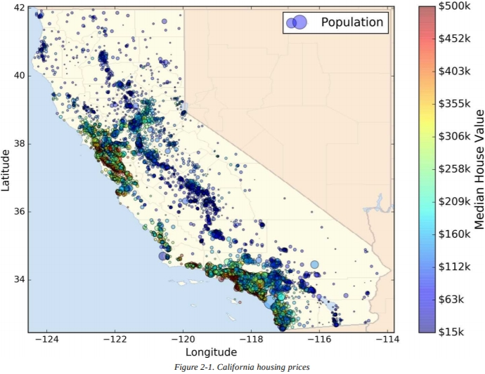

## 项目总览

欢迎来到机器学习房产公司！你的第一份任务是使用加州人口普查数据建立一个加州房价模型。该数据包含加州每个区块组的人口、收入中位数、房价中位数等指标。区块组是美国人口普查局发布样本数据的最小地理单位（区块组通常拥有600至3,000人口），我们将其简称为“区”。根据给出的所有指标，你的模型应该学习数据，能够预测任何区的房价中位数。

>  **提示**
>
> 因为你是一位有条不紊的数据科学家，你做的第一件事就是抽取机器学习项目清单。你可以参考附录B。清单适应大多数机器学习项目，但还是要确保让它适应你的需求。在本章中，我们将介绍许多清单项目，不过也会跳过一些，因为它们是不言自明的，或将在之后的章节中讨论。


### 解决问题

向老板询问的第一个问题是经营目标究竟是什么，建立模型也许不是最终目标。公司打算如何使用模型，并从中受益？这个问题很重要，因为它会决定你该如何解决问题，你该选择哪个算法，用哪个性能指标来评估模型，以及花多少精力来调整它。

你的老板回答，模型的输出（区房价中位数的预测）和许多其他信号会被提供给另一个机器学习系统（见图2-2），下游的系统会决定是否该投资给出的区。正确的做法至关重要，因为它直接影响财政收入。

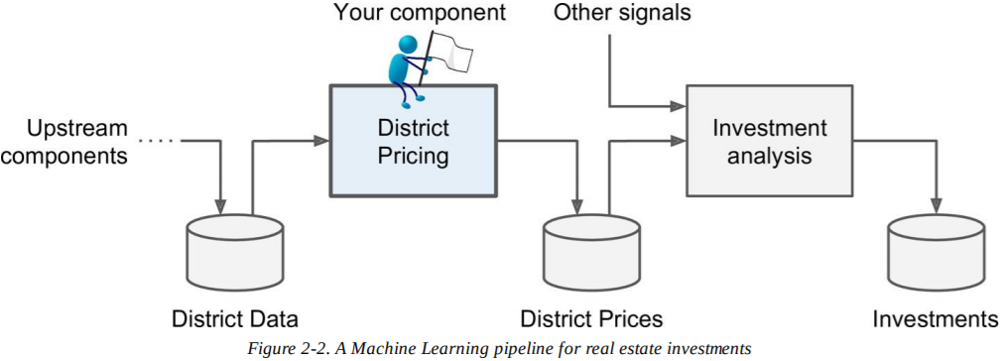

> **管道**
>
> 一系列数据处理**组件**（*components*）称为数据**管道**（*pipeline*）。管道在机器学习系统中很常见，因为需要处理大量数据并应用许多数据转换。组件通常以异步方式运行，每个组件都会提取大量数据，对其进行处理，然后将结果吐出到另一个数据存储中，一段时间后，管道中的下一个组件会提取此数据并吐出自己的输出，依此类推。每个组件都是相当独立的：组件之间的接口就是数据存储。这使得系统非常易于掌握（借助于数据流图），不同的团队可以专注于不同的组件。此外，如果组件发生故障，下游组件通常可以通过仅使用损坏组件的最后输出来继续正常运行（至少暂时一段时间）。这使得架构非常健壮。
>
> 另一方面，如果没有实施适当的监控，可能会在一段时间内忽略损坏的组件。数据变得陈旧，整个系统的性能下降。


下一个要问的问题是当前的解决方案是什么样的（如果有的话）。它通常会给你一个参考表现，以及如何解决问题的见解。你的老板回答说，地区房价目前由专家手动估算：一个团队收集有关某个地区的最新信息（不包括房价中位数），他们使用复杂的规则来进行估算。这样做昂贵而耗时，并且他们估算得还不好；他们的典型错误率在15%。

好吧，有了这些信息，你现在准备开始设计系统了。首先，你需要解决问题：这是监督学习，无监督学习，还是强化学习？是分类任务，回归任务，还是其他的什么？你应该用批量学习还是在线学习技术？在你读下去之前，暂停一下，试着自己回答这些问题。

你找到答案了吗？让我们来看看：它明显是个典型的监督学习任务，因为你得到了被标记的训练样例（每个实例都有预期的输出，即地区房价中位数）。此外，它也是个典型的回归任务，因为你被要求预测数值。更具体地说，这是一个**多元回归**（*multivariate regression*）问题，因为系统会使用多种特征来做出预测（它会使用地区人口、收入中位数，等等）。在第一章中，你只用了一个特征来预测生活满意度——人均GDP，所以它是个**单变量回归**（*univariate regression*）问题。最后，系统里没有连续的数据流，没有特别需要适应快速变化的数据，数据也很小，能放进内存里，所以普通的批量学习就能做好。

> **提示**
>
> 如果数据很庞大，你可以将批量学习的工作分成多个服务器（使用MapReduce技术，我们将在后面讨论），或者用在线学习技术。


### 选择性能指标

你的下一步是选择性能指标。回归问题的典型性能指标是**均方根误差**（Root Mean Square Error，RMSE）。它测量系统在预测时误差的**标准差**（*standard deviation*）。例如，等于50,000的RMSE意味着系统预测的约68％落在实际值的50000美元之内，并且约95％的预测落在实际值的100000美元之内。等式2-1显示了计算RMSE的数学公式。
$$
RMSE(\boldsymbol{X},h)=\sqrt{\frac{1}{m}\sum_{i=1}^{m}(h(\boldsymbol{x}^{(i)})-y^{(i)})^2}
$$
> **符号说明**
>
> 这个等式介绍了我们将在本书中使用的几种非常常见的机器学习符号：
>
> - $m$是你用RMSE测量的数据集中的实例数。
>
>   例如，如果你在2000个区域的验证集上评估RMSE，则$m$ = 2000。
>
> - $\mathbf{x}^{(i)}$是数据集中第$i$个实例的所有特征值（不包括标签）的向量，$y^{(i)}$是它的标签（实例预期的输出值）。
>
>   例如，如果数据集中第一个区位于经度-118.29°，北纬33.91°，它有1416名居民，平均收入为38372美元，房价中位数为156400美元（暂时忽略其他功能），那么：
>   $$
>   \mathbf{x}^{(1)}=\begin{pmatrix}
>   -118.29\\
>   33.91\\
>   1416\\
>   38372
>   \end{pmatrix}
>   $$
>   和
>   $$
>   y^{(1)}=156400
>   $$
>
> - $\mathbf {X}$是包含了数据集中所有实例的所有特征值（除了标签）的矩阵。每个实例都有一行，第$i$行和$\mathbf{x}^{(i)}$的转置相同，记为$(\mathbf{x}^{(i)})^T$。
>
>   例如，如果第一个区如上所述，则矩阵$\mathbf{X}$如下所示：
>   $$
>   \mathbf{X}=\begin{pmatrix}
>   (\mathbf{x}^{(1)})^T\\
>   (\mathbf{x}^{(2)})^T\\
>   \vdots\\
>   (\mathbf{x}^{(1999)})^T\\
>   (\mathbf{x}^{(2000)})^T
>   \end{pmatrix}
>   =\begin{pmatrix}
>   -118.29&33.91&1416&38372\\
>   \vdots&\vdots&\vdots&\vdots
>   \end{pmatrix}
>   $$
>
> - $h$是系统的预测函数，也被称为**假设**（*hypothesis*）函数。当系统收到一个实例的特征向量$\mathbf{x}^{(i)}$，它输出实例的预测值$\hat{y}^{(i)}=h(\mathbf{x}^{(i)})$（读作“y的估计值”）。
>
>   例如，如果系统预测第一个区的房价中位数为158400美元，那么$\hat{y}^{(1)}=h(\mathbf{x}^{(1)})=158400$。这个区的预测误差是$\hat{y}^{(1)}-y^{(1)}=2000$。
>
> - RMSE$(\mathbf {X},h)$是使用假设函数$h$测量样例集的代价函数。
>
> 我们用小写斜体表示标量（比如$m$或者$y^{(i)}$）和函数名（比如$h$），小写粗体表示向量（比如$\mathbf{x}^{(i)}$），大写粗体表示矩阵（比如$\mathbf {X}$）。

尽管RMSE通常是回归任务的首选性能指标，但在某些情况下，你可能更喜欢使用其他函数。例如，有许多离群点的区域。在这种情况下，你可以考虑使用**平均绝对误差**（*Mean Absolute Error*）（也被称为平均绝对离差（Average Absolute Deviation），见等式2-2）。
$$
MAE(\mathbf{X},h)=\frac{1}{m}\sum_{i=1}^{m}\left\vert h(\mathbf{x}^{(i)})-y^{(i)} \right\vert
$$
RMSE和MAE都是测量两个向量间距离的方法：预测向量和目标值向量。各种距离测量或范数都是可能的：

- 计算平方和的根（RMSE）对应于**欧几里德范数**（*Euclidian norm*）：这是你熟悉的距离概念。它也被称为ℓ2**范数**（ℓ2 *norm*），记为$\lVert\ \cdot\ \rVert_2$（或只是$\lVert\ \cdot\ \rVert$）。
- 计算绝对值的和（MAE）对应于ℓ1**范数**（ℓ1 *norm*），记为$\lVert\ \cdot\ \rVert_1$。有时称为**曼哈顿范数**（*Manhattan norm*），因为它测量城市间两点的距离——如果你只能沿着正交的城市街区旅行。
- 更普遍地，包含个$n$元素的向量$\mathbf{v}$的ℓk范数定义为：$\lVert \mathbf{v} \rVert=(|v_0|^k+|v_1|^k+\cdots +|v_n|^k)^{\frac{1}{k}}$。ℓ0只给出了向量的基数（即元素的数量），ℓ$\infty$给出向量中的最大绝对值。
- 范数的指数越高，它就越关注大的数值，忽略小的数值。这就是RMSE对异常值比MAE更敏感的原因。但是当异常值呈指数级罕见时（如钟形曲线），RMSE表现非常好，通常是首选。


### 检查假设

最后，列出并验证迄今为止（由你或其他人）做出的假设是一种很好的做法，这样可以在早期发现一些严重的问题。比如说，系统输出的地区房价将会被提供给下游机器学习系统，我们假设这些价格会被这样使用。但是，如果下游系统实际将价格转换为类别（例如，“便宜”，“中等”或“昂贵”），然后使用这些类别而不是价格本身呢？在这种情况下，得到准确的价格就不重要了，系统只需要得到正确的类别。如果是这样，那么问题应该被定义为分类任务，而不是回归任务。你可不想在在回归系统上忙活数月后才发现这一点。

幸运的是，在与负责下游系统的团队交谈之后，你确信他们的确需要实际价格，而不仅仅是类别。太好了！万事俱备，只欠东风，现在你可以开始写代码了！


## 获得数据

是时候开始动手了。不要犹豫，拿起你的笔记本电脑，在Jupyter Notebook中浏览下面的示例代码。完整的Jupyter notebook可以在这里下载：[https://github.com/ageron/handson-ml](https://github.com/ageron/handson-ml)。


### 创建工作区

首先你需要下载Python。它可能已经安装在系统上了。如果没有，前往下载：[https://www.python.org/](https://www.python.org/)。

接下来，你需要为机器学习的代码和数据创建工作区目录。打开终端，输入下面的命令（在$提示符之后的）：

```
$ export ML_PATH="$HOME/ml" # 可以更改为你偏好的路径
$ mkdir -p $ML_PATH
```

你会需要许多Python的模块：Jupyter，NumPy，Pandas，Matplotlib，还有Scikit-Learn。如果你已经安装了带有所有这些模块的Jupyter，你可以安心跳到“下载数据”。如果还没有，你有很多方法来安装它们（还有它们的依赖库）。你可以使用系统的包装系统（比如，Ubuntu的apt-get，MacPorts或者macOS的HomeBrew），安装科学Python发行版——比如Anaconda，并使用它的包装系统，或者就用Python自带的包装系统pip，它默认包含在Python二进制安装程序中（从Python 2.7.9之后）。你可以通过下面的命令来检查pip是否被安装：

```
$ pip3 --version
pip 9.0.1 from [...]/lib/python3.5/site-packages (python 3.5)
```

你应该确保自己安装了最新版本的pip，至少高于1.4版本，支持二进制文件模块安装（被称为轮子）。如果要更新pip模块，输入：

```
$ pip3 install --upgrade pip
Collecting pip
[...]
Successfully installed pip-9.0.1
```

**创造隔离环境**

如果你想在


现在你能使用简单的pip命令来安装所需的模块和它们的依赖库了：

```
$ pip3 install --upgrade jupyter matplotlib numpy pandas scipy scikit-learn
Collecting jupyter
Downloading jupyter-1.0.0-py2.py3-none-any.whl
Collecting matplotlib
[...]
```

要检查安装情况，尝试像这样导入每个模块：

```
$ python3 -c "import jupyter, matplotlib, numpy, pandas, scipy, sklearn"
```

应该没有输出，也没有报错。现在你可以启动Jupyter了，输入：

```
$ jupyter notebook
[I 15:24 NotebookApp] Serving notebooks from local directory: [...]/ml
[I 15:24 NotebookApp] 0 active kernels
[I 15:24 NotebookApp] The Jupyter Notebook is running at: http://localhost:8888/
[I 15:24 NotebookApp] Use Control-C to stop this server and shut down all
kernels (twice to skip confirmation).
```

现在Jupyter服务器正在终端中运行，监听端口8888。你可以通过打开Web浏览器到[http://localhost:8888/](http://localhost:8888/)来访问此服务器（这通常在服务器启动时自动发生）。你应该会看到空的工作区目录（如果你遵循前面的virtualenv说明，则只包含env目录）。

现在，单击New按钮并选择适当的Python版本，创建一个新的Python Notebook（图2-3）。

这一步做了三件事：首先，在工作区里创建了一个名为*Untitled.ipynb*的新的笔记本文件；其次，启动了Jupyter Python内核来运行笔记本；最后，在新的选项卡中打开了笔记本。你应该先单击Untitled，输入新名字，重命名笔记本为”Housing“（这样会自动重命名文件为*Housing.ipynb*）。

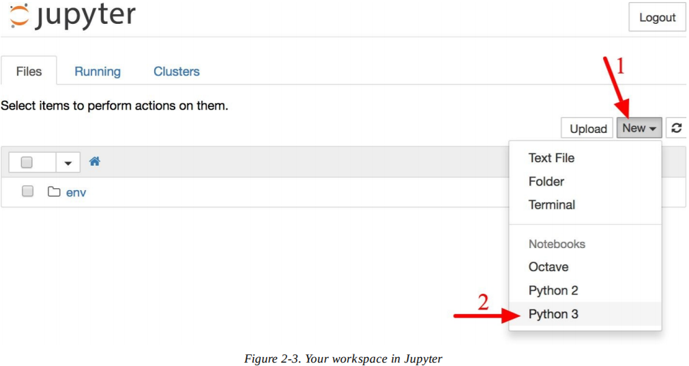

一个笔记本包括了许多单元格。每个单元格可以编辑可执行代码或格式化文本。现在，笔记本只有一个空白单元格，标记为“In [1]:”。试着在单元格里输入`print("Hello world!")`，然后单击运行按钮（图2-4）或按下Shift+Enter。这样会将当前的单元格发送到笔记本的Python内核中，运行并返回输出。结果显示在单元格下方，因为我们已经到达了笔记本的末尾，所以会自动创建一个新的单元格。从Jupyter“帮助”菜单中的用户界面导航可以学习基础知识。 

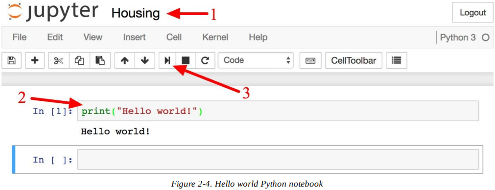


### 下载数据

一般情况下，数据储存在关系数据库（或其他一些常见数据存储区），并分布在多个表/文档/文件中。要访问数据，你得先获取凭据和访问权限，并熟悉数据模式。不过在这个项目中就简单多了：你只需下载一个压缩文件*housing.tgz*，它包含一个逗号分隔值（CSV）文件，名为*housing.csv*，包含所有数据。

你可以用浏览器下载，运行`tar xzf housing.tgz`解压文件， 提取CSV文件，不过最好是写一个小函数来做这件事。如果数据定期变更，它特别有用，因为它允许你编写一个小脚本，你可以在需要获取最新数据时运行该脚本（或者你可以事先设定好，定期自动执行）。如果你需要在多台计算机上安装数据集，则自动获取数据也很有用。	

下面是获取数据的函数：

```python
import os
import tarfile
from six.moves import urllib

DOWNLOAD_ROOT = "https://raw.githubusercontent.com/ageron/handson-ml/master/"
HOUSING_PATH = "datasets/housing"
HOUSING_URL = DOWNLOAD_ROOT + HOUSING_PATH + "/housing.tgz"

def fetch_housing_data(housing_url=HOUSING_URL, housing_path=HOUSING_PATH):
    if not os.path.isdir(housing_path):
        os.makedirs(housing_path)
    tgz_path = os.path.join(housing_path, "housing.tgz")
    urllib.request.urlretrieve(housing_url, tgz_path)
    housing_tgz = tarfile.open(tgz_path)
    housing_tgz.extractall(path=housing_path)
    housing_tgz.close()
```

现在，当你调用` fetch_housing_data() `，它会在你的工作区创建目录 *datasets/housing* ，下载文件*housing.tgz*，提取*housing.csv*。

现在让我们用Pandas来加载数据。你需要再写一个小程序来加载数据：

```python
import pandas as pd

def load_housing_data(housing_path=HOUSING_PATH):
    csv_path = os.path.join(housing_path, "housing.csv")
    return pd.read_csv(csv_path)
```

函数返回包含了所有数据的Pandas DataFrame对象。


### 快速查看数据结构

让我们用DataFrame的`head()`方法看一下前五行（图2-5）。

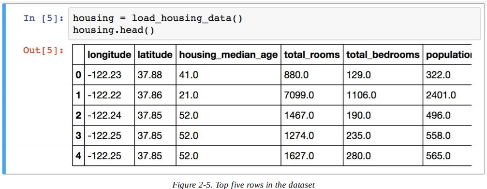

每行代表一个区。共有10种属性（你能在截图中看到前六种）：longitude（经度）, latitude（纬度）, housing_median_age（房龄中位数）, total_rooms（房间总数）, total_bedrooms（卧室数）, population（人口数）, households（家庭数）, median_income（收入中位数）, median_house_value（房价中位数）和ocean_proximity（离海距离）。 

`info()`方法能快速查看数据的描述，特别是总行数，每个属性的类型，还有空值的数量（见图2-6）。

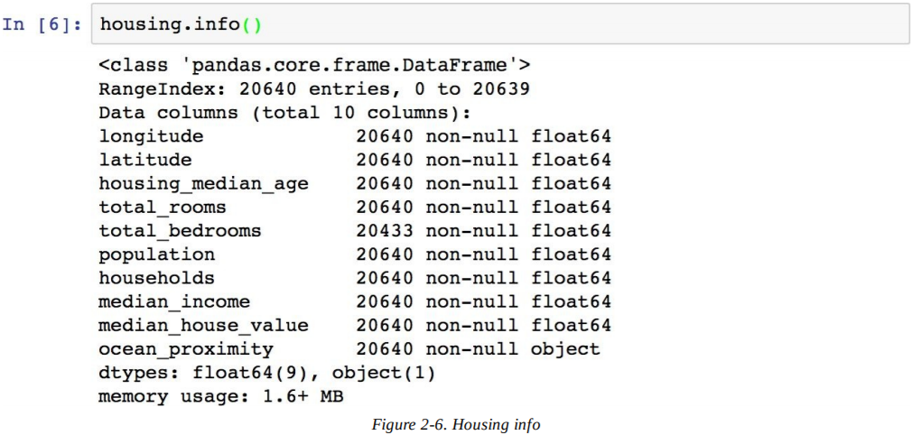

数据集中共有20640个实例，对于机器学习标准来说很小，不过对于入门来说刚好。总房间数只有20433个非空值，说明有207个区缺失了这个特征，我们之后会处理。

所有的属性都是数值型的，除了离海距离。它是对象类型的，所以可以包含任何Python对象，但是由于它是从CSV文件中加载的，所以肯定是文本。当查看前五行时，你也许会注意到有重复的值，意味着它可能是一个类别属性。用`values()_counts`方法可以查看有哪些类别，每个类别有多少区：

```python
>>> housing["ocean_proximity"].value_counts()
<1H OCEAN 9136
INLAND 6551
NEAR OCEAN 2658
NEAR BAY 2290
ISLAND 5
Name: ocean_proximity, dtype: int64
```

来看看其他字段，`describe()`方法能展示数值属性的总览（图2-7）。

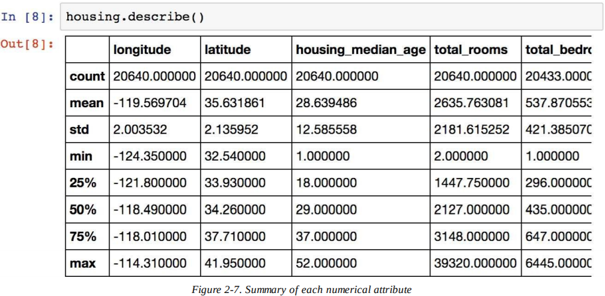

count（总数），mean（平均数），min（最小数）和max（最大数）几行的意思很明确了。注意，空值被忽略了（所以房间总数的数量是20433而不是20640）。std（标准）这一行是标准差（度量数值的分散度）。25%，50%，和 75%表示

另一种快速了解数据类型的办法就是画出每个数值属性的直方图。直方图在纵轴上展示实例的数值，在横轴上展示数值范围。你可以一次给一种属性画图，或者对整个数据集调用`hist()`方法，它会一次性画出所有数值属性的直方图（见图2-8）。例如，你可以看到略微超过800个区的房价中位数都在500000美元。

```python
%matplotlib inline # 只能在Jupyter notebook中使用
import matplotlib.pyplot as plt
housing.hist(bins=50, figsize=(20,15))
plt.show()
```

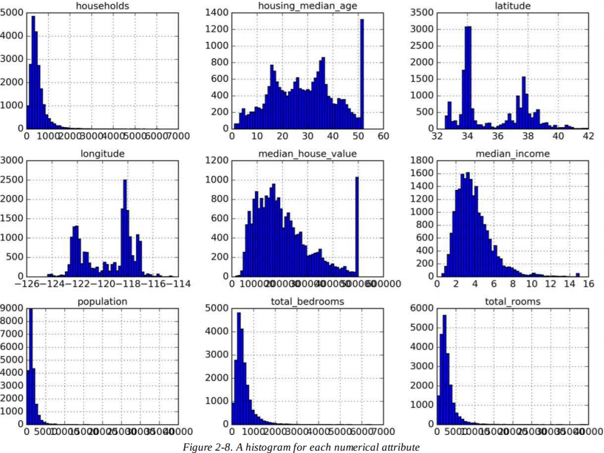

> **笔记**
>
> `hist()`方法依赖Matplotlib库，后者又依赖于用户指定的图形后端来画图。所以在画图之前，你要指定Matplotlib使用的后端。最简单的方法是使用Jupyter的魔术命令`%matplotlib inline `，它告诉Jupyter设定好Matplotlib，使用Jupyter自己的后端。绘图之后就会在笔记本中渲染。注意，在Jupyter中可以不调用`show()`，因为当单元格执行后，绘图会自动显示。

注意直方图的一些要点：

1. 首先，收入中位数似乎不是用美元（USD）表示的。在和数据采集组确认过后，你被告知数据被缩放了，过高的收入中位数限制在15（实际是15.0001），过低的限制在0.5（实际是0.4999）。在机器学习中，对属性进行预处理很常见，不一定是问题，但你要明白数据是如何计算得到的。
2. 房龄中位数和房价中位数也被限制了。后者可能是个严重的问题，因为它是你的目标属性（标签）。你的机器学习算法可能会认为价格永远不会超过这个限制。你需要和下游团队核实，这是否是个问题。如果他们告诉你需要准确的预测值，可能会超过500000美元，那么你有两个选择：
   - 对于被限制的标签，重新收集合适的标签。
   - 将这些区从训练集中移除（也包括测试集，因为如果预测房价超过500000美元，系统不应得到差评）
3. 这些属性的缩放比例大不相同。我们会在本章稍后讨论特征缩放。
4. 最后，很多直方图的尾巴都很重——相比于左边，它们在中位数右边延伸过远。对于有些机器学习算法而言，这会让它们更难预测规律。我们会在稍后尝试转换这些属性，使其变为正态分布。

现在，希望你对自己将要处理的数据有了更好的认识。

> **警告**
>
> 稍等！在你进一步观察数据之前，你需要创建一个测试集，把它放在一边，再也不去看它。

### 创建测试集

在这个阶段就划分数据听起来可能有点奇怪。毕竟，你只是快速扫了一眼数据，在你决定用哪个算法之前，应该对它更深入观察，是吧？这样是没错，不过人类的大脑是个奇妙的规则检测系统，这意味着大脑非常容易发生过拟合：如果你看过了测试集，可能会发现某些有趣的规律，会潜移默化地引导你选择特定的机器学习模式。当你再用测试集评估泛化误差时，结果就会过于乐观，你实际发布的系统不如预想的表现那么好。这叫**数据透视偏差**（*data snooping bias*）。

理论上，创建测试集很简单：只要随机挑选一些实例，通常是数据集的20%，然后把它们放在一边：

```python
import numpy as np

def split_train_test(data, test_ratio):
    shuffled_indices = np.random.permutation(len(data))
    test_set_size = int(len(data) * test_ratio)
    test_indices = shuffled_indices[:test_set_size]
    train_indices = shuffled_indices[test_set_size:]
    return data.iloc[train_indices], data.iloc[test_indices]
```

然后，你可以像下面这样使用这个函数：

```python
>>> train_set, test_set = split_train_test(housing, 0.2)
>>> print(len(train_set), "train +", len(test_set), "test")
16512 train + 4128 test
```

这样可行，不过还不完美：如果你再运行一遍程序，它会生成不同的测试集！多次之后，你（或者机器学习算法）就会得到整个数据集，而这是你想避免的。

一种解决方法是在第一次运行时保存测试集，在随后的运行中加载。另一种方法是在调用`np.random.permutation()`之前，设定随机数生成器的种子（比如`np.random.seed(42)`），这样就会一直产生相同的混合指数。

不过，在你获取更新的数据后，两种方法都会失效。一个通常的解决方法是使用每个实例的识别码，来决定是否该放入测试集（假设实例有单一不变的特征码）。例如，你可以计算每个实例识别码的哈希值，只保留最后一个字节，如果这个值小于等于51（256的20%左右），就把它放入测试集。这样确保在多次运行中，即便更新数据集，测试集也能保持不变。新的测试集将包含20%的新的实例，但不会包含任何一个之前在训练集中出现过的实例。下面是一种可行的方法：

```python
import hashlib

def test_set_check(identifier, test_ratio, hash):
    return hash(np.int64(identifier)).digest()[-1] < 256 * test_ratio

def split_train_test_by_id(data, test_ratio, id_column, hash=hashlib.md5):
    ids = data[id_column]
    in_test_set = ids.apply(lambda id_: test_set_check(id_, test_ratio, hash))
    return data.loc[~in_test_set], data.loc[in_test_set]
```

不幸的是，房价数据集并没有识别码这一列。最简单的方法是使用行的索引作为ID：

```python
housing_with_id = housing.reset_index() # 增加index列
train_set, test_set = split_train_test_by_id(housing_with_id, 0.2, "index")
```

如果你使用行索引作为唯一识别码，你得确保新数据添加在数据集的最后，并且没有行被删除。如果不行，那就试着用最稳定的特征来建立唯一的识别码。例如，一个地区的经度和纬度在几百万年之内是稳定的，所以你可以将它们组合成一个ID，像这样：

```python
housing_with_id["id"] = housing["longitude"] * 1000 + housing["latitude"]
train_set, test_set = split_train_test_by_id(housing_with_id, 0.2, "id")
```

Scikit-Learn提供了一些函数，可以用多种方式将数据集分割为多个子集。最简单的函数是`train_test_split`，作用和之前定义的`split_train_test`差不多，还有一些其他的特征。首先，有个参数`random_state`，可以设定之前提到的随机数生成器种子；之后，你可以将种子传递给多个行数相同的数据集，它会在相同的索引上分割分割数据集（这一点非常有用，比如说，如果你有另一个作为标签的DataFrame）。

```python
from sklearn.model_selection import train_test_split

train_set, test_set = train_test_split(housing, test_size=0.2, random_state=42)
```

到目前为止，我们只考虑了纯随机的采样方法。如果你的数据量足够大（尤其是相对于属性的数量），通常不会有问题；但如果不是，就会有引入抽样误差的风险。当一家调查公司想要对1000个人进行调查提问时，他们可不是随机在电话亭里挑出1000个人来。他们想要确保这1000个人能代表全部人口。例如，美国人口是由51.3%的女性和48.7%的男性组成，所以在美国，一份优秀的调查应该在样本中保持比例：513位女性和487位男性。这被称为**分层抽样**（*stratified sampling*）：将人口分为均匀的子分组，称为分层，每个分层中去除合适数量的实例，确保测试集能代表总人口。如果他们使用纯随机采样，会有12%的概率导致测试集有误差——女性少于49%或男性多于54%。不管是哪一种，调查结果都会严重偏差。

假设专家告诉你，收入中位数是预测房价中位数的一个重要属性。你可能会想确保测试集能代表全数据集中各种收入的类别。因为收入中位数是连续的数值型属性，你首先需要创建一个收入类别属性。让我们更近一步来看看收入中位数的直方图（见图2-9）：

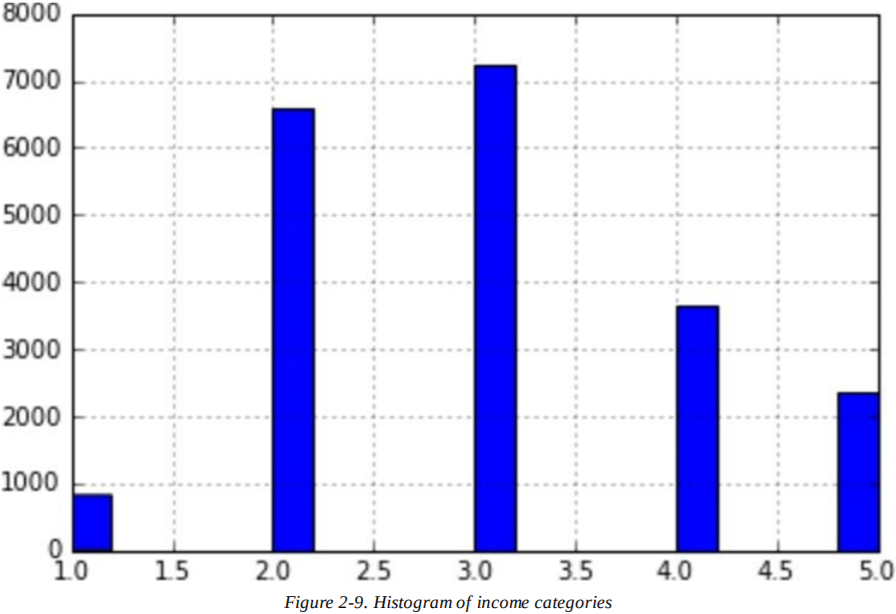

大多数收入中位数的值聚集在2-5（一万美元），不过有些超过了6。每个分层都要有大量的实例在数据集中，这点很重要，否则分层重要性的评估就会有偏差。这意味着你不能有太多的分层，每个分层都要足够大。下面的代码创建了收入类别属性，它将收入中位数除以1.5（限制收入类别的数量），使用`ceil()`向上取整（以产生离散的类别），之后将所有超过5的类别都合并到类别5中：

```python
housing["income_cat"] = np.ceil(housing["median_income"] / 1.5)
housing["income_cat"].where(housing["income_cat"] < 5, 5.0, inplace=True)
```

现在你就可以用分层抽样来做收入分类了。你可以使用Scikit-Learn中的`StratifiedShuffleSplit`这个类：

```python
from sklearn.model_selection import StratifiedShuffleSplit

split = StratifiedShuffleSplit(n_splits=1, test_size=0.2, random_state=42)
for train_index, test_index in split.split(housing, housing["income_cat"]):
    strat_train_set = housing.loc[train_index]
    strat_test_set = housing.loc[test_index]
```

看看结果是否符合预期。你可以在整个housing数据集中查看收入分类的比例：

```python
>>> housing["income_cat"].value_counts() / len(housing)
3.0 0.350581
2.0 0.318847
4.0 0.176308
5.0 0.114438
1.0 0.039826
Name: income_cat, dtype: float64
```

用类似的代码，你还可以测量测试集中的收入分类比例。图2-10比较了在完整数据集、分层抽样产生的测试集和纯随机抽样产生的测试集中收入分类的比例。如你所见，在分层抽样产生的测试集中，收入分类的比例几乎和在完整数据中的相同，而在纯随机抽样产生的测试集中偏差就很大。

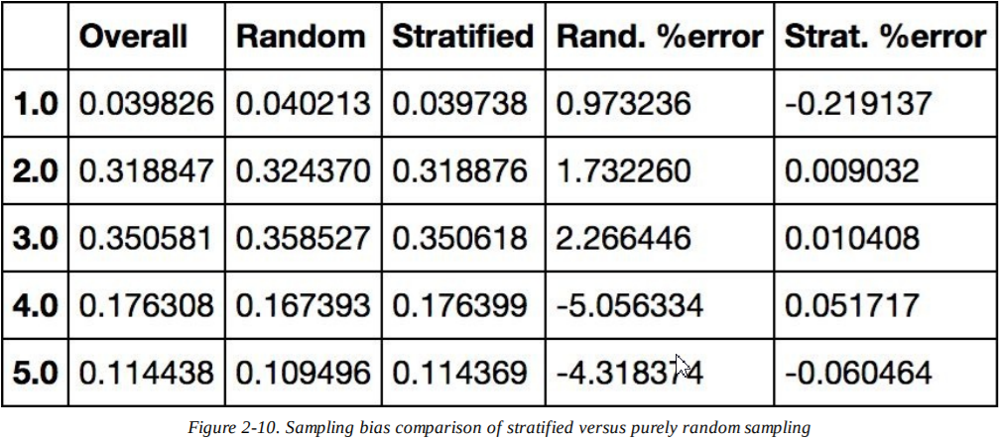

现在你可以移除`income_cat `属性了，数据就回到了最开始的状态：

```python
for set in (strat_train_set, strat_test_set):
    set.drop(["income_cat"], axis=1, inplace=True)
```

我们花了大量时间来生成测试集的原因是：这是一个在机器学习项目中经常被忽略，但是实际很重要的部分。另外，这其中的许多思路对于后面的交叉验证会很有用。接下来进入下一节：探索数据。


## 数据探索与可视化，发现规律

到目前为止，你只是快速扫了一眼数据，对要处理的数据有了大概理解。现在的目标是更深入了解数据。

首先，确保你已经把测试集放在了一边，只探索训练集。如果训练集很大，你可能想要采样一个探索集，为了操作便捷快速。在本例中，集合相当小，所以你可以直接在完整数据集上工作。创建一个副本，这样你就不用担心损坏训练集了：

```python
housing = strat_train_set.copy()
```

### 可视化地理数据

因为数据中有地理信息（经度和纬度），创建所有地区的散点图来可视化数据是个好主意（图2-11）。

```python
housing.plot(kind="scatter", x="longitude", y="latitude")
```

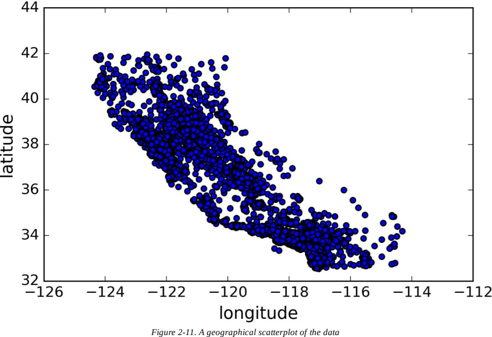

看起来像加州，不过除此之外很难看出其他规律了。设置`alpha`为0.1，更容易看到数据点密度高的地方（图2-12）：

```python
housing.plot(kind="scatter", x="longitude", y="latitude", alpha=0.1)
```

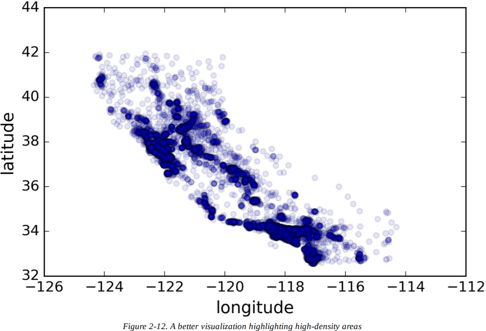

现在好多了：你能清晰地看见高密度的区域，湾区、洛杉矶和圣地亚哥，加上中央谷的一长条线，特别是在萨克拉门托和弗雷斯诺周围。

通常来说，人类的大脑非常擅长在图片中寻找规律，不过你可能需要调整可视化参数来使规律显现。

现在来看一下房价（图2-13）。每个圈的半径代表地区的人口（选项s），颜色代表价格（选项c）。我们用预定义的颜色图（选项cmap）jet，它的范围从蓝色（低数值）到红色（高数值）。

```python
housing.plot(kind="scatter", x="longitude", y="latitude", alpha=0.4,
s=housing["population"]/100, label="population",
c="median_house_value", cmap=plt.get_cmap("jet"), colorbar=True,
)
plt.legend()
```

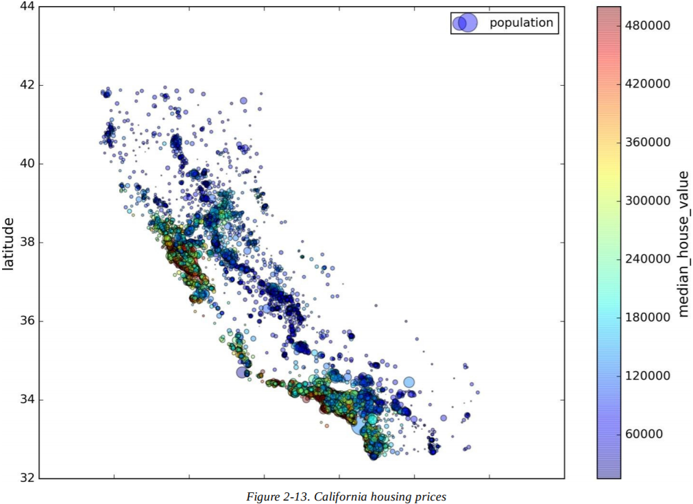

这张图说明房价和地理位置（比如，靠近海边）和人口密度有很大关系，也许你已经知道了。可以使用聚类算法来检测主要的簇，增加新的特征测量聚类中心的距离。海洋距离属性也可能有用，尽管加州北部海岸区的房价并不是太高，所以这不是一个简单的规则。


### 寻找关联

因为数据集不是很大，你很容易用`corr()`方法计算得到每对属性间的**标准相关系数**（*standard correlation coefficient*）（也称为**皮尔逊相关系数**（*Pearson's correlation coefficient*））：

```python
corr_matrix = housing.corr()
```

现在来看每个属性和房价中位数的关联度： 

```python
>>> corr_matrix["median_house_value"].sort_values(ascending=False)
median_house_value  1.000000
median_income       0.687170
total_rooms         0.135231
housing_median_age  0.114220
households          0.064702
total_bedrooms      0.047865
population         -0.026699
longitude          -0.047279
latitude           -0.142826
Name: median_house_value, dtype: float64
```

相关系数的范围从-1到1。当它接近1时，意味着强正相关；比如，当收入中位数上升时，房价中位数也趋向上升。当它接近-1时，意味着强负相关；你可以看到，纬度和房价中位有轻微的负相关（即，向北走房价有轻微的下降趋势）。最后，接近0的系数意味着没有线性相关性。图2-14展示了各种相关系数在横轴和纵轴上的图形。

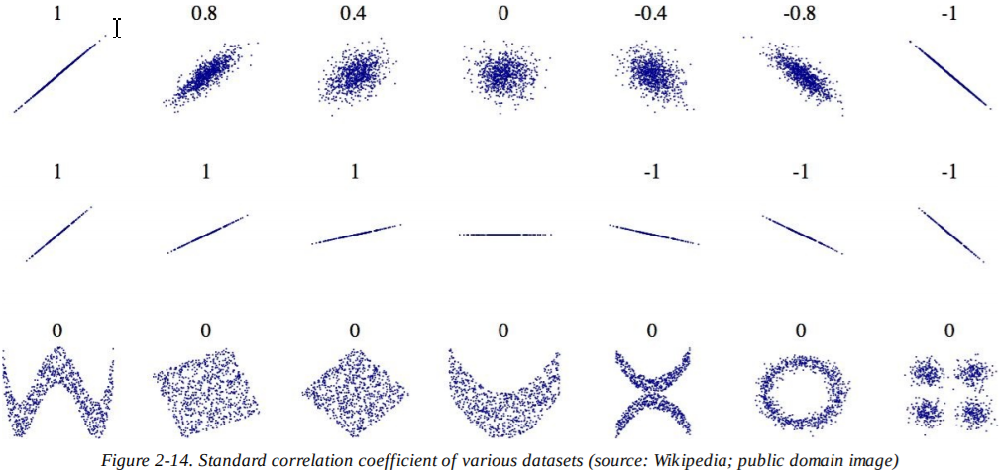

> **警告**
>
> 相关系数只测量线性关系（“若x上升，则y通常上升/下降”）。它可能会完全忽视非线性关系（比如，“若x接近0，则y通常上升”）。注意，在前面的计算中，底部有许多行的相关系数都接近0，尽管它们的轴并不独立：这就是非线性相关的例子。另外，第二行展示了相关系数为1或-1的例子；注意这与斜率无关。例如，你的身高（英寸）与你的身高（英尺或纳米）的相关系数就是1。

另一种检查属性间相关性的方法是使用Pandas的`scatter_matrix`函数，它会绘制每个数值型属性对应其他数值型属性的图。因为有11种数值型属性，所以你会得到$11^2=121$张图，一页纸放不下，所以只关注几个最有可能和房价中位数相关的属性（图2-15）：

```python
from pandas.tools.plotting import scatter_matrix

attributes = ["median_house_value", "median_income", "total_rooms", "housing_median_age"]

scatter_matrix(housing[attributes], figsize=(12, 8))
```

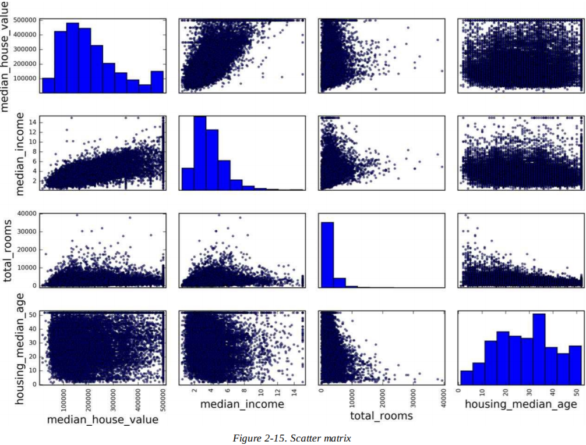

如果Pandas把每个变量对应自己作图，主对角线上（左上到右下）会全是直线图，并没有什么用。所以Pandas展示的是每个属性的直方图（也可以是其他选项，详见Pandas文档）。

最有希望预测房价中位数的属性是收入中位数，来看看放大后的关联散点图（图2-16）。

```
housing.plot(kind="scatter", x="median_income", y="median_house_value", alpha=0.1)
```

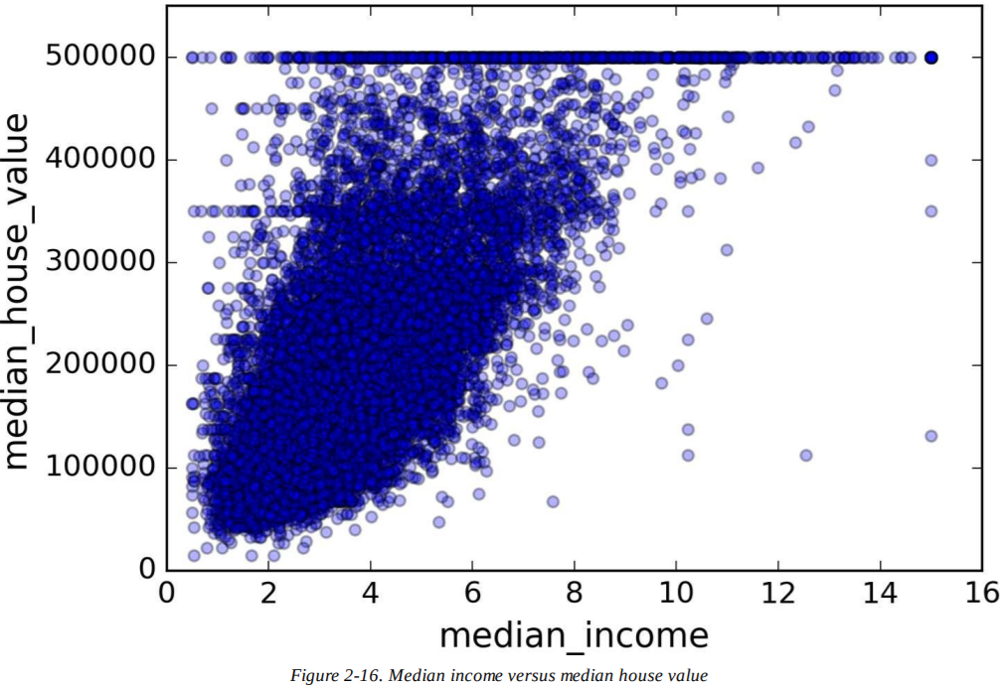

这张图说明了几点。首先，关联性很强。你能清楚看见上升趋势，数据点不是很分散。其次，我们之前看到的最高房价清晰地呈现为一条位于500000的直线。不过，这张图也呈现了一些不太明显的直线：一条位于450000的直线，一条位于350000的直线，也许还有一条位于280000的直线，还有一些在下面的线。你可能希望去掉相应的地区，防止算法重现这些数据巧合。


### 属性组合实验

希望前面几节能给你一些探索数据和发现规律的启迪。你发现了一些数据巧合，在将数据提供给机器学习算法之前，你也许想清除掉它们。你也发现了属性间一些有趣的关联，特别是和目标属性的关联。你也注意到一些属性具有尾巴很重的分布，所以你想转换它们（比如，计算它们的对数）。当然，项目的处理方法会变化，但是总体思想是相似的。

给机器学习算法准备数据之前，你还有最后一件事要做，就是尝试各种属性组合。例如，如果你不知道一个地区有多少家庭，那么房间总数就没什么用。你真正想要的是每家拥有的房间数。类似地，卧室数本身没什么用，你也许想要把它和房间总数比较。每家的人口数看起来也是个有趣的组合属性。让我们来创造这些新属性：

```
housing["rooms_per_household"] = housing["total_rooms"]/housing["households"]
housing["bedrooms_per_room"] = housing["total_bedrooms"]/housing["total_rooms"]
housing["population_per_household"]=housing["population"]/housing["households"]
```

现在再来看看关联矩阵：

```python
>>> corr_matrix = housing.corr()
>>> corr_matrix["median_house_value"].sort_values(ascending=False)
median_house_value          1.000000
median_income               0.687170
rooms_per_household         0.199343
total_rooms                 0.135231
housing_median_age          0.114220
households                  0.064702
total_bedrooms              0.047865
population_per_household   -0.021984
population                 -0.026699
longitude                  -0.047279
latitude                   -0.142826
bedrooms_per_room          -0.260070
Name: median_house_value, dtype: float64
```

还不错！和总房间数或卧室数相比，bedrooms_per_room属性和房价中位数更有关联。显然，卧室数/总房间数比例更低的房子会更贵。每家的房间数也比地区的房间总数信息量更大——显然房子越大，房价越高。


## 为机器学习算法准备数据

是时候为机器学习算法准备数据了。不用手工来做，你需要写一些函数，有如下理由：

- 你能在任何数据集上重现转换过程（比如，下一次你得到的是个新的数据集）。
- 你会慢慢建立一个转换函数的库，在未来的项目中可以重用。
- 在数据传递给算法之前，你能在实时系统中用这些函数来转换数据。
- 还能让你方便地转换各种数据，看看哪些转换方法的结合效果最好。

不过，先回到清洗数据集（再复制一遍`strat_train_set`），将预测量和标签分离，因为我们并不希望对预测量和标签值应用相同的转换（注意，`drop()`只是创造了数据的备份，并不会影响`strat_train_set()`）。

```python
housing = strat_train_set.drop("median_house_value", axis=1)
housing_labels = strat_train_set["median_house_value"].copy()
```


### 数据清洗

大多数机器学习算法并不能处理缺失的特征，所以先写一些函数来解决问题。你先前注意到了，房间总数的属性有些缺失值，所以来修复它。你有三个选项：

- 去除对应的地区。
- 去除整个属性。
- 对缺失值进行赋值（0，平均数，中位数，等等）

你能使用DataFrame的`dropna()`，`drop()`，和`fillna()`方法来轻松完成：

```python
housing.dropna(subset=["total_bedrooms"]) 	# 选项 1
housing.drop("total_bedrooms", axis=1) 		# 选项 2
median = housing["total_bedrooms"].median()
housing["total_bedrooms"].fillna(median) 	# 选项 3
```

如果你选择了选项3，你需要计算训练集的中位数，用它填充训练集中的缺失值，不过别忘了保存你计算得到的中位数。在后面评估系统的时候，你需要用来替换测试集中缺失值，也可以用来实时替换新数据中的缺失值。Scikit-Learn提供了一个方便的类来处理缺失值：`Imputer`。下面是使用方法。首先，你需要创建一个`Imputer`实例，指定该属性的中位数来替换它的每个缺失值。

```python
from sklearn.preprocessing import Imputer

imputer = Imputer(strategy="median")
```

因为只能在数值型属性上计算中位数，我们需要创造一个不含文本型海洋距离属性的数据备份：

```python
housing_num = housing.drop("ocean_proximity", axis=1)
```

现在你可以用`fit()`方法来将`imputer`实例拟合到训练集上：

```python
imputer.fit(housing_num)
```

`imputer`计算了每个属性的中位数，把结果保存在实例变量`statistics_`中。只有房间总数属性有缺失值，但我们不能确保在系统运行之后，新数据中不会再有任何缺失值，所以把`imputer`应用在所有的数值型属性上是安全的做法。

```python
>>> imputer.statistics_
array([ -118.51 , 34.26 , 29. , 2119. , 433. , 1164. , 408. , 3.5414])
>>> housing_num.median().values
array([ -118.51 , 34.26 , 29. , 2119. , 433. , 1164. , 408. , 3.5414])
```

现在你可以用这个“训练过的”`imputer`来转换训练集，将缺失值替换为中位数：

```python
X = imputer.transform(housing_num)
```

结果是一个普通的NumPy数组，包含了转换后的特征。如果你想把它放回Pandas DataFrame里，很简单：

```python
housing_tr = pd.DataFrame(X, columns=housing_num.columns)
```

Scikit-Learn设计


### 处理文本和分类属性

之前，我们丢弃了海洋距离，因为它是文本属性，无法计算它的中位数。大多数机器学习算法更适合处理数字，所以让我们把文本标签转换为数字。

Scikit-Learn为这项任务提供了一个转换器`LabelEncoder`：

```python
>>> from sklearn.preprocessing import LabelEncoder
>>> encoder = LabelEncoder()
>>> housing_cat = housing["ocean_proximity"]
>>> housing_cat_encoded = encoder.fit_transform(housing_cat)
>>> housing_cat_encoded
array([1, 1, 4, ..., 1, 0, 3])
```

这样好多了：现在我们可以在任何机器学习算法中使用这个数值型数据了。你可以查看映射表，编码器使用`classes_`属性来学习（“<1H OCEAN”被映射为0，“INLAND”被映射为1，等等）：

```python
>>> print(encoder.classes_)
['<1H OCEAN' 'INLAND' 'ISLAND' 'NEAR BAY' 'NEAR OCEAN']
```

这样做的问题是，机器学习算法会假设两个相近的值比两个疏远的值要相似。这样显然不对（比如，0和4比0和1相似）。为了解决这个问题，一种常见的方法是为每个分类创建二元属性：当类别为“<1H OCEAN”，一个属性为1（否则为0），当类别为“INLAND”，另一个属性为1（否则为0），以此类推。这被称为**独热编码**（*one-hot
encoding*），因为只有一个属性为1（热），其余都是0（冷）。

Scikit-Learn提供了`OneHotEncoder`编码器将整数分类值转换为独热向量。来把分类编码为独热向量吧。注意，`fit_transform()`接收二维数组，但`housing_cat_encoded`是个一维数组，所以我们需要重塑它：

```python
>>> from sklearn.preprocessing import OneHotEncoder
>>> encoder = OneHotEncoder()
>>> housing_cat_1hot = encoder.fit_transform(housing_cat_encoded.reshape(-1,1))
>>> housing_cat_1hot
<16513x5 sparse matrix of type '<class 'numpy.float64'>'
	with 16513 stored elements in Compressed Sparse Row format>
```

注意，输出是个SciPy的**稀疏矩阵**（*sparse matrix*），而不是NumPy的数组。当分类属性有数千种类别时，这就很有用了。在独热编码后，我们得到了一个有数千列的矩阵，这个矩阵每行只有一个1，其余都是0。使用大量内存来储存这些0很浪费，所以稀疏矩阵只储存非零元素的位置。你能像二维数组一样使用它，不过如果你想把它转变为（密集的）NumPy数组的话，只需调用`toarray()`方法：

```python
>>> housing_cat_1hot.toarray()
array([[0., 1., 0., 0., 0.],
       [0., 1., 0., 0., 0.],
       [0., 0., 0., 0., 1.],
       ...,
       [0., 1., 0., 0., 0.],
       [1., 0., 0., 0., 0.],
       [0., 0., 0., 1., 0.]])
```

使用类`LabelBinarizer`，我们能一步应用两种转换（从文本型到整数分类，再从整数分类到独热向量）：

```python
>>> from sklearn.preprocessing import LabelBinarizer
>>> encoder = LabelBinarizer()
>>> housing_cat_1hot = encoder.fit_transform(housing_cat)
>>> housing_cat_1hot
array([[0, 1, 0, 0, 0],
       [0, 1, 0, 0, 0],
       [0, 0, 0, 0, 1],
       ...,
       [0, 1, 0, 0, 0],
       [1, 0, 0, 0, 0],
       [0, 0, 0, 1, 0]])
```

注意，默认返回的是一个密集NumPy数组。如果向`LabelBinarizer`构造器传递`sparse_output=True`，你会得到一个稀疏矩阵。


### 自定义转换器

尽管Scikit-Learn提供了许多有用的转换器，你还是需要自己动手写来执行一些任务，比如自定义的清理操作或组合特定属性。你希望自己的转换器能和Scikit-Learn的组建（比如管道）无缝衔接，因为Scikit-Learn是依赖鸭子类型的（非继承），你需要做的就是创建一个类，应用三个方法：`fit()`（返回`self`），`transform()`和`fit_transform()`。通过增加`TransformerMixin`作为基类，你能很容易得到最后一个。另外，如果你还把`BaseEstimator`作为基类（避免在构造器中使用`*args`和`**kargs`），你会得到两个额外的方法（`get_params()`和`set_params()`），它们可以方便地进行超参数自动调参。例如，下面就是一个转换器类，添加了我们刚才讨论的组合属性：

```python
from sklearn.base import BaseEstimator, TransformerMixin

rooms_ix, bedrooms_ix, population_ix, household_ix = 3, 4, 5, 6

class CombinedAttributesAdder(BaseEstimator, TransformerMixin):
    def __init__(self, add_bedrooms_per_room = True): # no *args or **kargs
        self.add_bedrooms_per_room = add_bedrooms_per_room
    def fit(self, X, y=None):
        return self # nothing else to do
    def transform(self, X, y=None):
        rooms_per_household = X[:, rooms_ix] / X[:, household_ix]
        population_per_household = X[:, population_ix] / X[:, household_ix]
        if self.add_bedrooms_per_room:
            bedrooms_per_room = X[:, bedrooms_ix] / X[:, rooms_ix]
            return np.c_[X, rooms_per_household, population_per_household, bedrooms_per_room]
        else:
            return np.c_[X, rooms_per_household, population_per_household]

attr_adder = CombinedAttributesAdder(add_bedrooms_per_room=False)
housing_extra_attribs = attr_adder.transform(housing.values)
```

在这个例子中，转换器有一个超参数，`add_bedrooms_per_room`，默认为`True`（提供一个合理的默认值很有帮助）。这个超参数能让你很容易发现添加的这个属性对机器学习算法是否有帮助。更一般地，你可以为每个不能完全确保的数据准备步骤添加一个超参数，自动化数据准备步骤越多，能尝试自动化的组合越多，就更容易找到一种好的组合（会节省大量时间）。


### 特征缩放

数据最重要的转换之一就是**特征缩放**（*feature scaling*）。除了个别情况，当输入的数值属性量度差别很大时，机器学习算法都会表现不好。housing数据也一样：房间总数的范围从6到39320，而收入中位数的范围从0到15。注意，目标值通常不需要进行缩放。

有两种常见方法可以让所有的属性有相同的量度：**最小-最大缩放**（*min-max scaling*）和**标准化**（*standardization*）。

最小-最大缩放（许多人称为**归一化**（*normalization*））很简单：值被转变缩放，最终范围在0-1。我们通过减去最小值，再除以最大值和最小值的差来实现。Scikit-Learn为此提供了一个转换器`MinMaxScaler`。它有一个超参数`feature_range`，能让你改变值的范围，如果你不希望在0-1的话。

标准化就不一样了：它先减去平均值（所以标准化值的平均值通常是0），然后除以方差，使结果的分布具有单位方差。与最小-最大缩放不同，标准化不会把值限定在某个范围内，这也可能会成为某些算法的问题（比如，神经网络经常需要输入范围在0到1）。不过，标准化受异常值的影响很小。例如，假设某个地区的收入中位数是100（由于错误输入）。最小-最大缩放会把所有范围是0-15的值变为0-0.15，但是标准化不会受什么影响。Scikit-Learn为标准化提供了一个转换器`StandardScaler`。

> **警告**
>
> 和其他转换器一样，缩放器只能拟合训练数据，而不是完整的数据集（包括测试集）。只有这样，才能用缩放器转换训练集和测试集	（和新数据）。


### 转换管道

如你所见，有许多数据转换步骤需要按正确顺序执行。幸运的是，Scikit-Learn提供了`Pipeline`类来进行一系列的转换。下面是一个数值型属性的小管道：

```python
from sklearn.pipeline import Pipeline
from sklearn.preprocessing import StandardScaler

num_pipeline = Pipeline([
    ('imputer', Imputer(strategy="median")),
    ('attribs_adder', CombinedAttributesAdder()),
    ('std_scaler', StandardScaler()),
])

housing_num_tr = num_pipeline.fit_transform(housing_num)
```

`Pipeline`构造器需要一个定义步骤顺序的名字/估计量列表。除了最后一个估计量，其余都必须是转换器（即，它们都得有`fit_transform()`方法）。名字可以是任意的。

当你调用管道的`fit()`方法，它会对所有转换器顺序调用`fit_transform()`，将每次调用得到的输出作为参数传递给下一个调用，直到最后一个估计量，它就只用`fit()`方法。

管道暴露相同的方法作为最终的估计量。在本例中，最终的估计量是`StandardScaler`，是个转换器，所以管道有一个`transform()`方法，可以对所有数据进行顺序转换（它还有一个`fit_transform`方法可用，不需要再调用`fit()`和`transform()`方法）。

你现在有一个数值型的管道了，你还需要对类别型应用`LabelBinarizer`：如何将这些转换器放进一个管道中？Scikit-Learn提供了`FeatureUnion`类。你给它转换器的列表（可以是所有的转换器），当它的`transform()`方法被调用，每个转换器的`transform()`方法都会被并行执行，等待输出，然后将输出合并，返回结果（当然，调用它的`fit()`方法就会调用每个转换器的`fit()`方法）。一个完整的处理数值型和类别型属性的管道如下：

```python
from sklearn.pipeline import FeatureUnion

num_attribs = list(housing_num)
cat_attribs = ["ocean_proximity"]

num_pipeline = Pipeline([
    ('selector', DataFrameSelector(num_attribs)),
    ('imputer', Imputer(strategy="median")),
    ('attribs_adder', CombinedAttributesAdder()),
    ('std_scaler', StandardScaler()),
])

cat_pipeline = Pipeline([
    ('selector', DataFrameSelector(cat_attribs)),
    ('label_binarizer', LabelBinarizer()),
])

full_pipeline = FeatureUnion(transformer_list=[
    ("num_pipeline", num_pipeline),
    ("cat_pipeline", cat_pipeline),
])
```

你能简单地运行整个管道：

```python
>>> housing_prepared = full_pipeline.fit_transform(housing)
>>> housing_prepared
array([[0.73225807, -0.67331551, 0.58426443, ..., 0., 0., 0.],
       [-0.99102923, 1.63234656, -0.92655887, ..., 0., 0., 0.],
       [...]
>>> housing_prepared.shape
(16513, 17)
```

每个子管道都以一个选择转换器开始：它通过选择期望的属性（数值型或类别型），丢弃剩下的属性，将输出DataFrame转换为NumPy数组。Scikit-Learn中没有可以处理Pandas DataFrame的方法，所以我们需要写一个简单的自定义转换量来完成任务：

```python
from sklearn.base import BaseEstimator, TransformerMixin

class DataFrameSelector(BaseEstimator, TransformerMixin):
    def __init__(self, attribute_names):
        self.attribute_names = attribute_names
    def fit(self, X, y=None):
        return self
    def transform(self, X):
        return X[self.attribute_names].values
```


## 选择与训练模型

终于到了这里！ 你解决了问题，得到了数据并进行了探索，采样得到了训练集和测试集，也写了转换管道来自动清理数据，为机器学习算法提供数据。现在，你已经准备好选择与训练一个机器学习模型了。


### 训练与评估训练集

好消息是多亏了前面的步骤，接下来要做的事情比你想的简单多。先来训练一个线性回归模型，就像我们在前面做的那样：

```python
from sklearn.linear_model import LinearRegression

lin_reg = LinearRegression()
lin_reg.fit(housing_prepared, housing_labels)
```

完成了！你现在有一个可用的线性回归模型了。用训练集里的一些实例来试试：

```python
>>> some_data = housing.iloc[:5]
>>> some_labels = housing_labels.iloc[:5]
>>> some_data_prepared = full_pipeline.transform(some_data)
>>> print("Predictions:\t", lin_reg.predict(some_data_prepared))
Predictions: 	[ 303104. 44800. 308928. 294208. 368704.]
>>> print("Labels:\t\t", list(some_labels))
Labels: 		[359400.0, 69700.0, 302100.0, 301300.0, 351900.0]
```

这样可行，尽管预测并不是那么准确（比如，第二个预测偏移了50%！）。让我们使用`mean_squared_error`函数，来测量一下回归模型在完整数据集上的RMSE：

```python
>>> from sklearn.metrics import mean_squared_error
>>> housing_predictions = lin_reg.predict(housing_prepared)
>>> lin_mse = mean_squared_error(housing_labels, housing_predictions)
>>> lin_rmse = np.sqrt(lin_mse)
>>> lin_rmse
68628.413493824875
```

好吧，总比没有强，不过实在不是个好结果：大多数地区的房价中位数范围在120000美元到265000美元间，所以预测误差68628美元不太令人满意。这是一个模型欠拟合数据的例子。这种情况发生时，意味着特征并没有提供足够的信息来做出良好的预测，或者模型不够强大。如我们在上一章所见，解决欠拟合问题的方法是选择一个更强的模型，或者提供给训练算法更好的特征，或者减少模型的限制。这个模型没有正则化，所以排除最后一种选择。你可以尝试增加更多特征（比如，人口的对数），不过首先让我们尝试一个更复杂的模型，来看看它的效果如何。

试试训练一个`DecisionTreeRegressor`。这是一个很强大的模型，能找到数据中的非线性关系（决策树的详解见第六章）。代码看上去很熟悉：

```python
from sklearn.tree import DecisionTreeRegressor

tree_reg = DecisionTreeRegressor()
tree_reg.fit(housing_prepared, housing_labels)
```

既然模型已经训练好，让我们在训练集中评估它：

```
>>> housing_predictions = tree_reg.predict(housing_prepared)
>>> tree_mse = mean_squared_error(housing_labels, housing_predictions)
>>> tree_rmse = np.sqrt(tree_mse)
>>> tree_rmse
0.0
```

等等，什么情况？一点错误都没有？这个模型真的这么完美？当然，更可能是严重过拟合数据了。如何确定？如先前所见，直到你准备发布一个有信心的模型为止，你不想碰测试集，所以你需要训练集的一部分来测试，一部分来做模型验证。


### 使用交叉验证做更好的评估

一种评估决策树模型的方法是使用`train_test_split `函数，来把训练集划分为更小的训练集和验证集，然后在更小的训练集上训练模型，在验证集上评估模型。这需要一点工作量，不过并不难，效果也很好。

另一种方法是用Scikit-Learn的`cross-validation`功能。下面的代码展示了**K折交叉验证**（*K-fold cross-validation*）：随机将训练集分成十个子集，称为“折”，然后训练并评估决策树10次，每次选一个不同的折，用剩下的9折来训练。结果是一个包含10次评估的数组：

```python
from sklearn.model_selection import cross_val_score
scores = cross_val_score(tree_reg, housing_prepared, housing_labels,
						scoring="neg_mean_squared_error", cv=10)
rmse_scores = np.sqrt(-scores)
```

> **警告**
>
> Scikit-Learn交叉验证功能期望的是效用函数（越大越好）而不是代价函数（越低越好），所以评分函数实际是与MSE相反（即负数），这就是前面代码在计算平方根前先计算`-score()`的原因。

来看看结果：

```python
>>> def display_scores(scores):
... print("Scores:", scores)
... print("Mean:", scores.mean())
... print("Standard deviation:", scores.std())
...
>>> display_scores(tree_rmse_scores)
Scores: [74678.4916885 64766.2398337 69632.86942005 69166.67693232
         71486.76507766 73321.65695983 71860.04741226 71086.32691692
         76934.2726093 69060.93319262]
Mean: 71199.4280043
Standard deviation: 3202.70522793
```

现在决策树就不像之前那么好了。实际上，它似乎表现得比线性回归模型还差！注意，交叉验证不仅能让你得到模型的评估，还能测量评估的准确性（即它的标准差）。决策树的评分大约是71200±3200。如果你只用一个验证集，就无法得到这些信息。但是交叉验证的代价是训练了模型许多次，所以并不总是这样。

让我们计算一下线性回归模型的相同分数，来确认一下：

```python
>>> lin_scores = cross_val_score(lin_reg, housing_prepared, housing_labels,
...                             scoring="neg_mean_squared_error", cv=10)
...
>>> lin_rmse_scores = np.sqrt(-lin_scores)
>>> display_scores(lin_rmse_scores)
Scores: [70423.5893262 65804.84913139 66620.84314068 72510.11362141
         66414.74423281 71958.89083606 67624.90198297 67825.36117664
         72512.36533141 68028.11688067]
Mean: 68972.377566
Standard deviation: 2493.98819069
```

没错：决策树模型严重过拟合，比线性模型的性能还糟糕。

现在让我们尝试最后一个模型：`RandomForestRegressor`。我们在第七章中会见到，随机森林是通过特征的随机子集来训练许多决策树来运行的，然后输出它们预测的平均值。在许多模型之上建立模型的方法称为**集成学习**（*Ensemble Learning*），通常是个推进机器学习算法的好方法。我们会跳过大多数代码，因为代码本质上和其他模型一样：

```python
>>> from sklearn.ensemble import RandomForestRegressor
>>> forest_reg = RandomForestRegressor()
>>> forest_reg.fit(housing_prepared, housing_labels)
>>> [...]
>>> forest_rmse
22542.396440343684
>>> display_scores(forest_rmse_scores)
Scores: [53789.2879722 50256.19806622 52521.55342602 53237.44937943
         52428.82176158 55854.61222549 52158.02291609 50093.66125649
         53240.80406125 52761.50852822]
Mean: 52634.1919593
Standard deviation: 1576.20472269
```

这就好多了：随机森林看起来有希望。然而，训练集的评分还是比验证集低很多。意味着模型仍然过拟合训练集。也许解决方法是简化模型，限制模型（比如正则化），或者得到更多的训练数据。不过，在你更深入随机森林之前，应该尝试机器学习算法其他类型的模型（不同核心的支持向量机，神经网络，等等），不要在调超参数上花费过多的时间。目标是筛选出一些（2到5个）有希望的模型。

> **提示**
>
> 你应该保存每个试验过的模型，以便后续使用。确保你保存了超参数和训练参数，还有交叉验证的评分和实际预测值。这样方便比较不同模型的评分和犯的错。使用Python的`pickle`模块，你能很容易地保存Scikit-Learn的模型，或者使用`sklearn.externals.joblib`，序列化NumPy数组更高效。
>
> ```
> from sklearn.externals import joblib
> joblib.dump(my_model, "my_model.pkl")
> # 过一会儿……
> my_model_loaded = joblib.load("my_model.pkl")
> ```


## 模型微调

假设你已经筛选出了有希望的模型。现在你需要微调它们。来看看几种具体做法。


### 网格搜索

微调的一种方法是手工调整超参数，直到找到一个不错的超参数组合。这是件非常冗长乏味的事，你可能没有时间探索多种组合。

你应该用Scikit-Learn的`GridSearchCV`来帮你搜索。你只需要告诉它有哪些超参数要试验，要试什么值，它会用交叉验证评估所有可能的超参数组合。例如，下面的代码为`RandomForestRegressor`搜索了超参数的最佳组合：

```python
from sklearn.model_selection import GridSearchCV

param_grid = [
    {'n_estimators': [3, 10, 30], 'max_features': [2, 4, 6, 8]},
    {'bootstrap': [False], 'n_estimators': [3, 10], 'max_features': [2, 3, 4]},
]

forest_reg = RandomForestRegressor()

grid_search = GridSearchCV(forest_reg, param_grid, cv=5,
                           scoring='neg_mean_squared_error')
						   
grid_search.fit(housing_prepared, housing_labels)
```

> **提示**
>
> 当你不知道超参数该取什么值时，一种方法是尝试连续的10的次方（如果你想要一个粒度更小的搜索，可以用更小的数，就像在这个例子中对超参数`n_estimators`做的一样）。

`param_grid`告诉Scikit-Learn先评估第一个dict中超参数`n_estimators`和`max_features`的3×4=12种组合（现在不用担心这些超参数代表什么，我们会在第七章进行解释），然后尝试在第二个dict中2×3=6种超参数的组合，不过这一次超参数`bootstrap`设置为`False`（`True`是默认值）。

总之，网格搜索会探索超参数`RandomForestRegressor`的12+6=18种组合，它会训练每个模型5次（因为我们使用了5折交叉验证）。换言之，会有18×5=90轮的训练！这会花费大量时间，不过当它完成时，你就能得到参数的最佳组合了，就像这样：

```python
>>> grid_search.best_params_
{'max_features': 6, 'n_estimators': 30}
```

> **提示**
>
> 因为30是`n_estimators`的最大值，你也应该评估更高的值，因为评分也许会继续提升。

你也可以直接得到最佳估计量：

```python
>>> grid_search.best_estimator_
RandomForestRegressor(bootstrap=True, criterion='mse', max_depth=None,
                      max_features=6, max_leaf_nodes=None, min_samples_leaf=1,
                      min_samples_split=2, min_weight_fraction_leaf=0.0,
                      n_estimators=30, n_jobs=1, oob_score=False, random_state=None,
                      verbose=0, warm_start=False)
```

> **注意**
>
> 如果`GridSearchCV`是以`refit=True`（默认值）初始化运行的，所以它一旦用交叉验证找到最佳估计量，就会在整个数据上重新训练。这通常是个好办法，因为提供更多的数据会提高它的性能。

当然，也能得到评估值：

```python
>>> cvres = grid_search.cv_results_
... for mean_score, params in zip(cvres["mean_test_score"], cvres["params"]):
... print(np.sqrt(-mean_score), params)
...
64912.0351358 {'max_features': 2, 'n_estimators': 3}
55535.2786524 {'max_features': 2, 'n_estimators': 10}
52940.2696165 {'max_features': 2, 'n_estimators': 30}
60384.0908354 {'max_features': 4, 'n_estimators': 3}
52709.9199934 {'max_features': 4, 'n_estimators': 10}
50503.5985321 {'max_features': 4, 'n_estimators': 30}
59058.1153485 {'max_features': 6, 'n_estimators': 3}
52172.0292957 {'max_features': 6, 'n_estimators': 10}
49958.9555932 {'max_features': 6, 'n_estimators': 30}
59122.260006 {'max_features': 8, 'n_estimators': 3}
52441.5896087 {'max_features': 8, 'n_estimators': 10}
50041.4899416 {'max_features': 8, 'n_estimators': 30}
62371.1221202 {'bootstrap': False, 'max_features': 2, 'n_estimators': 3}
54572.2557534 {'bootstrap': False, 'max_features': 2, 'n_estimators': 10}
59634.0533132 {'bootstrap': False, 'max_features': 3, 'n_estimators': 3}
52456.0883904 {'bootstrap': False, 'max_features': 3, 'n_estimators': 10}
58825.665239 {'bootstrap': False, 'max_features': 4, 'n_estimators': 3}
52012.9945396 {'bootstrap': False, 'max_features': 4, 'n_estimators': 10}
```

在这个例子中，通过设定超参数`max_features`为6，`n_estimators`为30，得到了最佳解决方案。对于这个组合，RMSE的值为49959，比之前用默认超参数得到的值（52634）要好一些了。恭喜，你成功微调了最佳模型！

> **提示**
>
> 别忘了，你可以像超参数一样处理数据准备步骤。例如，网格搜索可以自动判断是否添加一个你不确定的特征，（比如，使用转换器`CombinedAttributesAdder`的超参数`add_bedrooms_per_room`）。它还能用相似的方法来自动找到处理异常值、缺失特征、特征选择等的最佳方法。


### 随机搜索

当你探索的组合相对少时，像是之前的例子，网格搜索方法还算好，但是当超参数搜索空间很大时，最好使用`RandomizedSearchCV`。这个类的使用方法和`GridSearchCV`很类似，但不是尝试所有可能的组合，而是通过每次迭代时选择每个超参数的一个随机值的特定数量的随机组合。这种方法有两个主要优点：

- 如果你让随机搜索运行，比如1000次，它会为每个超参数探索1000个不同的值（而不是像网格搜索那样，只搜索每个超参数的几个值）。
- 只需设置迭代次数，你就可以更好地控制分配给超参数搜索的计算量。


### 集成方法

另一种微调系统的方法是将表现最好的模型组合起来。组合（“集成”）总会比单独的模型表现好（就像随机森林比单独的决策树表现好），尤其是当单独的模型的误差类型不同时。我们会在第七章详细讨论。


### 分析最佳模型和它们的误差

通过检查最佳模型，你常能获得对问题的良好见解。例如，`RandomForestRegressor`能指出每个属性对做出准确预测的相对重要性：

```python
>>> feature_importances = grid_search.best_estimator_.feature_importances_
>>> feature_importances
array([7.14156423e-02, 6.76139189e-02, 4.44260894e-02,
       1.66308583e-02, 1.66076861e-02, 1.82402545e-02,
       1.63458761e-02, 3.26497987e-01, 6.04365775e-02,
       1.13055290e-01, 7.79324766e-02, 1.12166442e-02,
       1.53344918e-01, 8.41308969e-05, 2.68483884e-03,
       3.46681181e-03])
```

来把重要性指数放到相关属性名旁边：

```python
>>> extra_attribs = ["rooms_per_hhold", "pop_per_hhold", "bedrooms_per_room"]
>>> cat_one_hot_attribs = list(encoder.classes_)
>>> attributes = num_attribs + extra_attribs + cat_one_hot_attribs
>>> sorted(zip(feature_importances, attributes), reverse=True)
[(0.32649798665134971, 'median_income'),
 (0.15334491760305854, 'INLAND'),
 (0.11305529021187399, 'pop_per_hhold'),
 (0.07793247662544775, 'bedrooms_per_room'),
 (0.071415642259275158, 'longitude'),
 (0.067613918945568688, 'latitude'),
 (0.060436577499703222, 'rooms_per_hhold'),
 (0.04442608939578685, 'housing_median_age'),
 (0.018240254462909437, 'population'),
 (0.01663085833886218, 'total_rooms'),
 (0.016607686091288865, 'total_bedrooms'),
 (0.016345876147580776, 'households'),
 (0.011216644219017424, '<1H OCEAN'),
 (0.0034668118081117387, 'NEAR OCEAN'),
 (0.0026848388432755429, 'NEAR BAY'),
 (8.4130896890070617e-05, 'ISLAND')]
```

有了以上信息，你可能想要丢掉一些不重要的特征（比如，只要有海洋距离分类就够了，其他都可以舍弃）。

你也应该看看系统犯的特定误差，尝试理解为什么会有这些误差，以及如何修复问题（增加额外特征或者，相反地，舍弃没有什么信息的特征，清理异常值，等等）。


### 在测试集上评估系统

调完系统后，你最终有了一个表现还不错的系统。现在是在测试集上评估最终模型的时候了。这个过程没什么特殊的，只是从测试集获得预测值与标签值，运行`full_pipeline`来转换数据（调用`transform()`，而不是`fit_transform()`！），在测试集上评估最终模型：

```python
final_model = grid_search.best_estimator_

X_test = strat_test_set.drop("median_house_value", axis=1)
y_test = strat_test_set["median_house_value"].copy()

X_test_prepared = full_pipeline.transform(X_test)

final_predictions = final_model.predict(X_test_prepared)
final_mse = mean_squared_error(y_test, final_predictions)
final_rmse = np.sqrt(final_mse) # => evaluates to 48,209.6
```

如果你做了大量超参数调节，性能通常会比你用交叉验证的效果差一些（因为你的系统在验证集上微调表现效果好，在未知的数据集上通常表现不会好）。这个例子不属于这种情况，不过当它发生的时候，千万不要忍不住出调超参数，来让测试集的结果变好看，这样的提升并不能泛化到新数据上。

现在是项目的预上线阶段：你需要展示你的解决方案（高亮你学了什么、做了什么、没做什么、做过什么假设、系统的限制是什么），记录所有事，用清晰的可视化方式和易懂的陈述（比如，“收入中位数是房价最重要的一个预测量”）来做精彩的展示。


## 启动、监控、维护系统

很好，你能启动系统了！你需要为生产做准备，尤其是接入数据源和编写测试。

你也需要写监控代码，每隔固定间隔来检查系统的实时表现，当它下降使触发警报。这对于捕获突如其来的系统崩溃和性能下降十分重要。这样做很常见，因为模型会随着数据演变而性能下降，除非经常用新数据定期训练。

评估系统的性能需要对系统的预测量采样并进行评估。这通常需要人工分析。分析者可能是专家，或众包平台（比如Amazon Mechanical Turk，或者Crowd Flower）的工人。不管用哪种方法，你都需要把人工评估管道植入系统。

你也应该评估系统输入数据的质量。有时因为低质量的信号（比如，失灵的传感器发送随机值，或另一个团队的输出过时）性能会稍微下降，不过可能需要一些时间才会触发警报。如果你监控系统的输入，你可能会早点发现。监控输入对于在线学习系统而言尤其重要。

最后，你可能想定期用新数据训练模型。你应该尽可能自动化这个过程。如果不这么做，你很有可能得每六个月更新一次模型，系统性能可能会随时间而严重波动。如果是在线学习系统，你需要定期保存状态快照，为了方便回滚到之前的工作状态。


## 实践！

希望这一章能告诉你机器学习项目是什么样的，并展示了一些用于训练更好系统的工具。如你所见，大部分工作都在数据准备步骤，建立监控工具，设置人工评估管道，还有自动化定期模型训练。当然，机器学习算法也很重要，不过最好能了解全过程，熟知三到四种算法，而不是在探索高级算法上花费所有时间，以致于没有时间留给全过程。

所以，如果你还没这样做，现在最好拿起笔记本电脑，选择一个你感兴趣的数据集，尝试着经历一遍完整流程。一个不错的起手开始是竞赛网站，[http://kaggle.com/](http://kaggle.com/)：你会得到一个数据集，一个清晰的目标，还有一群可以分享经验的人。


## 练习

使用本章的housing数据集：

1. 尝试使用支持向量机回归器（`sklearn.svm.SVR`），使用多种超参数，比如`kernel="linear"`（有多个超参数`C`值）或者`kernel="rbf"`。现在不用担心这些超参数代表什么。最好的`SVR`预测表现如何？
2. 尝试用`RandomizedSearchCV`代替`GridSearchCV`。
3. 尝试在准备管道中增加一个转换器，只需要选择最重要的属性。
4. 尝试创建一个单独的管道，可以完成数据准备和最终预测。
5. 用`GridSearchCV`自动探索一些准备过程中的候选项。

## 总结

本章重点：回归任务

回归问题的两种性能指标：

- 均方根误差（RMSE）：sklearn.metrics.mean_squared_error

- 平均绝对误差（MAE）

查看数据的方法：

- Matplotlib：

  - head()：查看前五行数据
  - info()：查看数据描述（属性及其类型、空值数等）
  - describe()：数据总览（count、mean、std、min、25%、50%、75%、max）
  - hist()：画出所有属性的直方图
  - corr()：计算每对属性间的皮尔逊相关系数

- Pandas：

  - scatter_matrix()：画出数值-数值属性的直方图

划分训练集和测试集的方法：

- sklearn.model_selection - train_test_split()

处理缺失值的方法：

- Pandas.DataFrame：
  - dropna()：删除含有空值的行/列
  - drop()：删除整个属性
  - fillna()：对缺失值进行赋值
- Sklearn.preprocessing - Imputer类

处理文本数据的方法：

- sklearn.preprocessing - LabelEncoder类
- sklearn.preprocessing - OneHotEncoder类
- sklearn.preprocessing - LabelBinarizer类

特征缩放：

- 归一化
- 标准化

训练模型的方法：

- sklearn.linear_model - LinearRegression：线性回归模型
- sklearn.tree - DecisionTreeRegressor：决策树模型
- sklearn.ensemble - RandomForestRegressor：随机森林模型

评估模型的方法：

- 交叉验证：sklearn.model_selection - cross-validation

模型微调的方法：

- sklearn.model_selection - GridSearchCV：网格搜索
- sklearn.model_selection - RandomizedSearchCV：随机搜索
