# 第三章：分类

在第一章中，我们提到了最普通的监督学习任务是回归（预测值）和分类（预测类）。在第二章中，我们探索了一个回归任务，预测了房价，使用了多种算法，比如线性回归，决策树，还有随机森林（在之后的章节中会详细解释）。现在我们来关注分类系统。


## MNIST

在本章中，我们将使用MNIST数据集，它有 70000 张手写数字的小图，来自美国高校生和人口调查局的雇员。每张图都被它代表的数字所标记。这个数据被多次使用，经常被称作机器学习的 “Hello World” ：当提出一个新的分类算法时，人们很好奇它在 MNIST 上表现如何。机器学习的学习者早晚都会处理 MNIST 这个数据集。

Scikit-Learn 提供了许多辅助函数来下载流行的数据集。 MNIST 也是其中之一。下面的代码获取了 MNIST 数据集：

```python
>>> from sklearn.datasets import fetch_mldata
>>> mnist = fetch_mldata('MNIST original')
>>> mnist
{'COL_NAMES': ['label', 'data'],
 'DESCR': 'mldata.org dataset: mnist-original',
 'data': array([[0, 0, 0, ..., 0, 0, 0],
                [0, 0, 0, ..., 0, 0, 0],
                [0, 0, 0, ..., 0, 0, 0],
                ...,
                [0, 0, 0, ..., 0, 0, 0],
                [0, 0, 0, ..., 0, 0, 0],
                [0, 0, 0, ..., 0, 0, 0]], dtype=uint8),
 'target': array([0., 0., 0., ..., 9., 9., 9.])}
```

Scikit-Learn 加载的数据集通常有相似的字典结构：

- `DESCR`键描述数据集
- `data`键包含数组，每行代表一个实例，每列代表一个特征
- `target`键包含标签数组

来看看这些数组：

```python
>>> X, y = mnist["data"], mnist["target"]
>>> X.shape
(70000, 784)
>>> y.shape
(70000,)
```

共有 70000 张图片，每张图有 784 个特征。这是因为每张图都是 28×28 的像素，每个特征代表像素的强度，范围从 0 （白色）到 255 （黑色）。让我们看看数据集中的某个数字。你只需要选取一个实例的特征向量，重塑为 28×28 的数组，并用 Matplotlib 的`imshow()`函数加以展示：

```python
%matplotlib inline
import matplotlib
import matplotlib.pyplot as plt

some_digit = X[36000]
some_digit_image = some_digit.reshape(28, 28)

plt.imshow(some_digit_image, cmap = matplotlib.cm.binary, interpolation="nearest")
plt.axis("off")
plt.show()
```

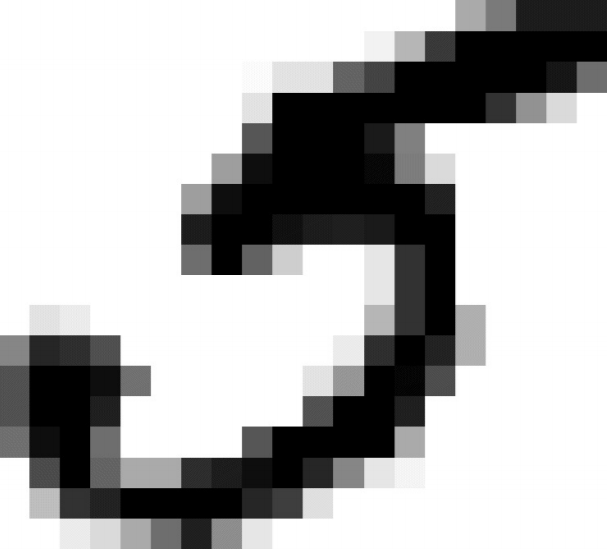

看起来像个 5 ，实际上标签也是这样告诉我们的：

```python
>>> y[36000]
5.0
```

图 3-1 展示了一些 MNIST 数据集的图片，让你感觉到分类问题的复杂。

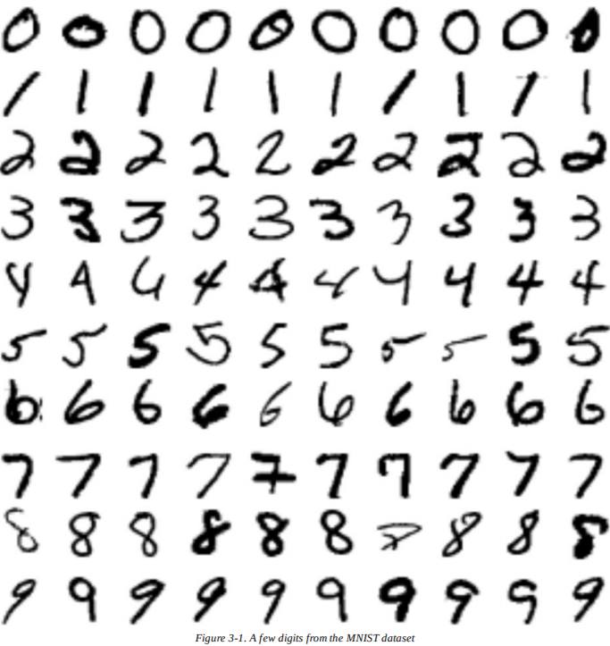

等一下！在进一步调查数据之前，你应该创建一个测试集，并把它放在一边。 MNIST 数据集实际上已经划分为训练集（前 60000 张图）和测试集（最后 10000 张图）：

```python
X_train, X_test, y_train, y_test = X[:60000], X[60000:], y[:60000], y[60000:]
```

让我们重排训练集，保证所有的交叉验证折都类似（你不希望某一折缺失了一些数字）。此外，一些学习算法对训练实例的顺序很敏感，如果它们在一列中得到过多相似的实例，会表现得很差。打乱数据集，确保这样的事不会发生：

```python
import numpy as np

shuffle_index = np.random.permutation(60000)
X_train, y_train = X_train[shuffle_index], y_train[shuffle_index]
```

## 训练二分类器

现在简化一下问题，只尝试识别一个数字——例如，数字 5 。这个“数字 5 - 检测器”是一个**二分类器**（*binary classifier*），只能区分两种类别，是 5 和非 5 。让我们来为这个分类任务创建目标向量：

```python
y_train_5 = (y_train == 5) # True for all 5s, False for all other digits.
y_test_5 = (y_test == 5)
```

现在让我们挑选一个分类器并训练它。可以用**随机梯度下降**（*Stochastic Gradient Descent*，SGD）分类器作为开始，使用 Scikit-Learn 的`SGDClassifier`类。这个分类有一个优点，它能高效处理非常大的数据集。部分原因是SGD一次只独立处理一个训练实例（这也使得 SGD 很好地适应在线学习），我们之后会看到。让我们创建一个`SGDClassifier`，在整个数据集上训练它：

```python
from sklearn.linear_model import SGDClassifier

sgd_clf = SGDClassifier(random_state=42)
sgd_clf.fit(X_train, y_train_5)
```

> **提示**
> `SGDClassifier`依赖训练集的随机程度（也是 “stochastic（随机）” 的由来），如果你想重现结果，需要设置参数`random_state`。

现在你可以用它来检测数字 5 的图片了：

```python
>>> sgd_clf.predict([some_digit])
array([True], dtype=bool)
```

分类器猜测这个数字是 5 （True）。看来在这个特定例子中，它猜对了！现在，让我们来评估模型的性能。

## 性能度量

评估一个分类器总是比评估一个回归器要棘手很多，所以我们会在这个话题上花费大量篇幅。有许多可行的性能度量方法，所以去取一杯咖啡，准备好学习许多新的概念和缩略词吧。

### 用交叉验证测量精度

评估模型的一种好方法是使用交叉验证，就像你在第二章里做的那样。

> **交叉验证的应用**
>
> 有时，相比于`cross_val_score()`和类似函数所提供的功能，你需要对交叉验证过程进行更多控制。在这种情况下，可以自己应用交叉验证，它非常直截了当。下面的代码大致和`cross_val_score()`做了同样的事，打印了同样的结果：
>
> ```python
> from sklearn.model_selection import StratifiedKFold
> from sklearn.base import clone
> 
> skfolds = StratifiedKFold(n_splits=3, random_state=42)
> 
> for train_index, test_index in skfolds.split(X_train, y_train_5):
>     clone_clf = clone(sgd_clf)
>     X_train_folds = X_train[train_index]
>     y_train_folds = (y_train_5[train_index])
>     X_test_fold = X_train[test_index]
>     y_test_fold = (y_train_5[test_index])
>     clone_clf.fit(X_train_folds, y_train_folds)
>     y_pred = clone_clf.predict(X_test_fold)
>     n_correct = sum(y_pred == y_test_fold)
>     print(n_correct / len(y_pred))  # prints 0.9502, 0.96565 and 0.96495
> ```
>
> `StratifiedKFold`类实现了分层采样（第二章中有解释），生成的折包含了每个类的比例。每次迭代，代码创造分类器的一个克隆，在训练折上训练克隆，在测试折上进行预测。它会计算预测正确的数量，输出正确预测的比例。

让我们使用`cross_val_score()`函数来评估使用了 K 折交叉验证（k=3）的`SGDClassifier`模型。记住， K 折交叉验证意味着将训练集划分为 K 折（此处为 3 折），使用模型在其中一折上进行预测和评估，在剩下折上进行训练（见第二章）：

```python
>>> from sklearn.model_selection import cross_val_score
>>> cross_val_score(sgd_clf, X_train, y_train_5, cv=3, scoring="accuracy")
array([ 0.9502 , 0.96565, 0.96495])
```

哇！在交叉验证上的精度（正确预测的比例）超过 95% ！令人惊讶，对吧？不过，别兴奋太早，让我们来看看一个非常笨的分类器在这个“非 5 ”类上的表现：

```python
from sklearn.base import BaseEstimator
class Never5Classifier(BaseEstimator):
    def fit(self, X, y=None):
        pass
    def predict(self, X):
        return np.zeros((len(X), 1), dtype=bool)
```

你猜到这个模型的精度了吗？

```python
>>> never_5_clf = Never5Classifier()
>>> cross_val_score(never_5_clf, X_train, y_train_5, cv=3, scoring="accuracy")
array([ 0.909 , 0.90715, 0.9128 ])
```

没错，它的精度超过 90% ！这是因为只有大约 10% 的图片是 5 ，所以如果你总是猜测图片不是 5 ，有 90% 的次数你都是对的。打败了大预言家诺查丹玛斯。

这表明了为什么精度通常不适合作为分类器的性能度量，尤其是当你处理有偏差的数据集（*skewed datasets*）（即，有一些类相比其他类出现得更频繁）。

### 混淆矩阵

一种更好的评估分类器性能的方法是查看**混淆矩阵**（*confusion matrix*）。大体思路是计算类别 A 被分类成类别 B 的次数。例如，想知道分类器错把 5 分类成 3 的次数，你需要查看混淆矩阵的第 5 行第 3 列。

为了计算得到混淆矩阵，你首先需要一系列预测值，能和真实目标作比较。你可以在测试集上进行预测，不过我们暂时先不碰它（记住，只有在项目临近结尾、你已经准备启动分类器时才使用测试集）。相反，你可以使用`cross_val_predict()`函数：

```python
from sklearn.model_selection import cross_val_predict
y_train_pred = cross_val_predict(sgd_clf, X_train, y_train_5, cv=3)
```

就像`cross_val_score()`函数一样，`cross_val_predict()`也使用K折交叉验证，不过不是返回一个评估分数，而是返回每一个测试折的预测。这就意味着，你对训练集每个实例都得到一个干净的预测（ ”干净“ 是指模型在训练时从未看过数据而做出了预测）。

现在你已经准备好用`confusion_matrix()`函数来得到混淆矩阵了。只需将目标类（`y_train_5`）和预测类（`y_train_pred`）传递给函数：

```python
>>> from sklearn.metrics import confusion_matrix
>>> confusion_matrix(y_train_5, y_train_pred)
array([[53272, 1307],
       [1077, 4344]])
```

混淆矩阵中的每一行代表一个实际的类，每一列代表一个预测的类。矩阵中的第一行认为非 5 的图片（**反例**（*negative class*））中： 53272 张被正确分类为非 5 （被称为**真反例**（*true negatives*）），剩下的 1307 张被错误分类为 5 （**假正例**（*false positives*））。第二行认为是 5 的图片（**正例**（*positive class*））： 1077 张被错误分类为非 5 （**假反例**（*false negatives*）），剩下的 4344 张被正确分类为 5 （**真正例**（*true positives*））。一个完美的分类器只有真正例和真反例，所以混淆矩阵的非零值只在主对角线（左上到右下）上。

```python
>>> confusion_matrix(y_train_5, y_train_perfect_predictions)
array([[54579, 0],
       [0, 5421]])
```

混淆矩阵能提供许多信息，不过有时你想要更简洁的指标。一个有趣的指标是正例预测的精度，被称为分类器的**准确率**（*precision*）（等式 3-1 ）。


TP 是真正例的数量， FP 是假正例的数量。

得到完美准确率的一个简单方法是构造一个单一正例的预测，确保它是对的（precision = 1/1 = 100%）。这并没有什么用，因为分类器会忽略所有样例，除了那个正例。所以准确率一般伴随着另一个指标一起使用——**召回率**（*recall*），也被称为**敏感度**（*sensitivity*）或者**真正例率**（*true positive rate*，TPR）：这是正例被被分类器正确探测到的比例（等式 3-2 ）。


FN 是假负例的数量。

如果你对混淆矩阵感到困惑，图 3-2 可能会有所帮助。

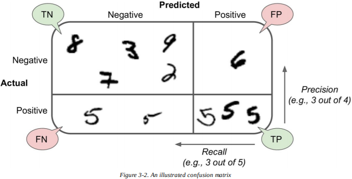

### 准确率与召回率

Scikit-Learn 提供了一些计算分类器指标的函数，包括准确率和召回率：

```python
>>> from sklearn.metrics import precision_score, recall_score
>>> precision_score(y_train_5, y_pred) # == 4344 / (4344 + 1307)
0.76871350203503808
>>> recall_score(y_train_5, y_train_pred) # == 4344 / (4344 + 1077)
0.79136690647482011
```

现在当你观察精度时，你的 5 - 检测器看起来还不够好。当它声称一张图代表 5 时，它只有 77% 的正确率。此外，它只预测 79% 的 5 。

通常把准确率和召回率结合成一个单独的指标  值（*F1 score*），这样会比较方便，特别是当你需要一个简单的方法来比较两个分类器的时候。  值是准确率与召回率的调和平均（等式 3-3 ）。普通的平均数平等对待所有值，而调和平均数会给小值更高的权重。所以，只有在准确率和召回率都高的情况下，  值才会高。


要计算  值，只要简单地调用`f1_score()`函数：

```python
>>> from sklearn.metrics import f1_score
>>> f1_score(y_train_5, y_pred)
0.78468208092485547
```

 值偏好准确率和召回率相似的分类器。这不总是你想要的：有些情况你会更关注准确率，另一些情况你会更关注召回率。例如，如果你训练的分类器用于检测视频对于儿童是否安全，你会更偏向于宁可拒绝很多好视频（低召回率），也要保证所有视频都是好的（高准确率）分类器，而不是召回率很高，但让一些坏视频出现的分类器（这种情况下，你也许会想要增加人工管道来检查分类器的视频选择）。另一方面，假设你训练的分类器用于检测监控图像里的扒手：如果你的分类器只有 30% 的准确率和 99% 的召回率也无妨（当然，保安会接到一些错误的警报，不过至少所有的贼都被逮到了）。

不幸的是，鱼与熊掌不可兼得：提高准确率会降低召回率，反之亦然。这被称为**准确率/召回率权衡**（*precision/recall tradeoff*）。

### 准确率/召回率权衡

为了理解权衡，让我们看看`SGDClassifier`是如何做出分类选择的。对于每个实例，它会基于**决策函数**（*decision function*）	计算分数，如果大于阈值，分配到正例，否则分配到反例，图 3-3 展示了一些数字，从左到右按分数从低到高排列。假设决策阈值在中央箭头处（两个 5 之间）：你会发现 4 个正例（数字 5 ）和 1 个假例（数字 6 ）在阈值右边。因此，在这个阈值下，准确率为 80% （ 4/5 ）。不过有 6 个数字 5 ，分类器只检测到 4 个，所以召回率是 67% （ 4/6 ）。现在，如果你提升阈值（移动到右边的箭头处），反例数字 6 会变成真反例，从而提高准确率（这种情况下为 100% ），不过一个真正例变成了假反例，召回率降到了 50% 。反过来，降低阈值会提高召回率，降低准确率。

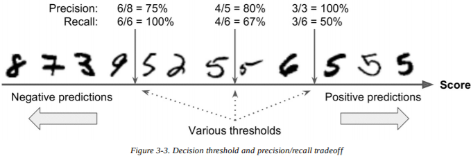

Scikit-Learn 不让你直接设定阈值，但是提供了设置决策函数的方法。无需调用分类器的`predict()`方法，你能调用`decision_function()`方法，返回每个实例的分数，基于这些分数使用你想要的阈值做出预测：

```python
>>> y_scores = sgd_clf.decision_function([some_digit])
>>> y_scores
array([ 161855.74572176])
>>> threshold = 0
>>> y_some_digit_pred = (y_scores > threshold)
array([ True], dtype=bool)
```

`SGDClassifier`使用的阈值为 0 ，所以之前的代码返回了和`predict()`一样的结果（ True ）。让我们提高阈值：

```python
>>> threshold = 200000
>>> y_some_digit_pred = (y_scores > threshold)
>>> y_some_digit_pred
array([False], dtype=bool)
```

这证明了提高阈值会降低召回率。图片实际上是数字5，分类器在阈值为 0 的时候能检测到，但在阈值为 200000 时就无法检测到了。

所以如何决定用哪个阈值？你首先需要再次使用`cross_val_predict()`函数，得到训练集中所有实例的分数，不过这次指定返回一个决策函数，而不是预测值。

```python
y_scores = cross_val_predict(sgd_clf, X_train, y_train_5, cv=3,
                             method="decision_function")
```

现在有了这些分数，对于任何可能的阈值，你都能用`precision_recall_curve()`函数计算准确率与召回率：

```python
from sklearn.metrics import precision_recall_curve

precisions, recalls, thresholds = precision_recall_curve(y_train_5, y_scores)
```

最后，你能使用 Matplotlib 绘制出准确率与召回率，作为阈值的函数（图 3-4 ）：

```python
def plot_precision_recall_vs_threshold(precisions, recalls, thresholds):
    plt.plot(thresholds, precisions[:-1], "b--", label="Precision")
    plt.plot(thresholds, recalls[:-1], "g-", label="Recall")
    plt.xlabel("Threshold")
    plt.legend(loc="upper left")
    plt.ylim([0, 1])
    
plot_precision_recall_vs_threshold(precisions, recalls, thresholds)
plt.show()
```

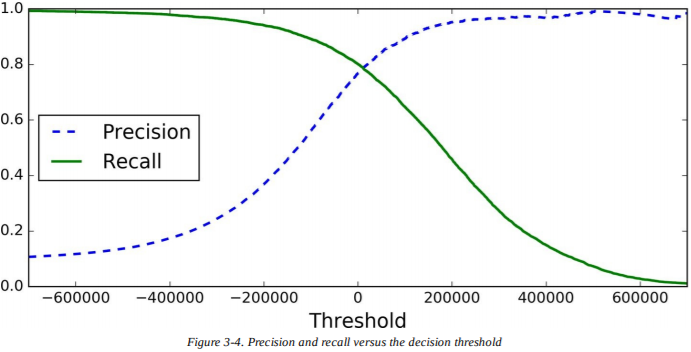

> **笔记**
> 你也许好奇为何在图 3-4 中，准确率曲线比召回率曲线更起伏不平。原因是当你提高阈值时，准确率有时会降低（虽然它通常是升高的）。要理解为什么，回头看图 3-3 ，注意当你从中间箭头开始向右移动一个数字会发生什么：准确率从 4/5 （ 80% ）降到了 3/4 （ 75% ）。另一方面，当阈值提高时，召回率只会降低，这就解释了为什么它它的曲线是平滑的。

现在你能为任务选择准确率/召回率权衡最佳的阈值。另一种方法是选择一个好的准确率/召回率权衡，直接画出准确率对召回率的图，像图 3-5 展示的那样：

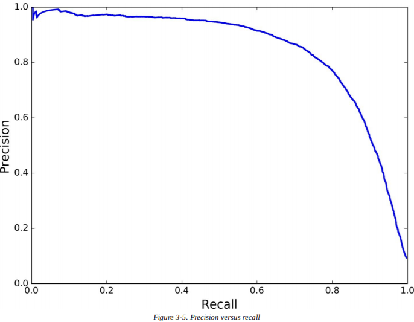

可以看到，召回率在 80% 左右时，准确率急剧降低。你也许想在下降之前选择一个权衡点——比如，在 60% 左右。不过，如何抉择取决于你的项目。

我们假设你选择的目标是 90% 准确率。你查阅第一幅图（稍微放大点），发现需要选用的阈值在 70000 左右。为了进行预测（在训练集上），无需调用分类器的`predict()`方法，你可以运行下面的代码：

```python
y_train_pred_90 = (y_scores > 70000)
```

让我们检查一下预测的准确率和召回率：

```python
>>> precision_score(y_train_5, y_train_pred_90)
0.8998702983138781
>>> recall_score(y_train_5, y_train_pred_90)
0.63991883416343853
```

很好，你有了一个准确率（接近） 90% 的分类器！如你所见，很容易就能创造一个任意准确率的分类器：只要阈值设置得足够高。如果召回率太低的话，高准确率的分类器并不是很有用。

>  **提示**
>  如果有人说“让我们达到99%的准确率”，你应该问，“召回率呢？”

### ROC曲线

**受试者工作特征**（*receiver operating characteristic*，ROC）曲线是另一种二分类器常用的工具。它和准确率/召回率曲线很类似，不过并不画出准确率对召回率， ROC 描绘的是真正例率（*true positive rate*）（召回率的别名）对假正例率的曲线。 FPR 是反例被错误分成正例的比率。它等于1减去真反例率（*true negative rate*）——反例被正确分类的比例。 TNR 也被称为**特异性**（*specificity*）。所以 ROC 曲线绘制召回率对（ 1 减去特异性）的曲线。

为了绘制 ROC 曲线，你首先需要计算多种阈值下 TPR 和 FPR ，使用`roc_curve()`函数：

```python
from sklearn.metrics import roc_curve

fpr, tpr, thresholds = roc_curve(y_train_5, y_scores)
```

然后你就能用 Matplotlib 画 FPR 对 TPR 的图了。下面的代码生成图 3-6 ：

```python
def plot_roc_curve(fpr, tpr, label=None):
    plt.plot(fpr, tpr, linewidth=2, label=label)
    plt.plot([0, 1], [0, 1], 'k--')
    plt.axis([0, 1, 0, 1])
    plt.xlabel('False Positive Rate')
    plt.ylabel('True Positive Rate')
	
plot_roc_curve(fpr, tpr)
plt.show()
```

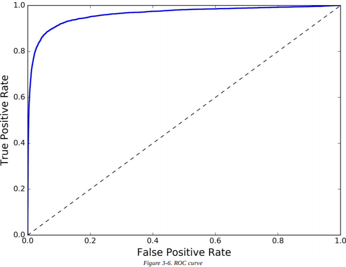

这里也存在权衡的问题：召回率（ TPR ）越高，分类器会产生越多反例（ FPR ）。虚线代表纯随机分类器的 ROC 曲线；一个好的分类器 ROC 曲线应该尽可能远离这条线（向左上角中心靠拢）。

一种比较分类的方法是测量 ROC 曲线下的面积（*area under the curve*，AUC）。完美的分类器 ROC AUC 等于 1 ，而纯随机的分类器 ROC AUC 等于 0.5 。 Scikit-Learn 提供了一个函数来计算 ROC AUC ：

```python
>>> from sklearn.metrics import roc_auc_score
>>> roc_auc_score(y_train_5, y_scores)
0.97061072797174941
```

> **提示**
> 因为 ROC 曲线和准确率/召回率（ PR ）曲线很相似，你可能想知道该如何决定用哪个。根据经验，每当正例很稀少，或你更关注假正例时，你应该更偏好 PR 曲线。其他情况用 ROC 曲线。例如，看之前的 ROC 曲线（和 ROC AUC 数值），你可能会觉得这个分类器很棒。但这主要是因为和反例（非 5 ）相比，正例（ 5 ）很少。相反地， PR 曲线就能清楚表明，分类器还有提升空间（曲线还能更靠近左上角）。

让我们来训练一个`RandomForestClassifier`，用它的 ROC 曲线和 ROC AUC 数值和`SGDClassifier`进行比较。首先，你需要得到训练集中每个实例的数值。但由于它的工作方式（见第七章），`RandomForestClassifier`类没有`decision_function()`方法，但有`predict_proba()`方法。 Scikit-Learn 分类器通常有两个方法中的一个。`predict_proba()`方法返回一个数组，每行代表一个实例，每列代表一个类，每个都包含了给定的样例属于给定类的概率（例如，图片是 5 的概率为 70% ）：

```python
from sklearn.ensemble import RandomForestClassifier

forest_clf = RandomForestClassifier(random_state=42)
y_probas_forest = cross_val_predict(forest_clf, X_train, y_train_5, cv=3,
                                    method="predict_proba")
```

不过为了绘制 ROC 曲线，你需要数值，而不是概率。一个简单的方法是使用正例的概率作为数值：

```python
y_scores_forest = y_probas_forest[:, 1] # score = proba of positive class
fpr_forest, tpr_forest, thresholds_forest = roc_curve(y_train_5,y_scores_forest)
```

现在你可以绘制 ROC 曲线了。把第一个 ROC 曲线也一并画出来会很有帮助，可以进行比较（图 3-7 ）：

```python
plt.plot(fpr, tpr, "b:", label="SGD")
plot_roc_curve(fpr_forest, tpr_forest, "Random Forest")
plt.legend(loc="bottom right")
plt.show()
```

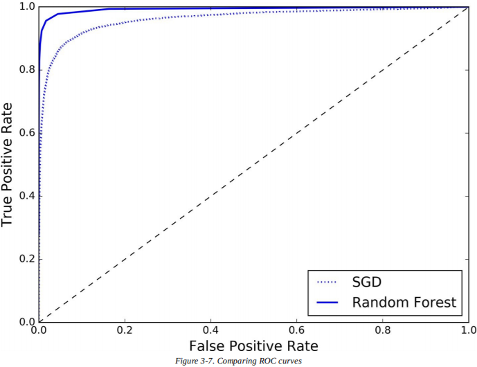

如你在图 3-7 中所见，`RandomForestClassifier`的 ROC 曲线看起来比`SGDClassifier`的要好：它更靠近左上角。所以，它的 ROC AUC 数值也更大：

```python
>>> roc_auc_score(y_train_5, y_scores_forest)
0.99312433660038291
```

试着计算一下准确率和召回率： 98.5% 的准确率， 82.8% 的召回率。还不错！

希望现在你知道如何训练二分类器了，为任务选择合适的指标，用交叉验证评估分类器，选择适应需求的准确率/召回率权衡，用 ROC 曲线和 ROC AUC 数值来比较不同模型。现在，让我们来检测更多数字，不仅仅是 5 。

## 多分类器

二分类器只能区分两个类别，而**多分类器**（*multiclass classifiers*，也称为*multinomial classifiers*）能区分两个以上的分类。

一些算法（比如随机森林分类器，或朴素贝叶斯分类器）能直接处理多分类问题。其他的（比如支持向量机分类器，或线性分类器）是严格的二分类器。不过，有很多策略能让你用二分类器去进行多分类任务。

例如，创造能分类数字图片（ 0 - 9 ）的系统的一种办法是训练 10 个二分类器，每一个对应一个数字（ 0 - 检测器， 1 - 检测器， 2 - 检测器，以此类推）。当你想分类图片时，从每一个分类器得到图片的决策数值，选择输出值最高的分类器作为分类。这叫做**一对所有**（*one-versus-all*，OvA）策略（也称为**一对其余**（*one-versus-the-rest*））。

另一种策略是每一对数字都训练一个二分类器：一个用来区分 0 和 1 ，一个用来区分 0 和 2 ，另一个用来区分 1 和 2 ，以此类推。这叫做**一对一**（*one-versus-one*，OvO）策略。如果有 N 个类，你需要训练 N × (N-1)/2 个分类器。对于 MNIST 问题，这意味着要训练 45 个分类器！当你想分类一张图片时，你不得不在 45 个分类器上运行图片，看看是哪个类胜出。 OvO 的主要优点是，对于要区分的两个类，每个分类器只需要在其训练集的一部分上训练。

有些算法（比如支持向量机分类器）在训练集大小上很难扩展，所以 OvO 更适合这些算法，因为它在小训练集上训练大量分类器比在大训练集上训练少量分类器要更快。但是，对于大多数二分类算法而言， OvA 更佳。

Scikit-Learn 能检测出你想用一个二分类算法去完成多分类的任务，它会自动运行 OvA （除了 SVM 分类器，它会使用 OvO ）。让我们用`SGDClassifier`来试试：

```python
>>> sgd_clf.fit(X_train, y_train) # y_train, not y_train_5
>>> sgd_clf.predict([some_digit])
array([ 5.])
```

简单！这段代码在训练集上训练了`SGDClassifier`，使用的是从 0 到 9 的原始目标类（`y_train`），而不是5对所有目标类（`y_train_5`）。之后它做出预测（在这个例子里是个正确的结果）。在幕后， Scikit-Learn 实际上训练了10个二分类器，得到每个对于图片的决策数值，选择数值最高的类。

为了证明事实确实如此，你可以调用`decision_function()`方法。它并不是每个实例返回一个数值，而是每个类返回 10 个数值：

```python
>>> some_digit_scores = sgd_clf.decision_function([some_digit])
>>> some_digit_scores
array([[-311402.62954431, -363517.28355739, -446449.5306454,
        -183226.61023518, -414337.15339485, 161855.74572176,
        -452576.39616343, -471957.14962573, -518542.33997148,
        -536774.63961222]])
```

最高的数值对应 5 的类：

```python
>>> np.argmax(some_digit_scores)
5
>>> sgd_clf.classes_
array([ 0., 1., 2., 3., 4., 5., 6., 7., 8., 9.])
>>> sgd_clf.classes[5]
5.0
```

> **警告**
> 当分类器训练好后，它会把目标类的列表存在`classes_`属性中，按照值排序。在本例中，`class_`数组中每个类的索引都能方便地和类自身匹配（比如，索引为 5 的类碰巧也是类 5 ），不过通常你不会这么幸运。

如果想强制 Scikit-Learn 使用一对一或一对所有策略，你可以使用`OneVsOneClassifier`或`OneVsRestClassifier`类。创建一个实例，将二分类器传递给构造器。例如，下面这段代码基于`SGDClassifier`，使用 OvO 策略创建了一个多分类器：

```python
>>> from sklearn.multiclass import OneVsOneClassifier
>>> ovo_clf = OneVsOneClassifier(SGDClassifier(random_state=42))
>>> ovo_clf.fit(X_train, y_train)
>>> ovo_clf.predict([some_digit])
array([ 5.])
>>> len(ovo_clf.estimators_)
45
```

训练`RandomForestClassifier`也一样简单：

```python
>>> forest_clf.fit(X_train, y_train)
>>> forest_clf.predict([some_digit])
array([ 5.])
```

这次 Scikit-Learn 不必运行 OvO 或 OvA ，因为随机森林分类器可以直接对多分类进行分类。你可以调用`predict_proba()`，得到样例对应类别的概率的列表：

```python
>>> forest_clf.predict_proba([some_digit])
array([[ 0.1, 0. , 0. , 0.1, 0. , 0.8, 0. , 0. , 0. , 0. ]])
```

你能看到分类器很确信它的预测：在数组索引5上的概率为 0.8 ，这意味着模型评估图片有 80% 的概率代表 5 。它也认为有可能是 0 或者 3 （每个都是 10% 的概率）。

现在，当然你会想评估这些分类器。像往常一样，你想使用交叉验证。让我们用`cross_val_score() `函数来评估`SGDClassifier`的精度：

```python
>>> cross_val_score(sgd_clf, X_train, y_train, cv=3, scoring="accuracy")
array([ 0.84063187, 0.84899245, 0.86652998])
```

它在所有测试折上的精度都超过84%。如果你使用的是随机的分类器，你会得到 10% 的精度，所以它的表现还不错，不过你还能做得更好。例如，简单地缩放输入（如第二章中讨论的）会将精度提高到90%：

```python
>>> from sklearn.preprocessing import StandardScaler
>>> scaler = StandardScaler()
>>> X_train_scaled = scaler.fit_transform(X_train.astype(np.float64))
>>> cross_val_score(sgd_clf, X_train_scaled, y_train, cv=3, scoring="accuracy")
array([ 0.91011798, 0.90874544, 0.906636 ])
```

## 误差分析

当然，如果这是个实际的项目，你会遵循机器学习检查表（见附录 B ）中的步骤：探索准备数据的选项，尝试多种模型，把最好的几个列入名单中，使用`GridSearchCV`调整超参数，尽可能的自动化，就像你在前几章做的那样。我们假设你已经找到一个靠谱的模型，你想要改进它。一种方法是分析误差种类。

首先，你可以看一下混淆矩阵。你需要使用`cross_val_predict()`函数做出预测，然后调用`confusion_matrix()`函数，就像你之前做的那样：

```python
>>> y_train_pred = cross_val_predict(sgd_clf, X_train_scaled, y_train, cv=3)
>>> conf_mx = confusion_matrix(y_train, y_train_pred)
>>> conf_mx
array([[5725, 3, 24, 9, 10, 49, 50, 10, 39, 4],
       [2, 6493, 43, 25, 7, 40, 5, 10, 109, 8],
       [51, 41, 5321, 104, 89, 26, 87, 60, 166, 13],
       [47, 46, 141, 5342, 1, 231, 40, 50, 141, 92],
       [19, 29, 41, 10, 5366, 9, 56, 37, 86, 189],
       [73, 45, 36, 193, 64, 4582, 111, 30, 193, 94],
       [29, 34, 44, 2, 42, 85, 5627, 10, 45, 0],
       [25, 24, 74, 32, 54, 12, 6, 5787, 15, 236],
       [52, 161, 73, 156, 10, 163, 61, 25, 5027, 123],
       [43, 35, 26, 92, 178, 28, 2, 223, 82, 5240]])
```

有很多数字。使用 Matplotlib 的`matshow()`函数，混淆矩阵会以图片的形式呈现，更便于观察：

```python
plt.matshow(conf_mx, cmap=plt.cm.gray)
plt.show()
```

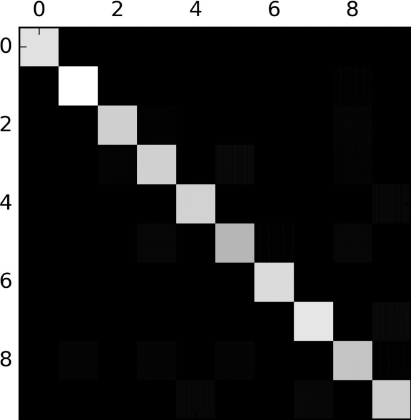

混淆矩阵看起来很好，因为大多数图片都在主对角线上，意味着它们被正确分类了。 5 看起来比其他数字更暗，说明数据集中 5 很少，或者分类器在5上的表现不如在其他数字上好。事实上，你可以证实两者皆有之。

让我们把注意力放在绘制误差上。首先，你需要将混淆矩阵中每一个值除以对应类图片的总数，这样你就能比较误差率了，而不是绝对的误差数（这对于有大量数据的类是不公平的）：

```python
row_sums = conf_mx.sum(axis=1, keepdims=True)
norm_conf_mx = conf_mx / row_sums
```

现在让我们用 0 来填充对角线，只保留被错误分类的数据，再来绘制结果：

```python
np.fill_diagonal(norm_conf_mx, 0)
plt.matshow(norm_conf_mx, cmap=plt.cm.gray)
plt.show()
```

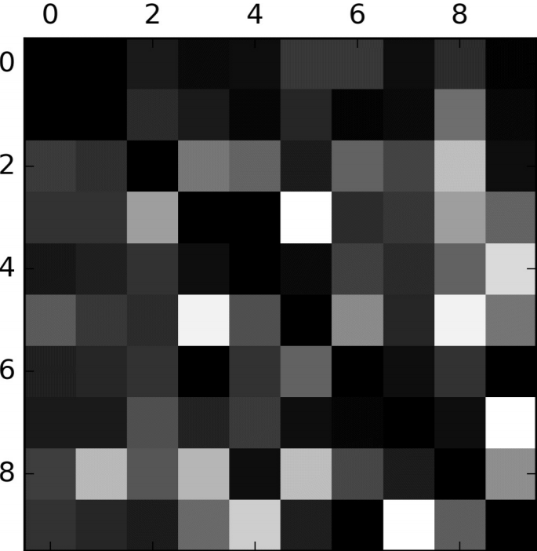

你能清楚看到分类器制造的各种错误。记住，行代表实际的类别，列代表预测的类别。 8 和 9 类的列都特别亮，这告诉你许多图片被错误分类为 8 或者 9 。类似的， 8 和 9 类的行也很亮，这告诉你 8 和 9 经常被误认为是其他数字。相反，一些行格外暗，比如第一行：这意味着大部分 1 都被正确分类了（一些错误分类为 8 ）。注意误差不是完美对称的，例如，相比 8 被错误分类为 5 的情况，有更多的 5 被错误分类为 8 。

分析混淆矩阵能给你一些改进分类器的见解。根据图片的信息，你应该努力改善 8 和 9 的分类，以及修复 3/5 混淆的问题。例如，你能尝试获取更多数字的训练集，或者构造新的、对分类器有帮助的特征——比如，写一个算法来计算闭合环的数量（ 8 有两个， 6 有一个， 5 没有）。或者你可以预处理图片（比如使用 Scikit-Image ， Pillow ，或者 OpenCV ），使一些模式更显著，比如闭合环。

在分类器在做什么、为什么失败的问题上，分析独立的错误也是一种获得见解的好办法，不过它更加困难且费时。例如，让我们来绘制 3 和 5 的图片：

```python
cl_a, cl_b = 3, 5
X_aa = X_train[(y_train == cl_a) & (y_train_pred == cl_a)]
X_ab = X_train[(y_train == cl_a) & (y_train_pred == cl_b)]
X_ba = X_train[(y_train == cl_b) & (y_train_pred == cl_a)]
X_bb = X_train[(y_train == cl_b) & (y_train_pred == cl_b)]
plt.figure(figsize=(8,8))
plt.subplot(221); plot_digits(X_aa[:25], images_per_row=5)
plt.subplot(222); plot_digits(X_ab[:25], images_per_row=5)
plt.subplot(223); plot_digits(X_ba[:25], images_per_row=5)
plt.subplot(224); plot_digits(X_bb[:25], images_per_row=5)
plt.show()
```

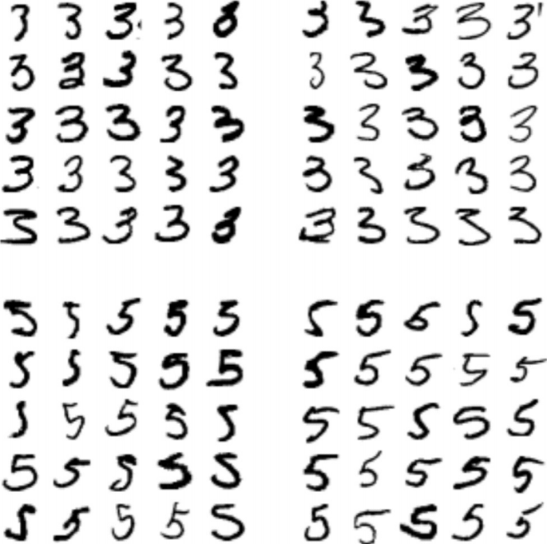

左边的两个 5×5 方格显示了被分类成 3 的数字，右边的两个 5×5 方格显示了被分类成 5 的图片。有些被分类器错误分类的数字（即左下和右上的方格）是因为书写太差了，即便是人类也很难辨认（比如，第 8 行第一列的 5 ，真的看起来像个 3 ）。不过，大部分被错误分类的图片在我们看来都是显而易见的错误，很难理解为什么分类器会出错。原因是我们使用了简单的`SGDClassifier`，它是个线性模型。它所做的事就是为每个像素分配每个类的权重，当它遇到一张新的图片，它只是把像素强度的权重累加，每个类得到一个总和数值。因为 3 和 5 只有一些像素不同，所以模型很容易混淆它们。

 3 和 5 主要的不同是连接顶部线和底部弧的小竖线位置。如果你画 3 时，连接点稍微向左偏移，分类器也许就会把它当成 5 ，反之亦然。换言之，这个分类器的对图片的偏移和旋转非常敏感。所以减少 3/5 混淆问题的一个办法是预处理图片，确保它们都被放在中间，且没有过度旋转。这样也会帮助降低误差。

## 多标签分类

到现在为止，每个样例总是分配到一个类别。有些情况下，你可能希望分类器对每个实例输出多个类别。例如，考虑人脸识别分类器：如果它在同一张照片上识别出多个人，它应该怎么做？当然，它应该给识别到的每个人都上一个标签。假设分类器经过训练能识别三个人脸， Alice ， Bob ， Charlie 。当给它一张 Alice 和 Charlie 的照片时，它应该输出[1, 0, 1]（意味着有 Alice，没有 Bob，有 Charlie ）。这种输出多个二值标签的分类系统被称为**多标签分类**（*multilabel classification *）系统。

目前我们不会深入人脸识别，不过让我们来看一个更简单的例子，只是为了阐明的目的：

```python
from sklearn.neighbors import KNeighborsClassifier

y_train_large = (y_train >= 7)
y_train_odd = (y_train % 2 == 1)
y_multilabel = np.c_[y_train_large, y_train_odd]

knn_clf = KNeighborsClassifier()
knn_clf.fit(X_train, y_multilabel)
```

上面的代码创建了一个`y_multilabel`数组，每个数字图片都包含两个目标标签。第一个标签表明数字是否很大（ 7，8，9 ）第二个标签表明数字是否为奇数。第二行创建了一个`KNeighborsClassifier`实例（它支持多标签分类，但不是所有分类器都支持），我们使用多标签目标数组训练它。现在可以进行预测了，注意它输出了两个标签。

```python
>>> knn_clf.predict([some_digit])
array([[False, True]], dtype=bool)
```

它运行正确！数字 5 不是大数字（ False ），是奇数（ True ）。

有许多评估多标签分类的方法，选择正确的指标由你的项目决定。例如，一种方法是测量每个独立标签的  数值（或者之前讨论过的其他二分类器指标），然后计算平均值。下面的代码计算所有标签的平均  值：

```python
>>> y_train_knn_pred = cross_val_predict(knn_clf, X_train, y_train, cv=3)
>>> f1_score(y_train, y_train_knn_pred, average="macro")
0.96845540180280221
```

这里假设所有的标签都同样重要，可能实际不是这样。特别地，如果 Alice 的照片比 Bob 和 Charlie 多，你可能会想让分类器在 Alice 的照片上有更大的权重。一个简单的选择是，给每个标签和它支持度（即，有目标标签的实例的数量）相同的权重。在之前的代码中设置`average="weighted"`就能办到。

## 多输出分类

我们将讨论的最后一种分类任务被称为**多输出-多分类分类**（*multioutput-multiclass classification*）（或简称为多输出分类）。它是多标签分类的泛化，每个标签都是多类别的（即它能有两个以上可能的值）。

为了说明这点，让我们建立一个系统，去除图片中的噪音。它会输入一张带有噪音的数字图片，（希望）它能输出一张干净的数字图片，用像素强度的数组表示，就像 MNIST 的图片那样。注意，分类器的输出是多标签的（每个像素一个标签），每个标签可以有多个值（从 0 到 255 的像素强度）。这就是多输出分类系统的一个例子。

> **笔记**
> 分类和回归之间的界限有时很模糊，比如这个例子。按理说，预测像素强度更类似于回归，而不是分类。而且，多输出系统也不限于分类任务。你甚至能创建一个系统，让每个实例都输出多标签，包括类标签和值标签。

从用 MNIST 的图片创建训练集和测试集开始，使用 NumPy 的`randint()`函数给像素强度增加噪音。目标图片是原始图像：

```python
noise = rnd.randint(0, 100, (len(X_train), 784))
noise = rnd.randint(0, 100, (len(X_test), 784))
X_train_mod = X_train + noise
X_test_mod = X_test + noise
y_train_mod = X_train
y_test_mod = X_test
```

来看一眼测试集中的一张图片（是的，我们是在窥探测试集，所以你现在应该皱眉）：

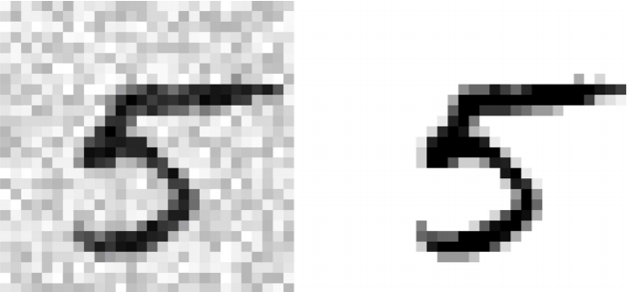

左边的是有噪音的输入图片，右边是干净的目标图片。现在让我们来训练分类器，让它清洁这张图：

```python
knn_clf.fit(X_train_mod, y_train_mod)
clean_digit = knn_clf.predict([X_test_mod[some_index]])
plot_digit(clean_digit)
```

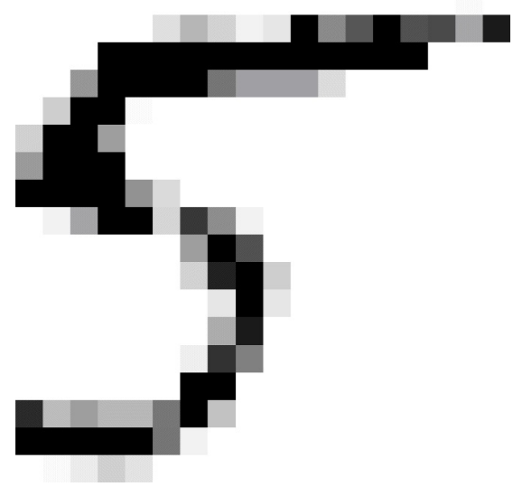

看起来和目标更接近了！它总结了我们的分类之旅。希望你现在知道如何为分类任务选择好的指标，挑选合适的准确率/召回率权衡，比较分类器，更普遍的，为各种任务建立优良的分类系统。

## 练习

1. 尝试为 MNIST 数据集建立一个分类器，在测试集上达到97%的精度。提示：`KNeighborsClassifier`在这个任务上表现得很好，你只需要找到好的超参数（试试对`weights`和`n_neighbors`进行网格搜索）。
2. 编写一个能让 MNIST 图像任意方向（上下左右）移动一个像素的函数。之后，对于训练集中的每一幅图，创建四个移动后的副本（每张一个方向），将它们加入训练集中。最后，在扩展的训练集上训练最好的模型，并在测试集上测量它的精度。你应该观察到你的模型表现更好了！这项人工补充训练集的技术称为**数据增强**（*data augmentation*）或**训练集扩展**（*training set expansion*）。
3. 处理*Titanic*的数据集。一个很好的开始平台在Kaggle上。
4. 建立一个垃圾邮件过滤器（更有挑战性的练习）：
  - 从 [Apache SpamAssassin’s public datasets](http://spamassassin.apache.org/old/) 上下载垃圾邮件和正常邮件的样例。
  - 解压数据集，熟悉数据格式。
  - 将数据分为训练集和测试集。
  - 编写一个数据准备管道，将每封邮件转变为一个特征向量。你的管道应该将一封邮件转换为一个稀疏向量，它表明每个可能的单词是否出现过。例如，如果所有邮件只包含四个单词，“Hello”，“how”，“are”，“you”，那么一封内容为“Hello you Hello Hello you”的邮件将会被转换为一个向量[1, 0, 0, 1]（意味着“Hello”和“you”出现过，“how”和“are”没出现过），或者向量[3, 0, 0, 2]，如果你想计算每个单词出现过的次数。
  - 你可能想往准备管道中添加超参数，控制是否要剥离邮件头部、将邮件转化为小写、去掉标点符号、将所有超链接替换为“URL”、将所有数字替换为“NUMBER”、甚至提取词干（即修剪词尾，有现成的Python库可以做到）。
  -  尝试多个分类器，看看你是否可以建立一个很好的垃圾邮件分类器，使准确率和召回率都很高。
  
## 总结  

显示灰度图像：

- imshow()

显示混淆矩阵图像：

- matshow()

二分类器：

- 随机梯度下降：sklearn.linear_model - SGDClassifier
  - 设置决策函数的方法：decision_function()

多分类器：

- 一对一策略：sklearn.multiclass - OneVsOneClassifier
- 一对其余策略：sklearn.multiclass - OneVsRestClassifier
- 随机森林：sklearn.ensemble - RandomForestClassifier
- K近邻：klearn.neighbors - KNeighborsClassifier

预测函数：

- sklearn.model_selection - cross_val_predict

混淆矩阵：

- sklearn.metrics - confusion_matrix()

二分类器的指标：

- 准确率：sklearn.metrics - precision_score
- 召回率：sklearn.metrics - recall_score
- 合在一起：sklearn.metrics - precision_recall_curve()
- F1值：sklearn.metrics - f1_score
- ROC曲线：sklearn.metrics - roc_curve()
- ROC曲线下面积：sklearn.metrics - roc_auc_score
