# 第四章：训练模型

迄今为止，我们对待机器学习模型和算法就像黑盒一样。如果你做过前几章的练习，你也许会感到惊奇，居然能在不知道背后原理的情况下实现那么多任务：优化回归系统，改进数字图像分类器，甚至从头开始建立了垃圾邮件过滤器——这一切你都不知道它究竟是怎么实现的。事实上，在许多解决方法中，你并不需要知道应用细节。

不过，对工作原理有一定了解的话，能帮助你快速选出合适的模型、正确的训练算法、以及一组好的超参数。了解背后的原理也能帮你调试问题、更高效地进行误差分析。最后，本章中讨论的绝大多数话题在理解、构建、训练神经网络上是很有必要的（在本书的第二部分讨论）。

本章中，我们首先来看线性模型，最简单的模型之一。我们会讨论两种极其不同的训练方法。

- 使用封闭方程直接计算在训练集上最适合模型的参数（即在训练集上使损失函数最小化的模型参数）
- 使用迭代优化方法，称为梯度下降（GD），它在训练集上逐渐调整模型参数，使损失函数最小化，最终会收敛到和第一种方法相同的值。我们也会介绍一些梯度下降的变体，当我们在第二部分学习神经网络的时候会反复用到：批量梯度下降（Batch GD），小批量梯度下降（Mini-batch GD）和随机梯度下降（Stochastic GD）。

接下来我们会介绍多项式回归，一个能适应非线性数据集的更复杂的模型。因为这个模型比线性回归有更多的参数，更容易发生过拟合训练集的情况，所以我们将会介绍如何使用学习曲线来检测模型是否过拟合，也会介绍一些能减少过拟合风险的正则技术。

最后，我们再看两个常用于分类任务的模型：逻辑回归和Softmax回归。

> **警告**
> 本章中会涉及到许多数学公式，以及线性代数和微积分的基本概念。为了理解这些公式，你需要知道向量和矩阵是什么、如何转换它们、点积是什么、矩阵的逆是什么、偏导数是什么。如果你对这些概念不熟悉，你可以在Jupyter notebook的在线补充材料上浏览线性代数和微积分入门指导。对于真的很讨厌数学的人，也应该浏览本章，仅跳过公式。希望能帮助你理解大部分概念。

## 线性回归

在第一章中，我们介绍了一个简单的生活满意度回归模型：$life\_satisfaction=\theta_0+\theta_1\times GDP\_per\_capita$。

这个模型只是输入特征`GDP_per_capita`的线性函数。$\theta_0$和$\theta_1$是模型的参数。

更普遍的，线性模型通过计算输入特征的权重总和，并加上一个常数**偏置项**（*bias term*）（也称为**截距项**（*intercept term*））来做出预测，如公式4-1：

$$\hat{y}=\theta_0+\theta_1x_1+\theta_2x_2+...+\theta_nx_n$$

- $\hat{y}$是预测值。
- $n$是特征总数。
- $x_i$是第i个特征值。
- $\theta_j$是第j个模型参数（包括偏置项$\theta_0$和特征权重$\theta_0,\theta_1,\theta_2,...,\theta_n$）

可以写成更简短的向量形式，如公式4-2：

$\hat{y}=h_{\theta}(\mathbf{x})=\theta^T·\mathbf{x}$

- $\theta$是模型的参数向量，包括偏置项$\theta_0$和特征权重$\theta_1$到$\theta_n$
- $\theta^T$是$\theta$的转置（行向量变为列向量）
- $\mathbf{x}$是特征向量的实例，包括$x_0$到$x_n$，且$x_0$恒为0
- $\theta^T·\mathbf{x}$是$\theta^T$和$\mathbf{x}$的点积
- $h_{\theta}$是函数的假设值，使用了模型参数$\theta$

这就是线性回归模型，所以我们该如何训练它呢？回想一下，训练模型意味着设置参数，使模型最适合训练集。为此我们需要一种能衡量模型好坏的指标。在第二章中我们已经知道，回归模型最普遍的性能测量是均方根误差（RMSE）（公式2-1）。因此，要训练线性回归模型，你需要找到能最小化RMSE的$\theta$值。在实践中，最小化均方误差（MSE）比RMSE更普遍，最小化的结果也是一样的（因为使函数最小化的值也使它的平方根最小化）。

在训练集$\mathbf{X}$上，线性模型的假设值$h_{\theta}$的 MSE 用公式4-3来计算：

$$MSE(\mathbf{X},h_{\theta})=\frac{1}{m}\sum^m_{i=1}(\theta^T·\mathbf{x}^{(i)}-y^{(i)})^2$$

大多数公式都在第二章中（见“公式”）。主要的不同是我们把$h$写成$h_{\theta}$，以便能清楚表明模型是由向量$\theta$参数化的。为了简化公式，我们用$MES(\theta)$代替$MSE(\mathbf{X},h_{\theta})$。

### 正规方程

为了找到能最小化损失函数的$\theta$值，可以使用**闭式解**（*closed-form solution*）——换言之，通过数学公式直接得到解。这被称为**正规方程**（*Normal Equation*）（公式4-4）：

$$\hat{\theta}=(\mathbf{X}^T·\mathbf{X})^{-1}·\mathbf{X}^T·y$$

- $\hat{\theta}$是最小化损失函数的$\theta$值
- $y$是目标值的向量，包含$y^{(1)}$到y^{(m)}

让我们来生成一些近似线性的数据，在图4-1上测试这个公式：

```python
import numpy as np

X = 2 * np.random.rand(100, 1)
y = 4 + 3 * X + np.random.randn(100, 1)
```


现在通过正规方程来计算$\theta$。我们会从NumPy的线性代数模块（`np.linalg`）中使用`inv()`函数计算矩阵的逆，`dot()`方法计算矩阵乘法。

```python
X_b = np.c_[np.ones((100, 1)), X] # add x0 = 1 to each instance
theta_best = np.linalg.inv(X_b.T.dot(X_b)).dot(X_b.T).dot(y)
```

我们用来生成数据的实际函数是$y=4+3x_0+高斯噪音$。来看看正规方程发现了什么：

```python
>>> theta_best
array([[ 4.21509616],
[ 2.77011339]])
```

我们希望得到$\theta_0=4$和$\theta_1=3$，而不是$\theta_0=4.215$和$\theta_1=2.770$。很接近了，但噪音使它无法恢复原函数的确切参数值。

现在你可以用$\hat{\theta}$来进行预测了：

```python
>>> X_new = np.array([[0], [2]])
>>> X_new_b = np.c_[np.ones((2, 1)), X_new] # add x0 = 1 to each instance
>>> y_predict = X_new_b.dot(theta_best)
>>> y_predict
array([[4.21509616],
       [9.75532293]])
```

来绘制模型的预测（图4-2）：

```python
plt.plot(X_new, y_predict, "r-")
plt.plot(X, y, "b.")
plt.axis([0, 2, 0, 15])
plt.show()
```


使用下面的 Scikit-Learn 代码可以达到相同的效果：

```python
>>> from sklearn.linear_model import LinearRegression
>>> lin_reg = LinearRegression()
>>> lin_reg.fit(X, y)
>>> lin_reg.intercept_, lin_reg.coef_
(array([ 4.21509616]), array([[ 2.77011339]]))
>>> lin_reg.predict(X_new)
array([[4.21509616],
       [9.75532293]])
```

### 运算复杂度

正规方程计算`$\mathbf{X}^T·\mathbf{X}$`的逆，它是个n×n的矩阵（n是特征的数量）。对这个矩阵求逆的运算复杂度在$O(n^{2.4})$和$O(n^3)$之间（取决于具体应用）。换言之，如果特征数量翻倍，运算时间会变为原来的$2^{2.4}=5.3$到$2^3=8$倍。

> **警告**
> 当特征的数量很大时（比如100000），正规方程会变得很慢。

好的一方面是，这个公式在训练集上对于实例而言是线性的（复杂度为$O(m)$），只要内存足够，就能高效处理大批数据。

同时，只要你训练过线性模型（使用正规方程或其他算法），预测就会很快：因为运算复杂度对于实例和特征而言都是线性的。换言之，当实例变为两倍时（或特征变为两倍），预测时间也不过是原来的两倍。

现在我们来看另一种用于训练线性回归模型的方法，当特征数量很多或训练实例太多、内存放不下时，这种方法更适用。

## 梯度下降

**梯度下降**（*Gradient Descent*）是一种非常通用的优化算法，能在许多问题中找到最优解。梯度下降的整体思路是通过迭代调整参数，使损失函数最小化。

假设你在迷雾弥漫的山中迷路了，你只能感觉到脚下土地的坡度。为了快速到达山底，最好的策略是沿着最陡的坡度下山。这就是梯度下降所做的事：它测量误差函数关于参数向量$\theta$的局部梯度，沿着梯度下降的方向前进。一旦梯度为0，你就得到了最小值。

具体来说，首先把$\theta_0$置为随机值（成为**随机初始化**（*random initialization*）），然后慢慢改善它，一次一小步，每一步都尝试减小损失函数（比如，MSE），直到算法收敛到一个最小值（见图4-3）。


梯度下降中一个重要的参数是步长，由超参数**学习率**决定。如果学习率太小，算法就不得不迭代许多次才能收敛，这会花费很长的时间（见图4-4）。


另一方面，如果学习率太大，你会越过最低点，跳到另一边，可能比之前的值还要大。这样可能会使算法发散，它的值会越来越大，无法找到一个好的解决方法（见图4-5）。


最后，不是所有的损失函数都看起像规则的碗一样。它们可能是洞、山脊、高原和各种不规则的地形，收敛到最小值很困难。图4-6展现了两个梯度下降主要的挑战：如果随机初始值选在左边，那么它会收敛到一个**局部最小值**（*local minimum*），它不如**全局最小值**（*global minimum*）那么好。如果它从右边开始，那么跨越高原会花费很长的时间，如果你过早停止训练，你将永远无法得到全局最小值。


幸运的是，线性回归模型的均方差损失函数恰好是一个**凸函数**（*convex function*），意味着如果你在曲线上随机选两点，它们的连线不会与曲线交叉。这意味着函数没有局部最小值，只有一个全局最小值。并且，它也是一个斜率永远不会突变的连续函数。这两点要素有一个重要的推论：梯度下降保证能无限接近全局最小值（只要训练时间够长，并且学习率并不是很大）。

事实上，损失函数的形状像一个碗，不过如果特征的取值范围相差过大时，碗会被拉长。图4-7展示了梯度下降在不同训练集上的表现。左图中，特征1和特征2有相同的比例；右图中，特征1的值比特征2要小得多。


如你所见，左图中梯度下降算法直接快速到达了最小值，而右图中它第一次前进的方向几乎和全局最小值垂直，并且在平坦的山谷中走了很久。它最终会到达最小值，不过会花费很长时间。

> **警告**
> 使用梯度下降的时候，你应该确保所有的特征取值范围都相似（例如，使用Scikit-Learn的`StandardScaler`类，否则它会花很长的时间才能收敛）。

这幅图也表明了一个事实，训练一个模型意味着在训练集上找到能最小化损失函数的一组模型参数。这是在模型参数空间（*parameter space*）中的搜索：一个模型的参数越多，空间的维度就越多，搜索就越困难——在一个300维的干草堆中找一根针要比在3维的干草堆中找一根针棘手多了。

幸运的是，因为线性回归的损失函数是凸函数，所以“针”就在碗底。

### 批量梯度下降

为了实现梯度下降，你需要计算每一个$\theta_j$下损失函数的梯度。换言之，你需要计算当$\theta_j$变化了一点点时，梯度会改变多少。这被称为**偏导数**（*partial derivative*）。这就像是你面向东方时询问“我脚下的斜率是多少？”，然后面向北方时问相同的问题一样（如果你能想象出一个超过三维的宇宙，所有方向以此类推）。公式4-5计算了损失函数对于参数$\theta_j$的偏导数，记为$\frac{\partical}{\partical{\theta_j}}MSE(\theta)$。

$$\frac{\partical}{\partical{\theta_j}}MSE(\theta)=\frac{2}{m}\sum_{i=1}^{m}(\theta^T\dot x^{(i)}-y^{(i)})x_j^{(i)}$$

你可以使用公式4-6一次性计算所有偏导数，不用单独一个个计算。梯度向量记为$\nabla_{\theta}MSE(\theta)$，包括了损失函数所有的偏导数（每个模型参数一个）。

$\nabla_{\theta}MSE=$

> **警告**
> 注意，这个方程在每一步梯度下降计算时都使用了整个训练集X！这也就是算法被称为**批量梯度下降**（*Batch Gradient Descent*）的原因：每一步都使用全部训练集。所以它在大数据集上运行得很慢（不过我们马上就会介绍更快的梯度下降算法）。然而，梯度下降的运算规模和特征数量成正比。当有成百上千的特征时，使用梯度下降训练线性回归模型要比正规方程快很多。

一旦你得到梯度向量，如果它是上坡的，那就沿相反方向下坡。这就意味着从$\theta$减去$\nabla_{\theta}MSE(\theta)$。这就是学习率$\eta$发挥作用的地方：梯度向量和$\eta$的乘积决定了下坡时的步长（公式4-7）。

$$\theta^{next step}=\theta-\eta\nabla_{\theta}MSE(\theta)$$

来看看算法的一种快速实现方法：

```python
eta = 0.1 # learning rate
n_iterations = 1000
m = 100

theta = np.random.randn(2,1) # random initialization

for iteration in range(n_iterations):
	gradients = 2/m * X_b.T.dot(X_b.dot(theta) - y)
	theta = theta - eta * gradients
```

不是很难！来看看最终结果$\theta$：

```python
>>> theta
array([[ 4.21509616],
       [ 2.77011339]])
```

这就是正规方程找到的值！梯度下降工作得很完美。不过，换一个学习率`eta`会如何？图4-8展示了三种不同学习率下梯度下降的前10步（虚线代表起始点）。

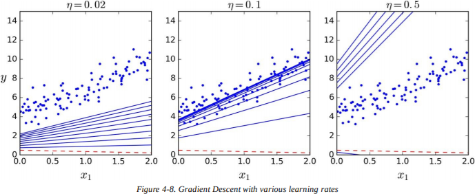

左边的图学习率太低了，算法虽然最终能算出结果，但是会花费大量时间。中间的图学习率看起来不错，它已经收敛到了最终结果。右边的图学习率太高了：算法发散了，跳过了所有数据，每一步都离正确结果越来越远。

为了找到一种好的学习率，你可以使用网格搜索（见第二章）。不过，你也许想限制迭代次数，让网格搜索筛掉收敛时间过久的模型。

你也许想知道如何设置迭代次数。如果次数太少，当算法结束时，你仍然离最优解很远，不过如果次数太多，当模型参数不再改变时，你会浪费许多时间。一种简单的方法是设定一个非常大的迭代次数，但当梯度向量变得很小时停止迭代——“很小”就是小于一个极小值$\epsilon$（称为容差（*tolerance*））——这时候梯度下降就（几乎）达到了最小值。

> **收敛率**
> 当损失函数是凸函数，并且斜率不会突变时（就像均方差损失函数），那么学习率固定的批量梯度下降有一个$O(\frac{1}{iterations})$的收敛率。换言之，如果你把$\epsilon$缩小10倍（为了得到更精确的解），那么算法的迭代次数会增加10倍。

### 随机梯度下降

批量梯度下降的主要问题是每一步计算梯度都要使用整个训练集，如果训练集过大，速度就会很慢。与之完全相反，**随机梯度下降**（*Stochastic Gradient Descent*），每一步都从训练集中随机挑选一个实例，只在这个单一实例上计算梯度。显然，这样算法会快很多，因为每次迭代时处理的数据都很少。这个算法可以训练大数据集，因为每次迭代只需要把一个实例放进内存（SGD可作为核外算法应用）。

另一方面，由于它的随机性，算法不像批量梯度下降那么有规律：损失函数会上下跳动，只在整体上具有下降趋势，而不是缓缓下降直到最小值。随时间流逝，它会很接近最小值，不过它不会停下，而是永远在周围跳动（见图4-9）。所以算法一旦停止，最终参数还不错，但不是最优。

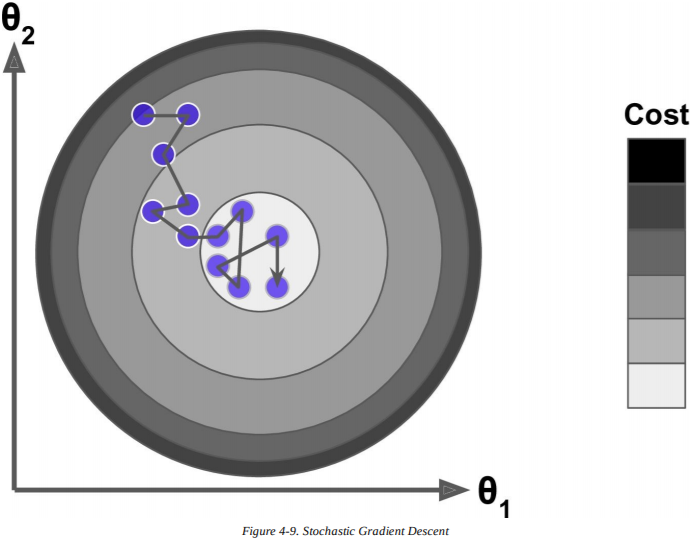

当损失函数非常不规律时（比如图4-6），这样其实能跳出局部最小值，所以在寻找全局最小值的问题上，随机梯度下降要优于批量梯度下降。

尽管随机能跳过局部最优，不过这也意味着永远无法到达最小值。解决两难问题的一个方法是逐渐减小学习率。开始时步长很大（有助于快速前进，并跳过局部最小），然后慢慢变小，让算法在全局最小处停止。这个过程被称为**模拟退火**（*simulated annealing*），因为它很像冶金时熔化金属慢慢冷却的退火过程。决定每次迭代的学习率的函数称为**学习进度**（*learning schedule*）。如果学习率下降过快，你可能会困在局部最小值中，甚至在半路就停止了。如果学习率下降过慢，你可能会在最小值附近长时间浮动，如果你过早停止训练，最终只能得到一个次优解。

下面的代码使用了一个简单的学习进度，实现了随机梯度下降：

```python
n_epochs = 50 
t0, t1 = 5, 50  #learning_schedule的超参数

def learning_schedule(t):
    return t0 / (t + t1)

theta = np.random.randn(2,1)	# random initialization

for epoch in range(n_epochs):
    for i in range(m):
        random_index = np.random.randint(m)
        xi = X_b[random_index:random_index+1]
        yi = y[random_index:random_index+1]
        gradients = 2 * xi.T.dot(xi,dot(theta)-yi)
        eta = learning_schedule(epoch * m + i)
        theta = theta - eta * gradiens
```

按照惯例，我们一般迭代m轮，每一轮都称为一代（*epoch*）。当批量梯度下降需要在训练集上迭代100次时，这段代码只需要迭代50次就能得到不错的解。

```python
>>> theta
array([[4.21076011],
       [2.74856079]])
```

图4-10展现了训练的前10步（注意它们的不规则性）。

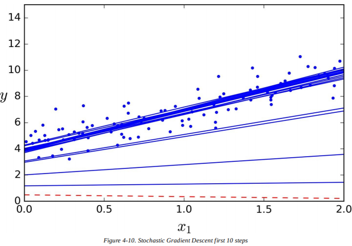

注意，尽管实例是随机挑选的，在每一代中，相同的实例可能会被挑选数次，而其他的一些可能从未被选中。如果你想确保在每一代中算法能遍历所有的实例，另一种方法是打乱训练集，再逐个遍历所有实例，然后再次打乱，以此类推。不过，这样会收敛得更慢。

要使用Scikit-Learn的SGD来实现线性回归，你可以使用`SGDRegressor`类，它默认最优化均方差损失函数。下面的代码会迭代50次，以0.1的学习率开始（`eta0=0.1`），使用默认的学习进度（和之前的不同），不使用任何正则化（`penalty=None`，还有更多细节）

```python
from sklearn.linear_model import SGDRegressor
sgd_reg + SGDRregressor(n_iter=50, penalty=None, eta0=0.1)
sgd_reg.fit(X,y.ravel())
```

你再一次发现返回的结果和正规方程的解很接近：

```python
>>> sgd_reg.intercept_, sgd_reg.coef_
(array([4.18380366]),array([2.74205299]))
```

### 小批量梯度下降

我们最后要介绍的算法是**小批量梯度下降**(*Mini-batch Gradient Descent*)。当你知道批量梯度下降和随机梯度下降后，它就好理解多了：在每一步中，它不像批量梯度下降，在整个训练集上计算梯度，也不像随机梯度下降，只在一个实例上计算梯度，小批量梯度下降在少量随机实例集（被称为小批量）上计算梯度。小批量梯度下降胜过随机梯度下降的主要优点是，你可以得到进行矩阵运算的硬件优化的性能提升，尤其是使用GPU的时候。

算法在参数空间上的表现比随机梯度下降要稳定，尤其是当小批量的数量很多时。所以，小批量梯度下降最终会比SGD更接近最小值。不过，另一方面，它也不容易跳出局部最小值（对于存在局部最小值的问题，不像先前见到的线性回归）。图4-11展现了三种梯度下降算法在参数空间中训练的路程。它们最终都很接近最小值，但是批量梯度下降最终停在了最小值，而随机梯度下降和小批量梯度下降都在周围浮动。不过，别忘了批量梯度下降每步都会花很长的时间，如果使用合适的学习进度，随机梯度下降和小批量梯度下降也能到达最小值。

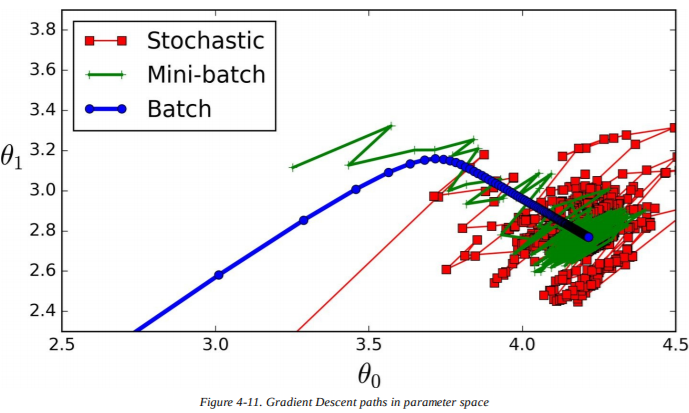

让我们来比较一下迄今为止的线性回归算法（m是训练实例的数量，n是特征的数量），见表4-1：

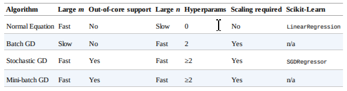

> **笔记**
> 它们在训练之后几乎没有区别：所有的算法最终都会得到相似的模型，以同样的方式做出预测。

## 多项式回归

如果你的数据实际上比简单的直线要更复杂呢？令人惊讶的是，你能用线性模型拟合非线性数据。一种简单的方法是给每个特征加权后作为新特征，在扩展的特征集上训练一个线性模型。这种技术称为**多项式回归**（*Polynomial Regression*）。

来看一个例子。首先，基于简单的二次方程生成一些非线性数据（增加一些噪音，见图4-12）。

```python
m = 100
X = 6 * np.random.rand(m, 1) - 3
y = 0.5 * X**2 + X + 2 + np.random.randn(m, 1)
```

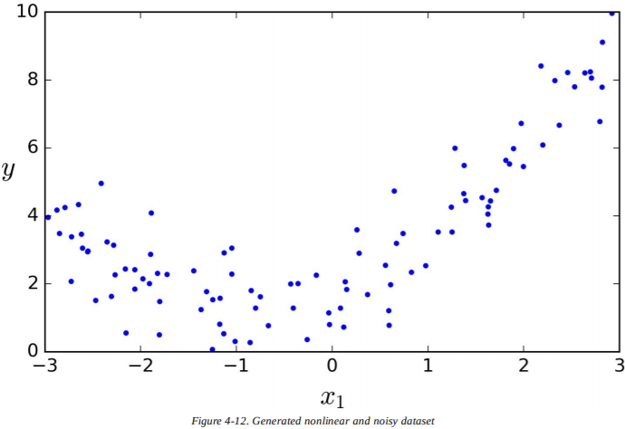

很明显，直线永远也不能合适地拟合这些数据。所以使用Scikit-Learn的`PolynomialFeatures`类来转换训练数据，在训练集中增加每个特征的平方（2次多项式）作为新特征（在本例中只有一个特征）：

```python
>>> from sklearn.preprocessing import PolynomialFeatures
>>> poly_features = PolynomialFeatures(degree=2,include_bias=False)
>>> X_poly = poly_features.fit_transform(X)
>>> X[0]
array([-0.75275929])
>>> X_poly[0]
array([-0.75275929, 0.56664654])
```

`X_poly`包含`x`的原始特征和它的平方。现在你能用`LinearRegression`模型来拟合扩展的训练集了（图4-13）：

```python
>>> lin_reg = LinearRegression()
>>> lin_reg.fit(X_poly, y)
>>> lin_reg.intercept_, lin_reg.coef_
(array([ 1.78134581]), array([[ 0.93366893, 0.56456263]]))
```

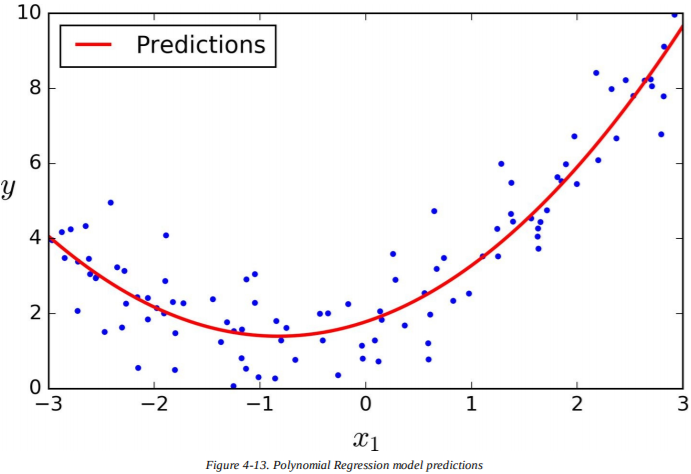

还不错：模型估计$\hat y=0.56x_1^2+0.93x_1+1.78$，实际上原始函数是$y=0.5x_1^2+1.0x_1+2.0+Gaussian noise$。

注意，当有多个特征时，多项式回归能找到特征之间的关系（这是普通的线性回归模型做不到的）。这是因为`PolynomialFeatures`增加了给定阶数的所有特征的组合。例如，如果有两个特征$a$和$b$，3阶的`PolynomialFeatures`不仅会增加特征$a^2$，$a^3$，$b^2$和$b^3$，也有组合$ab$，$a^2b$和$ab^2$。

> **警告**
> d阶的`PolynomialFeatures`将包含$n$个特征的数组转换为包含$\frac{(n+d)!}{d!n!}$个特征的数组，$n!$是n的阶乘（*factorial*），等于$1\times 2\times ... \times n$。当心特征数量的组合爆炸！

## 学习曲线

如果你使用高阶的多项式回归，它拟合数据的效果可能会比普通的线性回归模型更好。例如，图4-14在之前的训练集上使用了300阶的多项式模型，把它和纯线性模型、二项式模型进行比较。注意300阶的多项式模型是如何扭动而尽可能接近训练实例的。

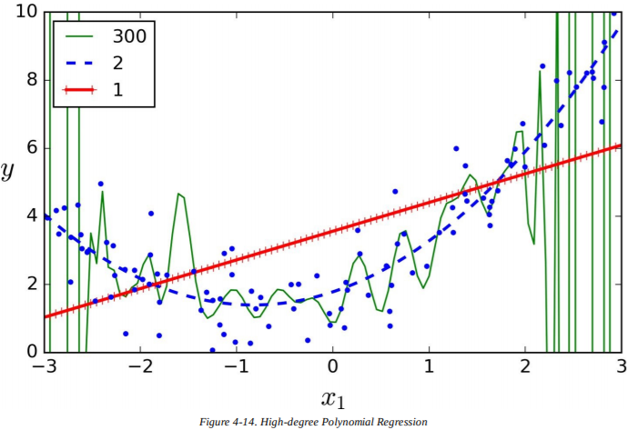

当然，高阶的多项式模型严重过拟合训练数据，而线性模型则欠拟合了。在本例中泛化最好的模型是二次项模型。因为数据是由二项式生成的，不过通常你不会知道是什么函数生成的数据，所以你该如何决定你的模型有多复杂？你该怎么知道自己的模型是过拟合还是欠拟合？

在第二章中，你使用交叉验证来得到模型泛化性能的评估。如果一个模型在训练数据上表现很好，但是通过交叉验证指标，得到的泛化很糟糕，那么你的模型过拟合了。如果两者皆糟糕，那么就是欠拟合了。这是一种分辨模型是过于简单还是过于复杂的方法。

另一种方法是看**学习曲线**（*learning curves*）：绘制模型在训练集和验证集上的表现，作为训练集规模的函数。为了泛化数据，在训练集不同规模的子集上简单训练模型多次。下面的代码定义了一个函数，用于绘制给定训练集模型的学习曲线：

```python
from sklearn.metrics import mean_squared_error
from sklearn.model_selection import train_test_split

def plot_learning_curves(model, X, y):
    X_train, X_val, y_train, y_val = train_test_split(X, y, test_size=0.2)
    train_errors, val_errors = [], []
    for m in range(1, len(X_train)):
        model.fit(X_train[:m], y_train[:m])
        y_train_predict = model.predict(X_train[:m])
        y_val_predict = model.predict(X_val)
        train_errors.append(mean_squared_error(y_train_predict, y_train[:m]))
        val_errors.append(mean_squared_error(y_val_predict, y_val))
plt.plot(np.sqrt(train_errors), "r-+", linewidth=2, label="train")
plt.plot(np.sqrt(val_errors), "b-", linewidth=3, label="val")
```

来看看普通线性回归模型的学习曲线（一条直线，图4-15）：


```python
lin_reg = LinearRegression()
plot_learning_curves(lin_reg, X, y)
```

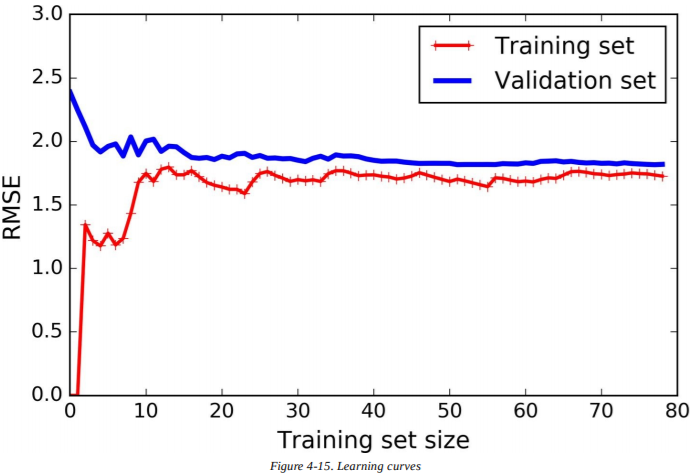

这需要一些解释。首先，来看看训练数据上的表现：当训练集中只有一两个实例时，模型能完美拟合它们，这就是曲线从零开始的原因。但是当新实例加入到训练集中，模型就不能再完美拟合数据了，不仅是因为数据有噪音，而且它也不再是线性了。所以训练数据的误差开始增大，直到它到达一个峰值，此时再增加新实例已经无法影响平均误差了。现在来看模型在验证集上的表现。当模型训练的实例过少时，它不能泛化得很好，这是因为验证误差初始就很大。然后当模型接受更多训练实例时，它开始学习，因此验证误差慢慢下降。不过，直线是无法很好地处理这些数据的，所以误差也停在一个峰值，很接近其他曲线。

这些学习曲线是典型的欠拟合模型。两条曲线都到达了一个峰值，它们很接近，并且相当高。

> **提示**
> 如果你的模型欠拟合了训练数据，增加一些训练实例也许会有所帮助。你需要使用一个更复杂的模型，或者找到更好的特征。

现在来看看10阶多项式模型在相同数据上的学习曲线（图4-16）：

```python
from sklearn.pipeline import Pipeline

polynomial_regression = Pipeline((
    ("poly_features", PolynomialFeatures(degree=10, include_bias=False)),
    ("sgd_reg", LinearRegression()),
))

plot_learning_curves(polynomial_regression, X, y)
```

这些曲线和之前的有点相似，不过有两处重要的不同点：

- 训练数据上的误差比在线性回归模型上的要低很多；
- 两条曲线之间有条沟。这意味着模型在训练集上的表现比在验证集上的要好得多，这是过拟合模型的标志。不过，如果你使用一个更大的训练集，两条曲线会继续靠近。

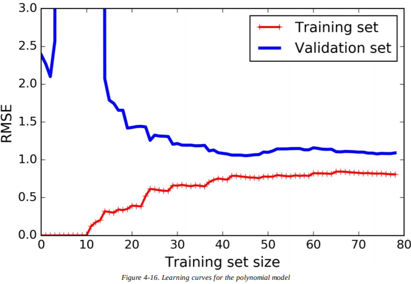

> **提示**
> 一种改善过拟合模型的方法是提供更多的训练数据，直到验证误差与训练误差相等。

> **偏差和方差的权衡**

> 在机器学习中和统计学中有一种重要的理论，模型的泛化误差是三种不同误差的总和：

> **偏差**（*Bias*）
> 这部分泛化误差是因为错误的假设，比如假设数据是线性的，而实际上是二次的。一个高偏差模型最可能欠拟合训练数据。
> **方差**（*Variance*）
> 这部分是因为对训练数据中细微方差的过度敏感。自由度很高的模型（比如高阶多项式模型）很可能有高方差，因此过拟合训练数据。
> **不可约误差**（*Irreducible error*）
> 这部分是因为数据本身的噪音。唯一能减少这种误差的方法是清洗数据（比如修复数据源，像是损坏的传感器，或者探测并移除异常值）。
> 增加模型的复杂度会典型地提高方差，降低偏差。相反地，减少模型的复杂度会提高偏差，降低方差。这就是权衡。

## 正则化线性模型

如我们在第一章和第二章中所见，减少过拟合的一种好办法是正则化模型（即，增加限制）：它的自由度越低，就越难过拟合数据。比如，正则化多项式模型的一种简单方法是减少多项式的阶数。

对于一个线性模型而言，正则化主要通过限制模型权重来实现。我们现在岭回归、Lasso回归，以及弹性网络，分别使用了三种不同的方法来限制权重。

### 岭回归

**岭回归**（*Ridge Regression*）（也被称为**吉洪诺夫正则法**（*Tikhonov regularization*））是线性回归的一种正则版本：在损失函数中加入等于$\alpha\sum_{i=1}^{n}\theta_i^2$的正则项（*regularization term*）。这样迫使学习算法不仅要拟合数据，也要保持模型权重尽可能小。注意，正则项只能在训练时加入损失函数。一旦模型已经训练好，评估模型性能时要使用未正则化的性能度量。

> **笔记**
> 一般来说，训练时使用的损失函数和测试时使用的性能度量是不一样的。除了正则化，另一个原因是一个优秀的损失函数应该在优化时易于求导，而用于测试的性能度量应该尽可能接近最终的目标。有一个好的例子：分类器在训练时使用类似对数损失（会在稍后讨论）的损失函数，但评估时使用精确率/召回率。

超参数$\alpha$控制模型的正则化程度。如果$\alpha=0$，岭回归就成了线性回归。如果$\alpha$很大，所有的权重最终都会接近0，结果就是经过数据平均值的一条水平直线。公式4-8就是岭回归的损失函数：

$$J(\theta)=MSE(\theta)+\alpha\frac{1}{2}\sum_{i=1}^{n}\theta_i^2$$

注意，偏差项$\theta_0$并没有被正则化（累加是从$i=1$开始的，而不是$0$）。如果我们定义$\mathbf{w}$作为特征权重（$\theta_1$到$\theta_n$）的向量，那么正规项就等于$\frac{1}{2}(\parallel\mathbf{w})^2\parallel_2$，其中$\parallel\dot\parallel_2$表示权重向量的$\ell_2$范数。对于梯度下降，只要在均方差梯度向量中增加$\alpha\mathbf{w}$。

> **警告**
> 使用岭回归前，对数据进行缩放（比如，使用`StandardScaler`）是很重要的，因为它对输入特征的尺度很敏感。大多数正则化模型都是如此。

图4-17展示了一些在相同的线性数据上使用不同$\alpha$值的岭回归模型。左图是普通的岭回归模型，得到线性预测结果。右图中，数据首先使用`PolynomialFeatures(degree=10)`进行扩展，然后使用`StandardScaler`进行数据缩放，最后再应用岭回归模型：这就是带有岭正则的多项式回归。注意$\alpha$增大时，预测曲线会变得平坦（即，更不极端，更合理），这样减少了偏差，但增加了方差。

对于线性回归，我们可以通过计算闭式解方程或者使用梯度下降来应用岭回归。优缺点是相同的。公式4-9展示了闭式解（矩阵$\mathbf{A}$是除了左上角有个0的$n\times n$单位矩阵（*identity matrix*），那个0对应偏差项）。

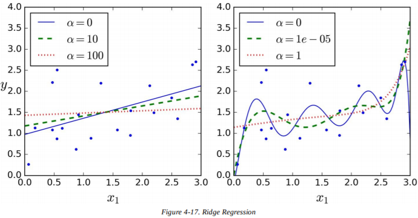

$$\hat\theta=(\mathbf{X}\dot \mathbf{X}+\alpha\mathbf{A})^{-1}\dot \mathbf{X}^T\doty$$

