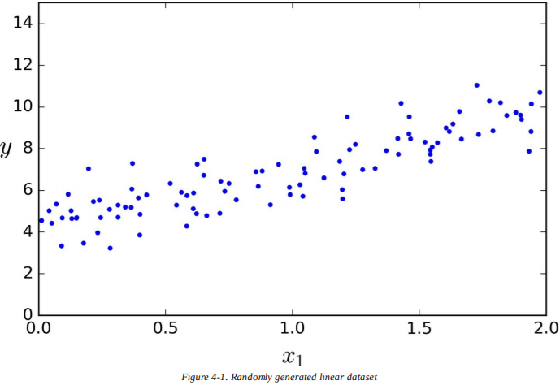
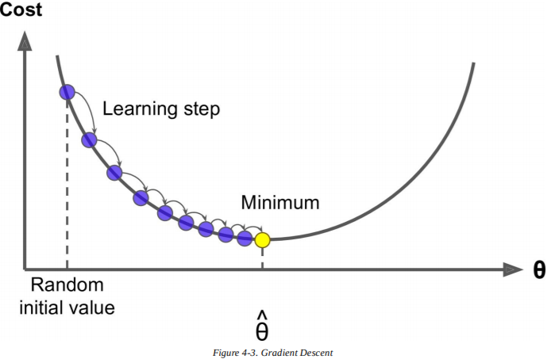
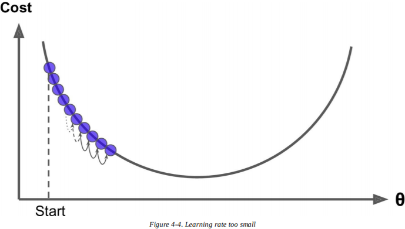
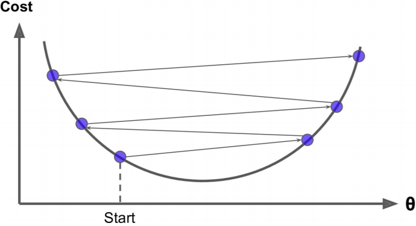
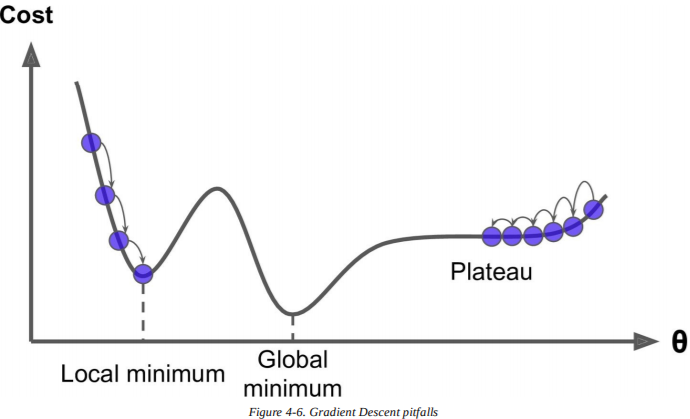
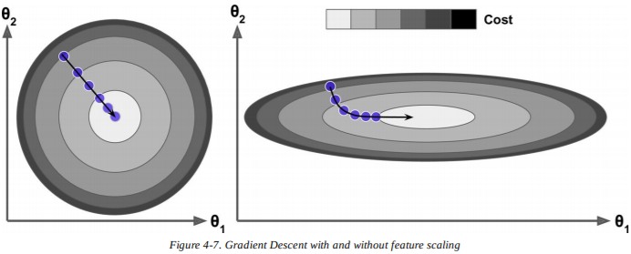

# 第四章：训练模型

迄今为止，我们对待机器学习模型和算法就像黑盒一样。如果你做过前几章的练习，你也许会感到惊奇，居然能在不知道背后原理的情况下实现那么多任务：优化回归系统，改进数字图像分类器，甚至从头开始建立了垃圾邮件过滤器——这一切你都不知道它究竟是怎么实现的。事实上，在许多解决方法中，你并不需要知道应用细节。

不过，对工作原理有一定了解的话，能帮助你快速选出合适的模型、正确的训练算法、以及一组好的超参数。了解背后的原理也能帮你调试问题、更高效地进行误差分析。最后，本章中讨论的绝大多数话题在理解、构建、训练神经网络上是很有必要的（在本书的第二部分讨论）。

本章中，我们首先来看线性模型，最简单的模型之一。我们会讨论两种极其不同的训练方法。

- 使用封闭方程直接计算在训练集上最适合模型的参数（即在训练集上使损失函数最小化的模型参数）
- 使用迭代优化方法，称为梯度下降（GD），它在训练集上逐渐调整模型参数，使损失函数最小化，最终会收敛到和第一种方法相同的值。我们也会介绍一些梯度下降的变体，当我们在第二部分学习神经网络的时候会反复用到：批量梯度下降（Batch GD），小批量梯度下降（Mini-batch GD）和随机梯度下降（Stochastic GD）。

接下来我们会介绍多项式回归，一个能适应非线性数据集的更复杂的模型。因为这个模型比线性回归有更多的参数，更容易发生过拟合训练集的情况，所以我们将会介绍如何使用学习曲线来检测模型是否过拟合，也会介绍一些能减少过拟合风险的正则技术。

最后，我们再看两个常用于分类任务的模型：逻辑回归和Softmax回归。

> **警告**
> 本章中会涉及到许多数学公式，以及线性代数和微积分的基本概念。为了理解这些公式，你需要知道向量和矩阵是什么、如何转换它们、点积是什么、矩阵的逆是什么、偏导数是什么。如果你对这些概念不熟悉，你可以在Jupyter notebook的在线补充材料上浏览线性代数和微积分入门指导。对于真的很讨厌数学的人，也应该浏览本章，仅跳过公式。希望能帮助你理解大部分概念。

## 线性回归

在第一章中，我们介绍了一个简单的生活满意度回归模型：$life\_satisfaction=\theta_0+\theta_1\times GDP\_per\_capita$。

这个模型只是输入特征`GDP_per_capita`的线性函数。$\theta_0$和$\theta_1$是模型的参数。

更普遍的，线性模型通过计算输入特征的权重总和，并加上一个常数**偏置项**（*bias term*）（也称为**截距项**（*intercept term*））来做出预测，如公式4-1：

$$\hat{y}=\theta_0+\theta_1x_1+\theta_2x_2+...+\theta_nx_n$$

- $\hat{y}$是预测值。
- $n$是特征总数。
- $x_i$是第i个特征值。
- $\theta_j$是第j个模型参数（包括偏置项$\theta_0$和特征权重$\theta_0,\theta_1,\theta_2,...,\theta_n$）

可以写成更简短的向量形式，如公式4-2：

$\hat{y}=h_{\theta}(\mathbf{x})=\theta^T·\mathbf{x}$

- $\theta$是模型的参数向量，包括偏置项$\theta_0$和特征权重$\theta_1$到$\theta_n$
- $\theta^T$是$\theta$的转置（行向量变为列向量）
- $\mathbf{x}$是特征向量的实例，包括$x_0$到$x_n$，且$x_0$恒为0
- $\theta^T·\mathbf{x}$是$\theta^T$和$\mathbf{x}$的点积
- $h_{\theta}$是函数的假设值，使用了模型参数$\theta$

这就是线性回归模型，所以我们该如何训练它呢？回想一下，训练模型意味着设置参数，使模型最适合训练集。为此我们需要一种能衡量模型好坏的指标。在第二章中我们已经知道，回归模型最普遍的性能测量是均方根误差（RMSE）（公式2-1）。因此，要训练线性回归模型，你需要找到能最小化RMSE的$\theta$值。在实践中，最小化均方误差（MSE）比RMSE更普遍，最小化的结果也是一样的（因为使函数最小化的值也使它的平方根最小化）。

在训练集$\mathbf{X}$上，线性模型的假设值$h_{\theta}$的 MSE 用公式4-3来计算：

$$MSE(\mathbf{X},h_{\theta})=\frac{1}{m}\sum^m_{i=1}(\theta^T·\mathbf{x}^{(i)}-y^{(i)})^2$$

大多数公式都在第二章中（见“公式”）。主要的不同是我们把$h$写成$h_{\theta}$，以便能清楚表明模型是由向量$\theta$参数化的。为了简化公式，我们用$MES(\theta)$代替$MSE(\mathbf{X},h_{\theta})$。

### 正规方程

为了找到能最小化损失函数的$\theta$值，可以使用**闭式解**（*closed-form solution*）——换言之，通过数学公式直接得到解。这被称为**正规方程**（*Normal Equation*）（公式4-4）：

$$\hat{\theta}=(\mathbf{X}^T·\mathbf{X})^{-1}$·\mathbf{X}^T·y$$

- $\hat{\theta}$是最小化损失函数的$\theta$值
- $y$是目标值的向量，包含$y^{(1)}$到y^{(m)}

让我们来生成一些近似线性的数据，在图4-1上测试这个公式：

```python
import numpy as np

X = 2 * np.random.rand(100, 1)
y = 4 + 3 * X + np.random.randn(100, 1)
```



现在通过正规方程来计算$\theta$。我们会从NumPy的线性代数模块（`np.linalg`）中使用`inv()`函数计算矩阵的逆，`dot()`方法计算矩阵乘法。

```python
X_b = np.c_[np.ones((100, 1)), X] # add x0 = 1 to each instance
theta_best = np.linalg.inv(X_b.T.dot(X_b)).dot(X_b.T).dot(y)
```

我们用来生成数据的实际函数是$y=4+3x_0+高斯噪音$。来看看正规方程发现了什么：

```python
>>> theta_best
array([[ 4.21509616],
[ 2.77011339]])
```

我们希望得到$\theta_0=4$和$\theta_1=3$，而不是$\theta_0=4.215$和$\theta_1=2.770$。很接近了，但噪音使它无法恢复原函数的确切参数值。

现在你可以用$\hat{\theta}$来进行预测了：

```python
>>> X_new = np.array([[0], [2]])
>>> X_new_b = np.c_[np.ones((2, 1)), X_new] # add x0 = 1 to each instance
>>> y_predict = X_new_b.dot(theta_best)
>>> y_predict
array([[4.21509616],
       [9.75532293]])
```

来绘制模型的预测（图4-2）：

```python
plt.plot(X_new, y_predict, "r-")
plt.plot(X, y, "b.")
plt.axis([0, 2, 0, 15])
plt.show()
```


使用下面的 Scikit-Learn 代码可以达到相同的效果：

```python
>>> from sklearn.linear_model import LinearRegression
>>> lin_reg = LinearRegression()
>>> lin_reg.fit(X, y)
>>> lin_reg.intercept_, lin_reg.coef_
(array([ 4.21509616]), array([[ 2.77011339]]))
>>> lin_reg.predict(X_new)
array([[4.21509616],
       [9.75532293]])
```

### 运算复杂度

正规方程计算`$\mathbf{X}^T·\mathbf{X}$`的逆，它是个n×n的矩阵（n是特征的数量）。对这个矩阵求逆的运算复杂度在$O(n^{2.4})$和$O(n^3)$之间（取决于具体应用）。换言之，如果特征数量翻倍，运算时间会变为原来的$2^{2.4}=5.3$到$2^3=8$倍。

> **警告**
> 当特征的数量很大时（比如100000），正规方程会变得很慢。

好的一方面是，这个公式在训练集上对于实例而言是线性的（复杂度为$O(m)$），只要内存足够，就能高效处理大批数据。

同时，只要你训练过线性模型（使用正规方程或其他算法），预测就会很快：因为运算复杂度对于实例和特征而言都是线性的。换言之，当实例变为两倍时（或特征变为两倍），预测时间也不过是原来的两倍。

现在我们来看另一种用于训练线性回归模型的方法，当特征数量很多或训练实例太多、内存放不下时，这种方法更适用。

## 梯度下降

**梯度下降**（*Gradient Descent*）是一种非常通用的优化算法，能在许多问题中找到最优解。梯度下降的整体思路是通过迭代调整参数，使损失函数最小化。

假设你在迷雾弥漫的山中迷路了，你只能感觉到脚下土地的坡度。为了快速到达山底，最好的策略是沿着最陡的坡度下山。这就是梯度下降所做的事：它测量误差函数关于参数向量$\theta$的局部梯度，沿着梯度下降的方向前进。一旦梯度为0，你就得到了最小值。

具体来说，首先把$\theta_0$置为随机值（成为**随机初始化**（*random initialization*）），然后慢慢改善它，一次一小步，每一步都尝试减小损失函数（比如，MSE），直到算法收敛到一个最小值（见图4-3）。



梯度下降中一个重要的参数是步长，由超参数**学习率**决定。如果学习率太小，算法就不得不迭代许多次才能收敛，这会花费很长的时间（见图4-4）。



另一方面，如果学习率太大，你会越过最低点，跳到另一边，可能比之前的值还要大。这样可能会使算法发散，它的值会越来越大，无法找到一个好的解决方法（见图4-5）。



最后，不是所有的损失函数都看起像规则的碗一样。它们可能是洞、山脊、高原和各种不规则的地形，收敛到最小值很困难。图4-6展现了两个梯度下降主要的挑战：如果随机初始值选在左边，那么它会收敛到一个**局部最小值**（*local minimum*），它不如**全局最小值**（*global minimum*）那么好。如果它从右边开始，那么跨越高原会花费很长的时间，如果你过早停止训练，你将永远无法得到全局最小值。



幸运的是，线性回归模型的均方差损失函数恰好是一个**凸函数**（*convex function*），意味着如果你在曲线上随机选两点，它们的连线不会与曲线交叉。这意味着函数没有局部最小值，只有一个全局最小值。并且，它也是一个斜率永远不会突变的连续函数。这两点要素有一个重要的推论：梯度下降保证能无限接近全局最小值（只要训练时间够长，并且学习率并不是很大）。

事实上，损失函数的形状像一个碗，不过如果特征的取值范围相差过大时，碗会被拉长。图4-7展示了梯度下降在不同训练集上的表现。左图中，特征1和特征2有相同的比例；右图中，特征1的值比特征2要小得多。



如你所见，左图中梯度下降算法直接快速到达了最小值，而右图中它第一次前进的方向几乎和全局最小值垂直，并且在平坦的山谷中走了很久。它最终会到达最小值，不过会花费很长时间。

> **警告**
> 使用梯度下降的时候，你应该确保所有的特征取值范围都相似（例如，使用Scikit-Learn的`StandardScaler`类，否则它会花很长的时间才能收敛）。

这幅图也表明了一个事实，训练一个模型意味着在训练集上找到能最小化损失函数的一组模型参数。这是在模型参数空间（*parameter space*）中的搜索：一个模型的参数越多，空间的维度就越多，搜索就越困难——在一个300维的干草堆中找一根针要比在3维的干草堆中找一根针棘手多了。

幸运的是，因为线性回归的损失函数是凸函数，所以“针”就在碗底。

### 批量梯度下降

为了实现梯度下降，你需要计算每一个$\theta_j$下损失函数的梯度。换言之，你需要计算当$\theta_j$变化了一点点时，梯度会改变多少。这被称为**偏导数**（*partial derivative*）。这就像是你面向东方时询问“我脚下的斜率是多少？”，然后面向北方时问相同的问题一样（如果你能想象出一个超过三维的宇宙，所有方向以此类推）。公式4-5计算了损失函数对于参数$\theta_j$的偏导数，记为$\frac{\partical}{\partical{\theta_j}}MSE(\theta)$。

$$\frac{\partical}{\partical{\theta_j}}MSE(\theta)=\frac{2}{m}\sum_{i=1}^{m}(\theta^T\dot x^{(i)}-y^{(i)})x_j^{(i)}$$

你可以使用公式4-6一次性计算所有偏导数，不用单独一个个计算。梯度向量记为$\nabla_{\theta}MSE(\theta)$，包括了损失函数所有的偏导数（每个模型参数一个）。

$\nabla_{\theta}MSE=$

> **警告**
> 注意，这个方程在每一步梯度下降计算时都使用了整个训练集X！这也就是算法被称为**批量梯度下降**（*Batch Gradient Descent*）的原因：每一步都使用全部训练集。所以它在大数据集上运行得很慢（不过我们马上就会介绍更快的梯度下降算法）。然而，梯度下降的运算规模和特征数量成正比。当有成百上千的特征时，使用梯度下降训练线性回归模型要比正规方程快很多。

一旦你得到梯度向量，如果它是上坡的，那就沿相反方向下坡。这就意味着从$\theta$减去$\nabla_{\theta}MSE(\theta)$。这就是学习率$\eta$发挥作用的地方：梯度向量和$\eta$的乘积决定了下坡时的步长（公式4-7）。

$$\theta^{next step}=\theta-\eta\nabla_{\theta}MSE(\theta)$$

来看看算法的一种快速实现方法：

```python
eta = 0.1 # learning rate
n_iterations = 1000
m = 100

theta = np.random.randn(2,1) # random initialization

for iteration in range(n_iterations):
	gradients = 2/m * X_b.T.dot(X_b.dot(theta) - y)
	theta = theta - eta * gradients
```

不是很难！来看看最终结果$\theta$：

```python
>>> theta
array([[ 4.21509616],
       [ 2.77011339]])
```

这就是正规方程找到的值！梯度下降工作得很完美。不过，换一个学习率`eta`会如何？图4-8展示了三种不同学习率下梯度下降的前10步（虚线代表起始点）。


左边的图学习率太低了，算法虽然最终能算出结果，但是会花费大量时间。中间的图学习率看起来不错，它已经收敛到了最终结果。右边的图学习率太高了：算法发散了，跳过了所有数据，每一步都离正确结果越来越远。

为了找到一种好的学习率，你可以使用网格搜索（见第二章）。不过，你也许想限制迭代次数，让网格搜索筛掉收敛时间过久的模型。

你也许想知道如何设置迭代次数。如果次数太少，当算法结束时，你仍然离最优解很远，不过如果次数太多，当模型参数不再改变时，你会浪费许多时间。一种简单的方法是设定一个非常大的迭代次数，但当梯度下降
