# 第五章 支持向量机

支持向量机（*Support Vector Machine*, SVM）是一种非常强大而多功能的机器学习模型，能实现线性和非线性分类、回归甚至异常值检测。它是机器学习中最流行的模型之一，凡是对机器学习感兴趣的人都必备的工具。 SVM 尤其适合小型或中型数据集的复杂分类问题。

本章会解释 SVM 的核心准则，以及如何使用它们，它们是如何工作的。

## 线性 SVM 分类

SVM 的基本思路可以用这些图片来很好地解释。图5-1展示了部分鸢尾花数据集，在第四章中有所介绍。这两类很容易用一条直线来划分（它们是线性可分的）。左图展示了三种线性分类器的决策边界。虚线所表示的模型表现过差，甚至没能合适地把两类分开。其余的两个模型在训练集上表现优秀，但是它们的决策边界离实例太近了，在新实例上可能不会表现很好。相比之下，右图中的实线代表 SVM 分类器的决策边界，它不仅划分了两个类别，而且离最近的实例尽可能的远。你可以认为 SVM 在两类之间保持了最宽通道（以平行虚线表示）。这被称为**大间隔分类**（*large margin classification*）。

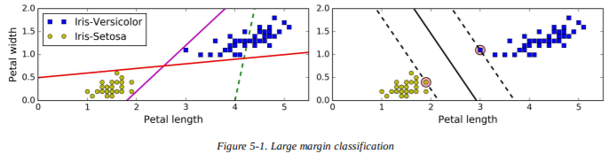

注意，添加通道外的训练实例完全不会影响决策边界：它是由通道边缘的实例决定（或“支持”）的。这些实例被称为支持向量（图 5-1 中的圆圈）。

> **警告**
> SVM 对特征缩放比较敏感，你可以在图 5-2 中看到：在左图，垂直的比例比水平的比例大得多，所以最宽通道接近水平。在特征缩放之后（比如使用 Scikit-Learn 的`StandardScaler`），决策边界看起来就好多了（右图）。

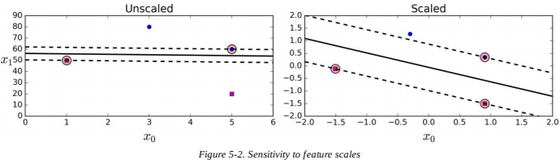

### 软间隔分类

如果我们严格规定所有的实例都在通道外，且都在右侧，这被称为**硬间隔分类**（*hard margin classification*）。它有两个主要问题，第一，只有当数据线性可分时，它才能工作；第二，它对异常值过于敏感。图 5-3 展示了加了一个异常值的鸢尾花数据集：左图中，不可能找到一个硬间隔；右图中，决策边界和图 5-1 中没有异常值的决策边界差异过大，可能不会泛化得很好。

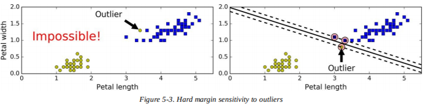

为了避免这些情况发生，最好使用更灵活的模型。目标是在两者之间找到平衡：保持通道尽可能大和限制间隔违规（*margin violations*）（即实例在通道中间，或者在错误的一侧）。这被称为**软间隔分类**（*soft margin classification*）。

在 Scikit-Learn 中的 SVM 类中，你可以使用超参数`C`来控制平衡：小的`C`值会有更宽的通道，但是间隔违规也会变多。图 5-4 展示了两个软间隔 SVM 分类器在非线性可分数据集上的决策边界和间隔，左图中，使用了较高的`C`值，分类器的间隔违规很少，但是间隔也很小。右图中，使用了较低的`C`值，间隔大多了，但有实例落在了通道里。不过，看起来还是第二个模型泛化得更好一：事实上，即便是在这个训练集上，它的预测误差也很小，因为大多数间隔违规的实例都分在了决策边界正确的一侧。

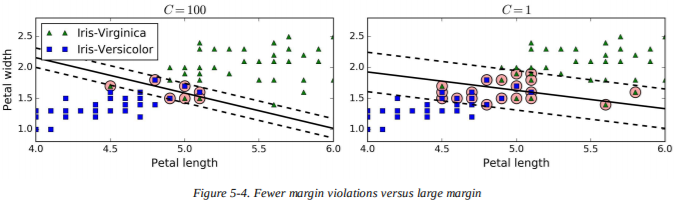

> **提示**
> 如果你的 SVM 模型过拟合了，可以试试降低`C`来正则化。

下面的 Scikit-Learn 代码 载入了鸢尾花数据集，进行了特征缩放，训练了一个线性 SVM 模型（使用`LinearSVC`类，`C=0.1`，铰链损失函数，稍后会讨论）来检测维吉尼亚鸢尾花。最终模型为图 5-4 的右图。

```python
import numpy as np
from sklearn import datasets
from sklearn.pipeline import Pipeline
from sklearn.preprocessing import StandardScaler
from sklearn.svm import LinearSVC

iris = datasets.load_iris()
X = iris["data"][:, (2, 3)] # petal length, petal width
y = (iris["target"] == 2).astype(np.float64) # Iris-Virginica

svm_clf = Pipeline((
        ("scaler", StandardScaler()),
        ("linear_svc", LinearSVC(C=1, loss="hinge")),
    ))

svm_clf.fit(X_scaled, y)
```

然后，你就可以像往常一样使用模型来进行预测了：

```python
>>> svm_clf.predict([[5.5, 1.7]])
array([ 1.])
```

> **笔记**
> 不像逻辑回归分类器， SVM 分类器不输出每个类的概率。

或者，你也可以使用`SVC`类，使用`SVC(kernel="linear",	C=1)`，但是它会更慢，尤其是当训练集很大时，所以并不推荐。另一个选择是使用`SGDClassifier`类，使用`SGDClassifier(loss="hinge",	alpha=1/(m*C))`。它应用了常规的随机梯度下降（见第四章）来训练线性 SVM 分类器。它不像`LinearSVC`类收敛那么快，但是能处理内存中放不下的大型数据集（核外训练），或者处理在线分类任务。

> **提示**
> `LinearSVC`类会正则化偏差项，所以首先你应该集中训练集，减去它们的平均值。如果你使用了`StandardScaler`来缩放数据，那么它会自动完成。此外，确保你把超参数`loss`设置为`hinge`，因为它不是默认值。最后，为了更好的性能你，你应该把超参数`dual`设置为`False`，除非特征比训练实例还多（我们会在本章稍后讨论对偶性）。

## 非线性 SVM 分类

尽管线性 SVM 分类器既高效，又在许多时候表现优秀，但是很多数据集都不是线性可分的。一种处理非线性数据集的方法是增加更多的特征，比如多项式特征（就像你在第四章中做的那样），有时候这样能产生线性可分的数据集。考虑图 5-5 中的左图：它代表只有一个特征  的简单数据集。如你所见，这个数据集不是线性可分的。不过如果增加第二个特征  ，生成的 2D 数据集就是完美的线性可分了。

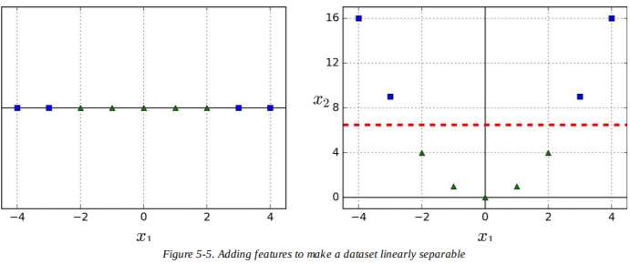

要使用 Scikit-Learn 实现这个想法，你可以创造一个包含`PolynomialFeatures`转换器（在“多项式回归”提到过）的`Pipeline`，然后再是`StandardScaler`和`LinearSVC`。让我们在卫星数据集上测试一下（见图 5-6）：

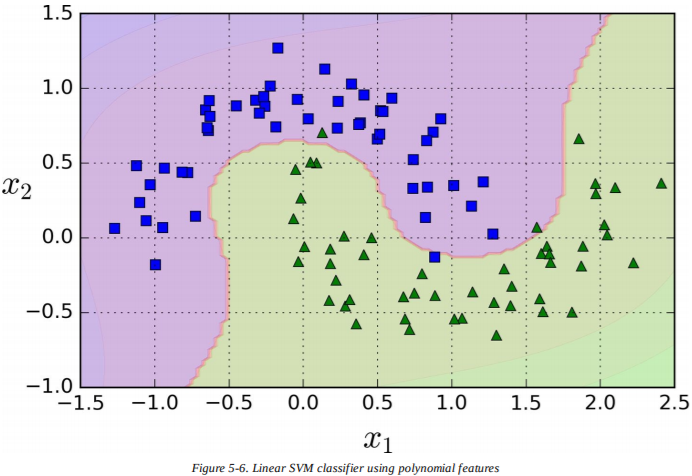

```python
from sklearn.datasets import make_moons
from sklearn.pipeline import Pipeline
from sklearn.preprocessing import PolynomialFeatures

polynomial_svm_clf = Pipeline((
        ("poly_features", PolynomialFeatures(degree=3)),
        ("scaler", StandardScaler()),
        ("svm_clf", LinearSVC(C=10, loss="hinge"))
    ))

polynomial_svm_clf.fit(X, y)
```

### 多项式核

增加多项式特征很简单，在各种机器学习算法（不只是 SVM ）上表现都很好，但是低阶多项式不能处理很复杂的数据集，高阶多项式创造了大量数据，使模型运行过慢。

幸运的是，使用 SVM 时你可以应用一种被称为**核技巧**（*kernel trick*，稍后会解释）的神奇数学技术。它能让你得到同样的结果——就像你添加了许多多项式特征一样，甚至是非常高阶的多项式——而并没有真的加上它们。所以不存在特征数的组合爆炸，因为你实际上并没有添加任何特征。这个技巧可以通过`SVC`类来实现。让我们在卫星数据集上测试一下：

```python
from sklearn.svm import SVC
poly_kernel_svm_clf = Pipeline((
        ("scaler", StandardScaler()),
        ("svm_clf", SVC(kernel="poly", degree=3, coef0=1, C=5))
    ))
poly_kernel_svm_clf.fit(X, y)
```

上面的代码使用了 3 阶多项式核训练了一个 SVM 分类器，显示在左图中。右图是使用了 10 阶多项式核的另一个 SVM 分类器。显然，如果你的模型过拟合了，你可能想减少多项式的阶数。相反地，如果它欠拟合了，你可以试着提高阶数。超参数`coef0`控制高阶多项式和低阶多项式对模型的影响。

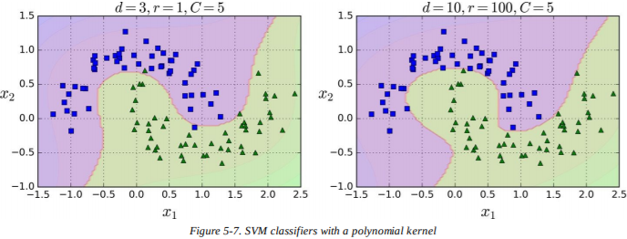

> **提示**
> 一种找到正确超参数值的通用方法是使用网格搜索（见第二章）。先做一遍粗略的网格搜索是很快的，然后在找到的最优值之间进行一遍仔细的网格搜索。对每种超参数的作用有良好的理解有助于你在正确的超参数空间进行搜索。

### 增加相似特征

另一种处理非线性问题的技术是使用**相似函数**（*similarity function*）来增加特征，它测量每个实例与特定地标（*landmark*）的相似度。例如，取之前讨论的一维数据集，增加两个地标：  和 （见图 5-8 中的左图）。接下来，将相似度函数定义为  的高斯**径向基函数**（*Radial Basis Function*，RBF）（见公式 5-1）。


它是个范围从 0（离地标很远）到 1（在地标上）的钟型函数。现在我们准备好计算新特征了。例如，来看实例  ：它和第一个地标的距离是 1，和第二个地标的距离是 2。所以它的新特征是  和  。图 5-8 中的右图显示了转换后的数据集（舍弃了原始特征）。如你所见，现在它是线性可分的了。

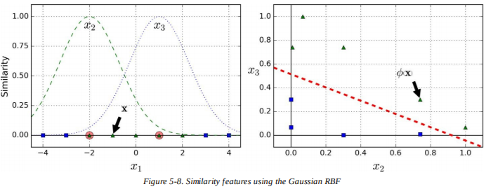

你也许想知道该如何选择地标。最简单的方法是给数据集中的每个实例都创建一个地标。这样会创造许多维度，增加转换后的训练集是线性可分的可能性。缺点是有  个实例和  个特征的训练集会被转换为有  个实例和  个特征的训练集（假设你舍弃了原始特征）。如果你的训练集很大，你会得到数量同样大的特征。

### 高斯径向基核

就像多项式特征理论一样，相似特征理论能用于任何机器学习算法，但是计算所有的特征可能会代价昂贵，尤其是在大型数据集上。不过，核技巧再一次施展了 SVM 魔法：它使获得相似结果成为可能，就像你已经添加了相似特征，而不用真的添加它们。让我们用`SVC`类来尝试高斯径向基核：

```python
rbf_kernel_svm_clf = Pipeline((
        ("scaler", StandardScaler()),
        ("svm_clf", SVC(kernel="rbf", gamma=5, C=0.001))
    ))
rbf_kernel_svm_clf.fit(X, y)
```

图 5-9 的左下角就是上述模型。其他的图是用不同的超参数`gamma`（）和  训练的模型。增加`gamma`会使钟型曲线更窄（看图 5-8 的左图），每个实例的影响范围也变小了：决策边界更不规律，在单个实例周围环绕。相反地，小的`gamma`值会使钟型曲线更宽，实例有更大的影响范围，决策边界也会更平滑。所以  就像正则化参数一样：如果你的模型过拟合了，你应该减小它，；如果欠拟合了，就增大它（和超参数`C`很相似）。

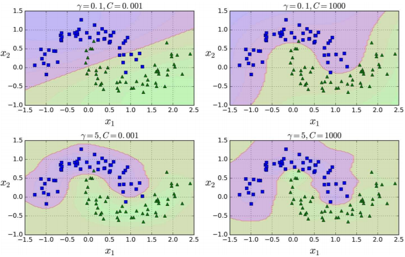

也有其他类型的核，不过用的很少。例如，有些核专门用于特定的数据结构。**字符串核**（*String kernels*）有时用于分类文本文档或 DNA 序列（比如，使用字符串子序列核（*string subsequence kernel*）或者基于莱文斯坦距离（*Levenshtein distance*）的核）。

> **提示**
> 有这么多种核可供选择，如何决定用哪个呢？一般来说，你应该首先尝试用线性核（记住，`LinearSVC`比`SVC(kernel="linear")`要快得多），尤其是当训练集很大或者特征很多的时候。如果训练集不是太大，你应该尝试用高斯径向基核，它在大多数时候表现都很好。如果你有空闲时间和计算能力，你也可以通过交叉验证和网格搜索体验一下其他的核，尤其是如果有核专门用于你训练集的数据结构。

### 计算复杂度

`LinearSVC`类基于`liblinear`库，它实现了线性 SVM 的优化算法。它不支持核技巧，不过它训练实例的数量和特征的数量几乎是线性缩放的：训练时间复杂度大约在 。

如果你需要很高的准确率，算法会花费更多时间。这是由容差超参数 （在 Scikit-Learn 中称为`tol`）控制的在。在大多数分类任务中，默认的容差已经很好了。

`SVC`类基于`libsvm`库，它实现了支持核技巧的[一个算法](https://www.microsoft.com/en-us/research/publication/sequential-minimal-optimization-a-fast-algorithm-for-training-support-vector-machines/?from=http%3A%2F%2Fresearch.microsoft.com%2Fpubs%2F69644%2Ftr-98-14.pdf)。训练时间复杂度常在  和  之间。不幸的是，这意味着当训练实例的数量变大时（比如成千上万的实例），它会惊人得慢。这个算法完美适用于复杂但是小型或中型的训练集。不过，它对特征数量有很好的缩放，尤其是对于稀疏特征（即每个实例都几乎没有非零特征）。在本例中，算法粗略地缩放了每个实例非零特征的平均数量。表格 5-1 比较了 Scikit-Learn 的 SVM 分类器的种类。


## SVM 回归

我们之前提到过，SVM 算法是非常全能的：不只是支持线性和非线性的分类，而且支持线性和非线性的回归。技巧是转换目标：无需试着拟合两类间的最大通道而避免间隔违规，SVM 回归要尽可能多的在通道上拟合实例（即，把实例放在通道上）。通道的宽度由超参数  控制，图 5-10 展示了两个在随机线性数据上训练的线性 SVM 回归模型，一个是大间隔（  ），另一个是小间隔（  ）。

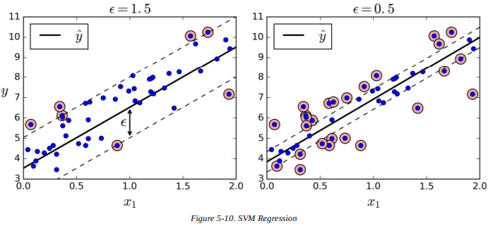

增加更多的训练实例在间隔之间并不会影响模型的预测，因此，模型被认为是对  不敏感的。

你可以使用 Scikit-Learn 的`LinearSVR`类来实现线性 SVM 回归。下面的代码会生成图 5-10 左边的模型（训练数据首先要进行缩放，并放在中间）。

```python
from sklearn.svm import LinearSVR

svm_reg = LinearSVR(epsilon=1.5)
svm_reg.fit(X, y)
```

要解决非线性回归任务，你可以使用核化的 SVM 模型。例如，图 5-11 展示了在随机二次训练集上使用了 2 阶多项式核的 SVM 回归。左图中几乎没有正则化（即`C`值很大），右图则进行了正则化（即`C`值很小）。

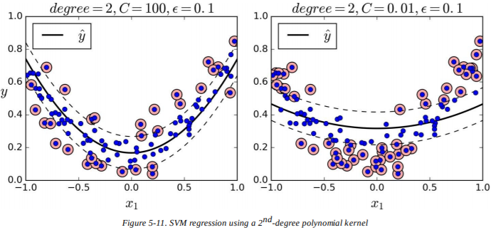

下面的代码使用了 Scikit-Learn 的`SVR`类（支持核技巧），会生成图 5-11 左图中的模型。`SVR`类和`SVC`一样，`LinearSVR`和`LinearSVC`一样，不过是回归。`LinearSVR`类和训练集的大小呈线性关系（就像`LinearSVC`类），而`SVR`类在训练集增大时就会变慢（就像`SVC`类）。

```python
from sklearn.svm import SVR

svm_poly_reg = SVR(kernel="poly", degree=2, C=100, epsilon=0.1)
svm_poly_reg.fit(X, y)
```

> **笔记**
> SVM 也能用于异常值检测，详情见 Scikit-Learn的文档。

## 原理

本节会解释 SVM 是如何进行预测的，以及它的训练算法是如何工作的，先从线性 SVM 分类器开始。如果你刚开始学习机器学习，你能安心跳过这部分，直接到本章结尾的练习，以后当你想更深入了解 SVM 的时候再回来。

首先，关于符号的一些说明：在第四章中，我们依照惯例将所有模型参数放进向量  中，包括偏差项  和 输入特征  到  ，以及一个对所有实例的偏差输入 。在本章中，我们将使用不同的约定，当你处理 SVM 的时候会更加方便（也更加普遍）：偏差项称为  ，特征权重向量称为 。特征向量中不加入偏差特征。

### 决策函数及其预测

线性 SVM 分类器模型通过计算决策函数  来预测新实例  的类别：如果结果是正值，预测类  就是正类（1），否则是负类（0），见公式 5-2。


图 5-12 展示了与图 5-4 右图模型相对应的决策函数：它是个二维的平面，因为数据集有两个特征（花瓣长度与花萼长度）。决策边界是一系列决策函数等于 0 的点：它是两个平面的交点，是一条直线（图中的细实线）。

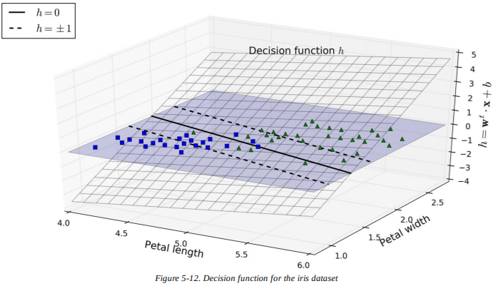

虚线代表决策函数等于 1 或 -1 的点：它们互相平行，到决策边界的距离相等，并在它周围形成间隔。训练一个线性 SVM 分类器意味着要找到  和  ，使间隔尽可能大，又要避免间隔违规（硬间隔）或者限制间隔违规（软间隔）。

### 训练目标

考虑决策函数的斜率：它等于权重向量的范数，  。如果我们将斜率除以 2 ，决策函数等于 ±1 的点到决策边界的距离会变为 2 倍。换言之，斜率减小为原来的一半，间隔会变为原来的两倍。也许在 图 5-13 的 2D 图中更容易可视化。权重向量  越小，间隔越大。

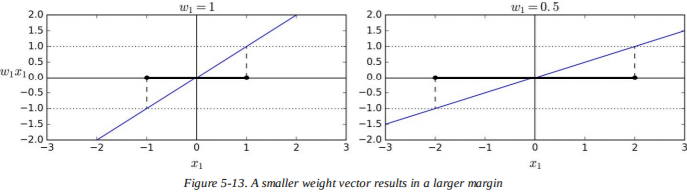

所以我们想要最小化  来得到更大的间隔。不过，如果我们也希望能避免间隔违规（硬间隔），对于所有正的训练实例，我们得让决策函数大于 1 ，对于所有负的训练实例则小于 -1 。如果我们定义，对于负的实例（  ）  ，对于正的实例（  ）  ，那么我们可以将所有实例表示为  。

因此，我们能将硬间隔线性 SVM 分类器的目标表示为公式 5-3 的约束优化问题：


> **笔记**
> 我们要最小化  ，它等于   ，但我们并不是要最小化  。这是因为得到的结果是相同的（因为最小化一个值的  和  也是最小化该值平方的一半），但是  有又好又简单的导数（只有  ），而  在  处不可微。优化算法在可微函数上表现更好。

要得到软间隔的目标，我们需要引入一个松弛变量  ，应用到每个实例上：  测量第 i 个实例允许违规的程度。我们现在有了两个对立的目标：让松弛变量尽可能小而减少间隔违规，以及使  尽可能小而增加间隔。这就是要用到超参数`C`的地方：它允许我们定义两者间的权衡。这就给了我们公式 5-4 中的约束优化问题。


### 二次规划

硬间隔和软间隔的问题都是线性约束的凸二次优化问题。这种问题被称为**二次规划**（*Quadratic Programming*，QP）问题，有许多现成的解决方法可以用来解决二次规划问题，但这超出了本书的范围。公式 5-5 给出了一般问题的公式：


注意表达式

### 对偶问题

给定一个约束优化问题，称为**原始问题**（*primal problem*），它可能表示另一个不同的但是密切相关的问题，称为它的**对偶问题**（*dual problem*）。

### 核化 SVM

### 在线 SVM

在总结本章之前，让我们来快速了解一下在线 SVM 分类器（回想一下，在线学习意味着当有新实例到达时要增量学习）。

对于线性 SVM 分类器，一种理论是使用梯度下降（比如`SGDClassifier`）来最小化公式 5-13 中源于原始问题的损失函数。不幸的是，它比基于 QP 的方法收敛慢得多。


损失函数中第一项会使模型有一个小权重向量  ，间隔会更大。第二项计算了所有间隔违规的总和。当一个实例在通道上并在正确的一侧，或者它和通道正确一侧的距离成比例，它的间隔违规等于 0 。最小化这一项确保模型让间隔违规尽可能小，也尽可能少。

> **铰链损失**
>
> 函数  被称为铰链损失函数（如下）。当  时，它等于 0 。如果  它的导数（斜率）等于 -1 ，如果  ，导数等于 0 。在  处函数不可微，不过就像 Lasso 回归，在  时（即 -1 到 0 间的任意值）你依旧可以通过次导数使用梯度下降。
> 

也可以实现在线核化 SVM ——比如，使用“[递增与递减 SVM 学习](http://isn.ucsd.edu/papers/nips00_inc.pdf)”或“[在线和主动的快速核分类器](http://www.jmlr.org/papers/volume6/bordes05a/bordes05a.pdf)”。不过，这些都是用 MATLAB 和 C++ 实现的。对于大规模的非线性问题，你可能会考虑使用神经网络（见第二部分）。

## 练习

1. 支持向量机的基础思想是什么？
2. 支持向量是什么？
3. 为什么在使用 SVM 的时候缩放输入数据很重要？
4. 当 SVM 分类器分类实例时，它能输出置信值吗？概率呢？
5. 在一个包含数百万实例和数百个特征的训练集上，你你应该使用 SVM 的原始形式还是对偶形式来训练模型？
6. 假设你用 RBF 核训练了一个 SVM 分类器。而它似乎欠拟合了训练集：你应该增加还是减少`gamma`值？`C`值呢？
7. 你该如何设置 QP 参数  ，使用现成的 QP 解决器来解决软间隔线性 SVM 分类器问题？
8. 在线性可分的数据集上训练一个`LinearSVC`。之后在相同的数据集上再训练`SVC`和`SGDClassifier`。看看你是否能得到大致相同的模型。
9. 在 MNIST 数据集上训练一个 SVM 分类器。因为 SVM 分类器是二分类器，你需要使用一对所有来分类十个数字。你也许想要使用少量验证集来调参，加速进程。你能达到怎样的精度？
10. 在加利福尼亚房价数据集上训练一个 SVM 回归器。
